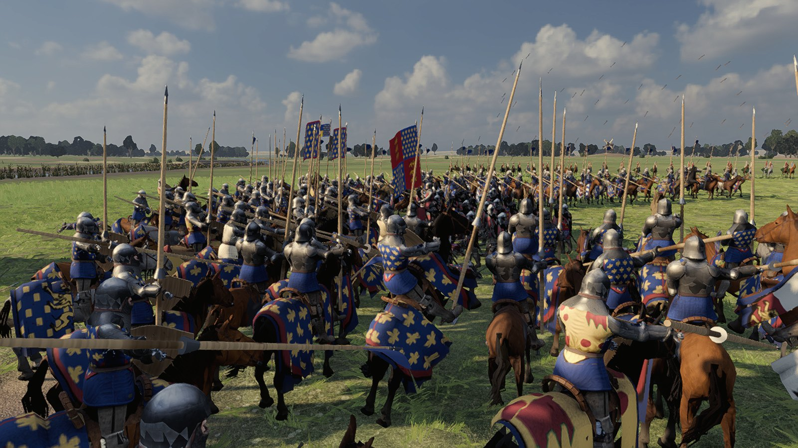
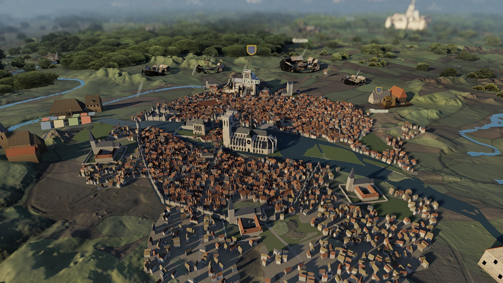
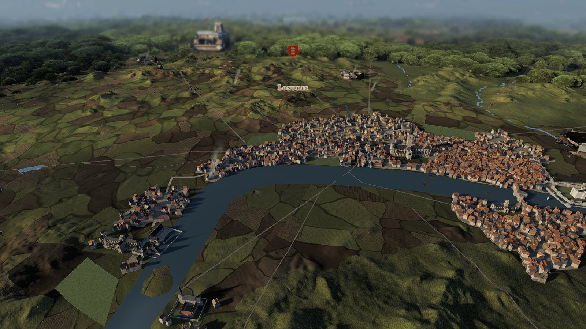
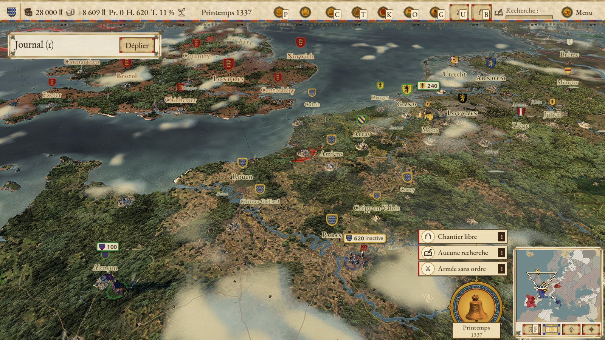
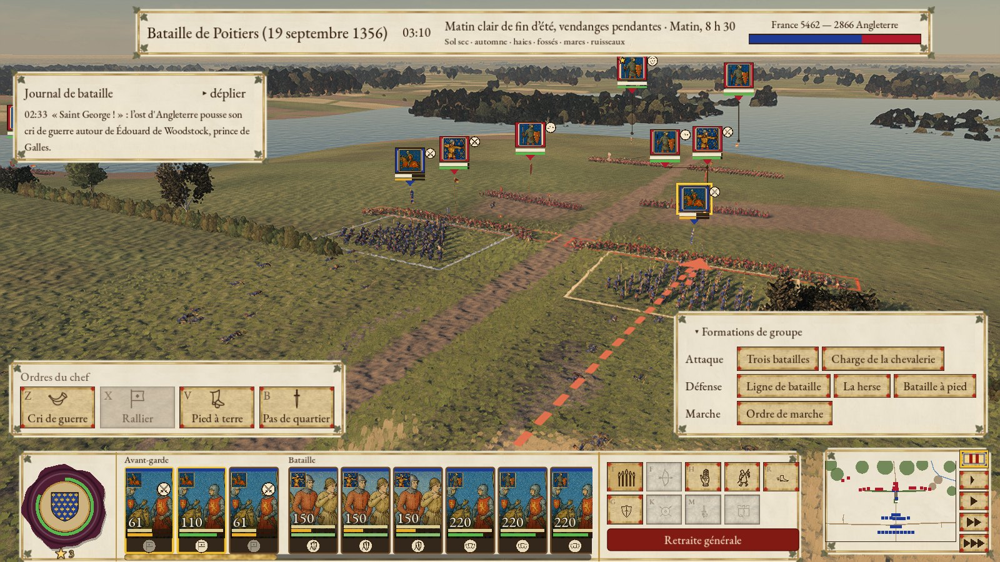
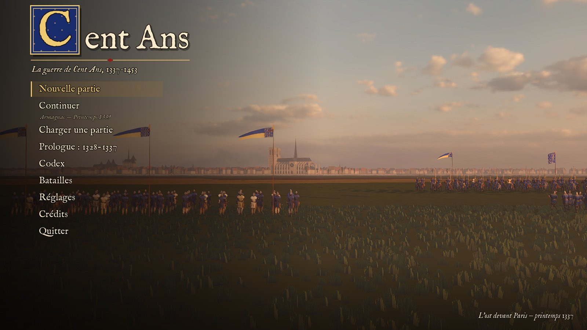

# Cent Ans

**Jeu de grande stratégie historique sur la guerre de Cent Ans (1337-1453)**, libre et open source.

Une carte de campagne au tour par saison sur l'Europe réelle, puis des batailles et des sièges en 3D en
temps réel avec pause, dans l'esprit de *Total War*. Incarnez la France des Valois, l'Angleterre des
Plantagenêts ou la Bourgogne, et menez un siècle de guerre, de diplomatie, de dynasties et de crises.



| Paris en 1337 sur la carte de campagne | Londres et la Tamise |
|---|---|
|  |  |

| Carte de campagne | Bataille de Poitiers (1356) |
|---|---|
|  |  |



*Captures en jeu. Pour les refaire : `godot --path game --resolution 1920x1080 --script res://tests/readme_shots.gd -- --out=<dossier>`.*

## Fonctionnalités

- **Carte réelle** de l'Europe occidentale : relief ETOPO/Copernicus, 132 provinces de 1337, fleuves,
  routes, forêts et zones humides de l'époque, déplacement libre des armées.
- **Campagne complète** de 1337 à 1453 (1477 pour la Bourgogne), 29 factions, objectifs historiques.
- **Batailles et sièges 3D** en temps réel avec pause : déploiement, formations, moral, des milliers
  de soldats, relief, engins de siège, murailles qui s'effondrent, incendies ; batailles navales.
- **Villes et économie** : population par classe, bâtiments, commerce, monnaie, impôts, révoltes,
  peste et famine.
- **Personnages et dynasties** : compétences, traits, mariages, successions (loi salique…), régences.
- **Diplomatie et religion** : casus belli, alliances, vassaux, papauté, Grand Schisme, Lollards,
  Hussites.
- **Chronique** : plus d'une centaine d'événements historiques et aléatoires sourcés (Écluse, Peste
  noire, Jacquerie, Jeanne d'Arc…).
- **IA** qui mène une vraie guerre de Cent Ans, avec ses phases et ses alliances historiques.
- **Encyclopédie et codex** : infobulles partout, fiches historiques illustrées.

Interface et textes en français.

## Architecture

```
core/    Rust : toutes les règles du jeu (simulation de campagne, batailles, IA),
         exposées à Godot par une GDExtension (godot-rust)
game/    Godot 4.7 (GDScript) : rendu, interface, entrées — aucune règle de jeu
data/    données de jeu JSON validées par des schémas (data/schemas/), sourcées
tools/   outils Python (uv) : géographie, assets, audio, scripts Blender
docs/    conception, décisions d'architecture (ADR), manuel, historique du projet
```

La simulation est déterministe et testable sans moteur ; Godot ne fait qu'afficher l'état et
transmettre les ordres. Les données (factions, personnages, unités, événements…) vivent dans `data/`,
jamais dans le code.

## Compiler et lancer

Plateformes prises en charge : **macOS Apple Silicon** et **Windows 10/11 x86_64** (ADR 0087). Linux
n'est pas encore déclaré, mais un portage suivrait le même schéma et serait le bienvenu.

Prérequis : [Rust](https://rustup.rs) stable, [Godot 4.7](https://godotengine.org),
[uv](https://docs.astral.sh/uv/) (outils Python, facultatif pour jouer).

```sh
git clone https://github.com/BenjaminNavet/cent-ans.git
cd cent-ans
core/build.sh                               # compile la GDExtension et la copie dans game/bin/
godot --headless --path game --import       # une fois après le clone
godot --path game                           # lancer le jeu
```

Application autonome : `tools/export_macos.sh` produit `export/Cent Ans.app` (modèles d'export
Godot 4.7 requis).

### Windows

**Jouer** : décompresser `Cent Ans Windows.zip` et lancer `Cent Ans.exe`. Il faut une carte graphique
compatible Vulkan ou Direct3D 12, mais aucune installation supplémentaire (la bibliothèque C de
Microsoft est intégrée à `cent_ans.release.dll`). En cas de problème, `Cent Ans.console.exe` lance le jeu
en gardant son journal affiché.

**Lancer depuis les sources sous Windows** (le dépôt ne contient pas la DLL compilée) :

1. Installer [Git pour Windows](https://git-scm.com/download/win) (fournit Git Bash),
   [Rust](https://rustup.rs) (l'installateur propose les « Visual Studio Build Tools », les accepter)
   et [Godot 4.7.2](https://godotengine.org/download/windows/) (version standard, pas .NET).
2. Dans Git Bash :

   ```sh
   git clone https://github.com/BenjaminNavet/cent-ans.git
   cd cent-ans
   core/build-windows.sh                    # compile cent_ans.debug.dll dans game/bin/ (quelques minutes)
   ```

3. Ouvrir Godot, **Importer** → `cent-ans/game/project.godot`, attendre la fin de l'import, puis
   **Lancer** (F5). En ligne de commande : `Godot_v4.7.2-stable_win64.exe --path game`.

Le cache du relief fin (`data/map/pyramid/`, ≈ 3 Go) n'est pas dans le dépôt : sans lui, le zoom
rapproché est limité (avis affiché en jeu). Il se régénère avec les outils Python
(`uv run --project tools cent-ans geo relief-all`, voir `docs/geo.md`).

**Préparer la version Windows depuis un Mac** (compilation croisée avec
[cargo-xwin](https://github.com/rust-cross/cargo-xwin), détails dans `docs/tools.md`) :

```sh
rustup target add x86_64-pc-windows-msvc
brew install llvm lld && cargo install --locked cargo-xwin
tools/export_windows.sh                     # export/windows/ et export/Cent Ans Windows.zip
```

Le workflow GitHub Actions `windows` compile la DLL et lance le test de fumée sur une vraie machine
Windows (`gh workflow run windows.yml`).

## Tests

```sh
cd core && cargo test                                          # simulation Rust
uv run --project tools pytest                                  # outils Python
godot --headless --path game --script res://tests/smoke.gd    # smoke test Godot
```

## Documentation

- Manuel du joueur : [`docs/manuel.md`](docs/manuel.md)
- Conception : [`docs/design/2026-09-23-cent-ans-design.md`](docs/design/2026-09-23-cent-ans-design.md)
- Décisions d'architecture : [`docs/decisions/`](docs/decisions/)
- Données géographiques et leur traitement : [`docs/geo.md`](docs/geo.md)
- État du projet et feuille de route : [`docs/status.md`](docs/status.md), [`docs/roadmap.md`](docs/roadmap.md)

## Contribuer

Les contributions sont bienvenues : issues, corrections historiques, équilibrage, portages.
Conventions : code, identifiants et commits en anglais ; documentation et interface en français.
Avant un commit Rust : `cargo fmt`, `cargo clippy -- -D warnings`, `cargo test`. Toute donnée
historique ajoutée cite ses sources (champ `sources`).

Le projet est développé avec l'assistance de Claude Code (Anthropic) ; `CLAUDE.md` et `docs/wip/`
contiennent les consignes et notes de travail des agents.

## Remerciements

Cent Ans n'existerait pas sans les jeux qui l'ont inspiré. Merci à leurs équipes pour des années
de parties mémorables :

- **[Total War](https://www.totalwar.com/)** (Creative Assembly) : l'alliance d'une carte de campagne et
  de batailles en temps réel où l'on voit chaque régiment se battre.
- **[Crusader Kings](https://www.paradoxinteractive.com/games/crusader-kings-iii/about)** (Paradox
  Interactive) : les dynasties, les personnages et les intrigues qui donnent vie au Moyen Âge.
- **[Civilization](https://civilization.2k.com/)** (Firaxis Games) : le plaisir du « encore un tour »
  et la façon de rendre l'histoire accessible à tous.

Si vous aimez Cent Ans, jouez à leurs jeux : ce sont des chefs-d'œuvre du genre, et ils vont bien
plus loin que ce projet amateur.

## Licence

- **Code** (`core/`, `game/` hors assets, `tools/`) : [GNU GPL v3.0](LICENSE).
- **Assets et données originaux** du projet : [CC BY-SA 4.0](LICENSE-ASSETS.md).
- **Assets tiers** (`game/assets/third_party/`, icônes, données géographiques) : leurs licences
  propres (CC0, CC BY, OFL, domaine public…), détaillées dans [`CREDITS.md`](CREDITS.md).

*Total War* est une marque de Creative Assembly / SEGA, *Crusader Kings* une marque de Paradox
Interactive, *Civilization* une marque de Take-Two Interactive. Ce projet n'est affilié à aucun de
ces éditeurs ni approuvé par eux ; il n'utilise aucun de leurs assets.
