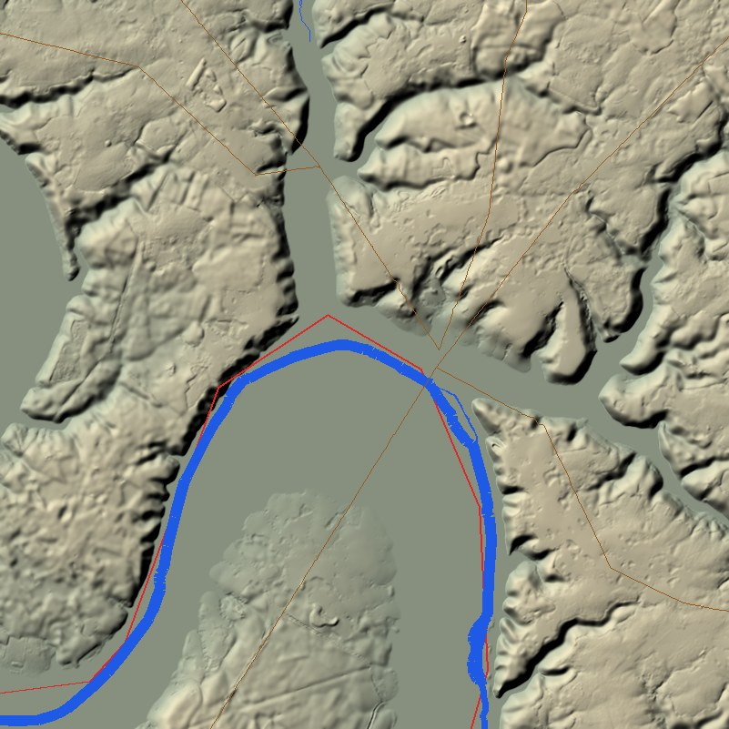

# Pipeline géographique (`tools/cent_ans_tools/geo`)

Construit le terrain de la carte de campagne (`data/map/`) depuis des données ouvertes,
conformément au contrat de `docs/design/m1-campaign-map.md`, puis les provinces
(`provinces.geojson`, `province_ids.png`, voir la section « Provinces » ci-dessous) à partir
de ces sorties (grille, masque terre, rivières) et des seeds de `data/provinces/`.


## Sources de données

| Donnée | Source | Licence | Fichiers |
|---|---|---|---|
| Relief (terre + bathymétrie) | [ETOPO 2022 v1](https://www.ncei.noaa.gov/products/etopo-global-relief-model), NOAA NCEI, grille « ice surface », 15 secondes d'arc, tuiles GeoTIFF 15° × 15° nommées par leur coin nord-ouest | Domaine public (données du gouvernement des États-Unis) ; citation : *NOAA National Centers for Environmental Information. 2022: ETOPO 2022 15 Arc-Second Global Relief Model. doi:10.25921/fd45-gt74* | `https://www.ngdc.noaa.gov/mgg/global/relief/ETOPO2022/data/15s/15s_surface_elev_gtif/ETOPO_2022_v1_15s_<NlatWlon>_surface.tif` (26 tuiles depuis OM2, ~800 Mo ; seules les tuiles touchant le rectangle projeté, `download.etopo_tiles_for_grid`) |
| Voies romaines (routes) | [Itiner-e](https://itiner-e.org), *A High-Resolution Dataset of Roads of the Roman Empire*, version statique 2024 v1.3 (de Soto, Pažout, Brughmans et al.), Zenodo [doi:10.5281/zenodo.17122148](https://doi.org/10.5281/zenodo.17122148) | CC BY 4.0 ; citation : *de Soto P., Pažout A., Brughmans T. et al. (2025). Itiner-e: A high-resolution dataset of roads of the Roman Empire. Scientific Data. doi:10.1038/s41597-025-06140-z* | `https://zenodo.org/api/records/17122148/files/itinere_roads.gpkg/content` (GeoPackage, 34 Mo, sans compte) |
| Hameaux | [GeoNames](https://www.geonames.org/) `cities500.zip` (lieux habités de 500 habitants et plus) | CC BY 4.0, © GeoNames (https://www.geonames.org) | `https://download.geonames.org/export/dump/cities500.zip` (14 Mo) |
| Terre, côte, rivières, lacs | [Natural Earth](https://www.naturalearthdata.com/) 10 m physical, servi par `https://naciscdn.org/naturalearth/10m/physical/<couche>.zip` | Domaine public | `ne_10m_land`, `ne_10m_coastline`, `ne_10m_rivers_lake_centerlines`, `ne_10m_rivers_europe`, `ne_10m_lakes`, `ne_10m_lakes_europe` |

Pourquoi ETOPO 2022 plutôt que GMTED2010 : téléchargement HTTPS direct sans compte, tuiles
légères, bathymétrie incluse (utile pour ombrer la mer) et résolution (≈ 300–460 m) plus fine
que le pixel de la carte (≈ 719 m), donc rééchantillonnage par moyenne sans artefact.

Les fichiers bruts sont mis en cache dans `tools/geo/raw/` (ignoré par git). Un fichier déjà
présent n'est jamais retéléchargé sauf avec `--force`.

## Commandes

```sh
uv run --project tools cent-ans geo build            # télécharge (cache) puis génère data/map/ (terrain, provinces, relief fin 14336 × 12288, routes, colonies, hameaux, grille de navigation) et docs/img/*-preview.png
uv run --project tools cent-ans geo build --force    # retélécharge les données brutes
uv run --project tools cent-ans geo provinces        # provinces seules (≈ 10 s), après modification de seeds ou de poids
uv run --project tools cent-ans geo relief           # relief fin ETOPO seul en 28 × 24 tuiles (repli, écrasé par geo relief-shade)
uv run --project tools cent-ans geo roads            # routes (Itiner-e + complément calculé) puis graphe des colonies
uv run --project tools cent-ans geo roads --computed # routes entièrement calculées (repli)
uv run --project tools cent-ans geo settlements      # graphe des colonies seul et tracé routier des arêtes (≈ 7 s), après modification de data/settlements
uv run --project tools cent-ans geo hamlets          # hameaux GeoNames (≈ 5 s)
uv run --project tools cent-ans geo info             # métadonnées, plage d'altitudes, fraction de terre, tailles
uv run --project tools cent-ans geo relief-all       # cache du relief fin E1-E7 + fleuves et routes fins, hors git (≈ 2,8 Go, heures ; --check pour l'état), voir « Cache du relief fin »
uv run --project tools pytest tests/test_geo.py      # tests sans réseau (grille, encodage des altitudes)
```

La construction complète prend quelques minutes (téléchargement inclus la première fois).

## Projection et convention de pixels

- CRS : **EPSG:3035** (Lambert azimutale équivalente Europe, centre 10° E / 52° N).
- Emprise (ADR 0115, lot OM2) : rectangle projeté **fixé explicitement** dans
  `cent_ans_tools/geo/project.py` (`BOUNDS_PROJECTED`) : x 2 169 486 → 7 323 110 m,
  y 775 684 → 5 193 076 m, soit 28 × 24 tuiles racines de 256 unités. `extent_lonlat` de
  `map.json` n'est qu'indicatif (Maroc atlantique → Oural, mer Blanche → delta du Nil). Bord ouest
  et échelle de l'ancienne carte 4096² (lon −11 → 16°, lat 35 → 60°, élargie en carré) : un ancien
  pixel `(x, y)` vaut `(x, y + 1280)` (`LEGACY_Y_OFFSET_PX`).
- Grille : 7168 × 6144 pixels, `meters_per_px` = 718,9765625 m (isotrope).
- Coordonnées carte : origine au coin **nord-ouest** de `bounds_projected`, X vers l'est,
  Y vers le sud, unité = pixel. Conversion : `px = (x − minx) / mpp`, `py = (maxy − y) / mpp`.
  Le pixel entier `(i, j)` couvre `[i, i+1[ × [j, j+1[`, son centre est `(i + 0,5 ; j + 0,5)`.
  Transformée affine rasterio équivalente : `Affine(mpp, 0, minx, 0, −mpp, maxy)`.
- Helpers : `MapGrid.projected_to_pixel`, `pixel_to_projected`, `lonlat_to_pixel`,
  `pixel_to_lonlat` (`cent_ans_tools.geo.project`).

## Sorties (`data/map/`)

| Fichier | Fabrication |
|---|---|
| `map.json` | Contrat (`crs`, `bounds_projected`, `size_px`, `meters_per_px`, `height_min_m`, `height_max_m`) + `extent_lonlat`, `sources`, `generated_at`. |
| `heightmap.png` | Mosaïque des tuiles ETOPO → reprojection EPSG:3035 par **moyenne** (`rasterio.warp.reproject`) → encodage linéaire 16 bits : `v = round((h + 200) × 65535 / 5000)`, borné à [0, 65535] (−200 m → 0, 4800 m → 65535, pas ≈ 7,6 cm). Les fonds marins sous −200 m sont donc écrêtés à 0. |
| `land_mask.png` | Rasterisation des polygones `ne_10m_land` (255) puis retrait des lacs `ne_10m_lakes` + `ne_10m_lakes_europe` (0). Un pixel est terre si son centre tombe dans un polygone. |
| `rivers.geojson` | `ne_10m_rivers_lake_centerlines` + `ne_10m_rivers_europe`, projetés, découpés à l'emprise, convertis en pixels (1 décimale). Propriétés : `name`, `scalerank`, `featurecla`, `source`. Sans CRS (coordonnées carte). |
| `coastline.geojson` | `ne_10m_coastline` idem, propriétés `scalerank`, `featurecla`. |

Relevé de la construction du 2026-09-23 : `heightmap.png` 14,4 Mo (altitudes présentes −200 → 4549 m,
Mont Blanc moyenné sur 719 m), `land_mask.png` 0,1 Mo (41 % de terre), `rivers.geojson` 0,6 Mo
(485 tronçons, dont Rhin, Loire, Seine, Rhône, Garonne, Èbre, Tamise), `coastline.geojson` 0,6 Mo
(289 tronçons). Construction : ≈ 10 s hors téléchargement.

`docs/img/map-preview.png` : aperçu 1024² (relief hypsométrique + ombrage, côte en noir,
rivières en bleu) pour vérification visuelle.

## Régénérer

1. `uv run --project tools cent-ans geo build` (ajouter `--force` pour ignorer le cache).
2. Vérifier `uv run --project tools cent-ans geo info` et l'aperçu.
3. Commiter `data/map/*` et `docs/img/map-preview.png` ensemble : les provinces en dépendent.

Pour changer l'emprise ou la résolution, modifier les constantes de
`cent_ans_tools/geo/project.py` (`BOUNDS_PROJECTED`, `WIDTH_PX`, `HEIGHT_PX`) et la plage
d'altitudes dans `terrain.py`, puis reconstruire et mettre à jour le contrat de design. Toute
donnée écrite à la main en pixels carte doit alors être migrée (voir « Emprise
Oural–Méditerranée »).

## Emprise Oural–Méditerranée (lot OM2, ADR 0115)

Régénération complète, dans cet ordre (mesuré le 29/09/2026, M4 Pro, 406 provinces, bruts en
cache) :

```sh
uv run --project tools cent-ans geo build          # 5 min 08 : terrain, provinces (34 s), relief ETOPO, routes, colonies, hameaux, grille de navigation
uv run --project tools cent-ans geo splat          # 2 min 20 : coast_dist, province_border_dist, puis landcover (splat, wetlands, forest_kind)
uv run --project tools cent-ans geo relief-shade   # 1 min 04 : tuiles fines Copernicus + ETOPO, heightmap_render, relief_shade_<i>
uv run --project tools cent-ans geo navgrid        # 6 s : recalcul avec splat et wetlands
uv run --project tools cent-ans geo rivers-render  # 14 s : rivers_render.json, river_bed.png, crossings_px.json
uv run --project tools cent-ans geo horizon        # 26 s : game/assets/horizon/relief/
```

Total ≈ 9 min 20. Après une modification des seules graines ou colonies :
`geo provinces`, `geo roads` (routes, colonies, tracés), `geo hamlets`, `geo splat`,
`geo navgrid`, `geo rivers-render`, `geo horizon` (le relief ne dépend pas des provinces).

- **Bruts** : 26 tuiles ETOPO (14 ajoutées, ≈ 480 Mo), KK10 1330-1349 sur lon −37 → 69,
  lat 24 → 71 (`kk10_1330_1349_om.npz`, 1,1 Mo, 16 s), Natural Earth
  `ne_10m_geography_regions_polys` (déserts nommés). Pas de GLO-90/GLO-30/WorldCover à l'Est :
  l'Ouest garde Copernicus (bbox lon −11 → 12, lat 41 → 60), l'Est et le Sud n'ont qu'ETOPO.
  Le cache `copernicus_cache/cop_<w>x<h>_<minx>_<maxy>.npy` dépend de la grille (705 Mo).
- **Occupation du sol de repli** (`landcover.dryness`) : sans source fine à l'Est, la forêt
  potentielle est retirée dans les steppes pontique, caspienne et kazakhe (au sud d'une ligne
  delta du Danube – Kiev – Voronej – Samara – Oufa, montagnes au-dessus de ~700 m exceptées),
  sur le plateau anatolien, dans la ceinture aride au sud de ~34° N (Atlas et Liban exceptés)
  et dans les déserts Natural Earth ; KK10 donne le défrichement partout.
- **Altitudes** : plage inchangée (−200 → 4800 m) : le quadtree décode E0 (`height/`) avec
  l'encodage de la pyramide, qui n'est pas recuite. La Caspienne (−28 m) est couverte ; les
  sommets du Caucase au-dessus de 4800 m sont écrêtés (30 px de `heightmap.png`, 147 px fins,
  ≈ 20 km²).
- **Terres hors provinces** : à plus de 400 km par la terre d'une graine (voir « Provinces »),
  province 0 dans `province_ids.png`, **infranchissables** dans `navgrid.png` ; la vérification
  des masses terrestres de la grille ne les compte pas (Scandinavie et continent ne sont reliés
  que par elles). Une province insulaire trop loin de toute côte (Gotland) reçoit une liaison
  maritime vers la province la plus proche.
- **Pyramide** (avant R7, voir ADR 0121) : rien n'est recuit. `relief_pyramid.json` porte `root_origin_tiles: [0, 5]` :
  la tuile (k, col, row) du cache est la tuile monde (col, row + 5·2^k). Le code de cuisson
  travaille dans ce cadre (`pyramid.map_bounds` = ancien carré 4096², `FineRelief` relit E0 avec
  le décalage) ; les points des tuiles CAFV (fleuves et routes fins) sont en unités de ce cadre.
  `geo anchors-fine` et `geo towns` refusent de tourner tant que le décalage n'est pas nul
  (`pyramid.require_world_frame`) : leurs sorties ont été migrées.
- **Migration +1280 y** (`python -m cent_ans_tools.geo.migrate_om2`, une seule fois, refuse une
  seconde passe) : `data/landmarks/*.json` (`anchor.px`), `fine_anchors.json`,
  `towns_1340.json`. Les points visés à la main par les tests et scripts Godot ont été décalés
  dans le même lot. Rien à migrer en lon/lat ou `origin_3035`.
- **Fichiers** : aucun fichier versionné au-delà de 50 Mo ; `relief_shade` en 4 bandes (31, 31,
  41, 31 Mo), `heightmap_render.png` 44,5 Mo, `heightmap.png` 43,5 Mo, `splat.png` 25 Mo, 672
  tuiles `height/` (159 Mo au total).

## Provinces (`cent_ans_tools/geo/provinces.py`)


Entrées : `data/map/` (grille, `land_mask.png`, `rivers.geojson`) et, pour chaque
`data/provinces/*.json`, `geo.seed_lonlat`, `geo.capital_lonlat`, `geo.voronoi_weight`, `owner`,
`name.display`. Les provinces sont indexées de 1 à 132 dans l'ordre alphabétique des ids
(`index` dans les propriétés du GeoJSON).

### Méthode : Voronoï pondéré par distance de coût

1. **Grille de travail 1792 × 1536** (blocs de 4 px, terre si ≥ 8 des 16 pixels sont terre). Chaque
   province a deux sources : son seed et sa capitale (la capitale appartient par définition à
   sa province ; un seed en mer est ramené sur la terre la plus proche, cas de Gênes).
2. **Coût par cellule** : terre = 1, cellule traversée par un fleuve majeur (`scalerank ≤ 4`,
   rastérisé) = 4, mer = infranchissable. Pour chaque province, `skimage.graph.MCP_Geometric`
   (Dijkstra géodésique, 8-connexité) donne la distance de coût depuis ses sources ; la cellule
   va à la province minimisant `coût / voronoi_weight`. Les provinces ne sautent donc jamais
   un détroit (Manche, Pyrénées contournées par les cols…) et les fleuves font frontière douce.
   Relevé OM2 : 313 provinces en 28 s tout compris (vectorisation, voisins, aperçu), 420
   (graines factices ajoutées hors dépôt) en 34 s.
3. **Terres hors provinces (ADR 0115, lot OM2)** : une cellule de terre dont la distance *par la
   terre* (Dijkstra 8-connexe) à la graine ou capitale la plus proche dépasse
   `MAX_SEED_DISTANCE_KM` = 400 km reste à 0 (Sahara, Arabie, steppe kazakhe, Sibérie, et pour
   l'instant tout l'Est tant que les lots de données n'y ont pas mis de graines). Une petite masse
   sans graine (île, ≤ `MAX_SEEDLESS_ISLAND_PX` = 64 000 px ≈ 33 000 km²) à moins de 400 km à vol
   d'oiseau d'une source rejoint la province la plus proche (Man, Wight, Baléares mineures) ; une
   grande masse sans graine (Islande, Afrique sans graine) reste à 0. Chaque propagation du
   Voronoï est coupée à 2 × 400 km de coût et calculée sur une fenêtre autour de ses sources :
   le temps croît avec le nombre de provinces, pas avec leur produit par la surface de la carte.
4. **Retour à la grille carte** : suréchantillonnage au plus proche, masquage par `land_mask.png`
   et par les terres atteignables (dilatées d'une cellule pour garder les pixels côtiers),
   puis remplissage des pixels terre sans étiquette (îlots, pixels perdus par le
   sous-échantillonnage) par l'étiquette la plus proche (distance euclidienne). Lissage des
   frontières par filtre majoritaire 5 × 5 (la mer est d'abord remplie par le plus proche voisin
   pour ne pas éroder les côtes, puis remasquée).
5. **Vectorisation** : `rasterio.features.shapes` (coins de pixels, 4-connexité) → union →
   `simplify(1,5 px, topologie préservée)` → parties < 30 px² supprimées (au moins une partie
   conservée). Les polygones sont simplifiés indépendamment : de minuscules écarts entre
   voisins sont possibles ; `province_ids.png` reste la référence pour le picking.
6. **Propriétés** : `centroid` = centroïde de la plus grande partie si elle le contient, sinon
   `representative_point` ; `capital_px` = projection de `capital_lonlat`, ramenée au pixel le
   plus proche de sa province si elle tombe en mer ou ailleurs (le rapport de construction le
   signale) ; `neighbors` = provinces partageant ≥ 3 paires de pixels adjacents (4-connexité)
   ; `sea_neighbors` = provinces non voisines par terre dont des pixels côtiers (1 sur 4,
   KD-tree) sont à moins de 60 px (≈ 43 km) ; `area_px` = nombre de pixels.

### Sorties

| Fichier | Contenu |
|---|---|
| `data/map/province_ids.png` | PNG RGB 7168 × 6144 : `R = index & 255`, `G = index >> 8`, `B = 0`, 0 = mer ou aucune. |
| `data/map/provinces.geojson` | `FeatureCollection` en coordonnées carte (1 décimale), propriétés `id`, `index`, `name`, `owner`, `centroid`, `capital_px`, `neighbors`, `sea_neighbors`, `area_px`. |
| `docs/img/provinces-preview.png` | 1024² : remplissage par `heraldry.primary_color` du propriétaire sur ombrage du relief, frontières noires, capitales en points blancs. |

Relevé de la construction du 2026-09-23 : 10 s, 0,35 Mo de GeoJSON (34 multipolygones), 302
arêtes terrestres (0 à 10 voisins, 4,6 en moyenne ; la Sardaigne n'a que des liaisons
maritimes), 15 liaisons maritimes (Kent–Boulonnais, Boulonnais–Flandre, Flandre–Hollande,
Corse–Sardaigne, Normandie–Ponthieu, Galloway–Highlands…). Seed déplacé : Gênes (en mer sur la
grille de travail). Capitales ramenées : Corse (Ajaccio) et Vénétie (Venise), toutes deux en mer
sur le masque.

Pour retoucher une frontière : modifier `seed_lonlat` / `voronoi_weight` dans
`data/provinces/<id>.json`, relancer `cent-ans geo provinces`, vérifier l'aperçu, commiter
`data/map/provinces.geojson`, `data/map/province_ids.png` et `docs/img/provinces-preview.png`
ensemble.

## Colonies (`cent_ans_tools/geo/settlements.py`, lot C3)


Entrées : `data/settlements/*.json`, `data/provinces/` (terrain, `capital_city`, ports),
`province_ids.png`, `provinces.geojson` (`neighbors`, `sea_neighbors`) et `roads.geojson` s'il
existe. Une province sans fichier (ou sans `city`) reçoit **la même cité de repli que le chargeur
Rust** (`Settlement::fallback_city`) : id `set_<slug>` (slug identique à `slugify` Rust), ou
`set_<slug>_<province>` si l'id est déjà pris par un fichier, `port` si la province est côtière
avec ports. Le graphe couvre donc toujours les 132 provinces ; relancer la commande quand des
fichiers de colonies arrivent.

1. **Position de jeu** : `lonlat` projeté (`MapGrid.lonlat_to_pixel`), tronqué au dixième de pixel.
   Si le pixel n'appartient pas à la province de la colonie (`province_ids.png`), la position est
   ramenée au pixel de la province le plus proche situé à ≥ 3 px de sa frontière et à ≥ 4 px des
   autres colonies (pour ne pas empiler Rye, Winchelsea et Hastings) ; le rapport le signale. Le
   `lonlat` des données n'est jamais modifié.
2. **Graphe** (spec § 4.4), non orienté, une entrée par paire (`from < to`) :
   - dans une province : triangulation de Delaunay ; arêtes > 2,5 × la médiane de la province
     retirées sauf si elles appartiennent à l'arbre couvrant minimal (graphe interne connexe) ;
   - entre provinces voisines (`neighbors`) : 1 à 3 paires les plus proches, sans colonie
     commune, à moins de 1,5 × la distance de la plus proche. Si le segment passe à plus de 50 %
     sur l'eau (détroits de Messine, Øresund…) et relie deux ports, l'arête devient `sea` ; sinon
     elle reste terrestre et le rapport le signale ;
   - entre `sea_neighbors` : la paire de colonies `port` la plus proche (`sea: true`) ; si l'une
     des provinces n'a aucun port, le rapport le signale.
3. **Coût** (sans unité, le cœur le rééchelonne) : longueur en km × coût du terrain
   (`terrain_cost` de `movement.rs` : 2 pour `mountains` et `marsh`, 1 sinon ; moyenne des deux
   provinces pour une arête frontalière), ÷ 2 si `road`. Arête `sea` : 100 (embarquement et
   débarquement, ≈ une traversée de province) + km.
4. **Route** : une arête terrestre porte `road: true` si la distance moyenne de son segment au
   réseau de `roads.geojson` (transformée de distance sur la grille carte) est < max(3 km, 4 % de sa
   longueur) — la tolérance relative évite de rater une voie qui serpente le long d'une arête
   de 200 km entre deux cités de repli.

| Fichier | Contenu |
|---|---|
| `data/map/settlement_graph.json` | `{"edges": [{"from", "to", "cost", "road", "sea"}]}`, format du lot C1 (chargé par `settlement_load.rs`, aucun autre champ). |
| `data/map/settlements_px.json` | `{"set_…": [x, y]}` : position de jeu en pixels carte 4096 (1 décimale), pour Godot. |
| `data/map/settlement_edge_paths.json` | Lot C7b, affichage seulement : `{"edges": [{"from", "to", "points"}]}`, tracé routier (pixels carte, 1 décimale, de `from` à `to`, extrémités sur les colonies) de chaque arête `road` qu'une route suit ; lu par `SettlementData.edge_path` pour l'aperçu de chemin d'armée. Voir ci-dessous. |
| `docs/img/settlements-preview.png` | 2048 px de large : provinces, colonies par type (cité rouge, ville orange, château gris, abbaye violette, village vert ; contour blanc = position ramenée), arêtes grises, routes brunes, liaisons maritimes en tirets bleus. |

Relevé du 2026-09-24 (132 fichiers de colonies, aucune cité de repli) : 568 colonies,
1 345 arêtes terrestres dont 634 sur route, 28 maritimes, graphe connexe ; 71 colonies ramenées
dans leur province (côtes et frontières du Voronoï : Saint-Malo, La Rochelle, Plymouth, Venise,
Alicante… ; certaines sont peut-être rattachées à la mauvaise province dans les données, par ex.
Galway en Ulster, Lund en Sjælland, Auch en Rouergue, Mantoue et Modène à Ferrare).

### Tracé routier des arêtes (`cent_ans_tools/geo/edge_paths.py`, lot C7b)

Écrit par la même commande (`geo settlements`, `geo roads`, `geo build`). Le graphe garde des
arêtes droites (coûts, règles) ; ce fichier ne sert qu'à dessiner l'aperçu de chemin le long des
vraies routes.

1. **Réseau** : les routes de `roads.geojson` sont densifiées (un point par pixel au plus) ; les
   points consécutifs sont reliés (poids = longueur) ainsi que tous les points à moins de 3 px
   l'un de l'autre (croisements, jonctions et petits trous entre tronçons Itiner-e ; poids
   × 1,5).
2. **Recherche** par arête `road` : Dijkstra depuis les points de route à moins de
   `min(16, max(6, 15 % de la longueur))` px de la première colonie (accès hors route compté
   × 3) jusqu'aux points proches de la seconde.
3. **Rejet** : un tracé plus long que 1,6 × le segment droit + 3 px est écarté (la route fait un
   détour par une autre ville) ; le jeu dessine alors le segment droit. Tracé simplifié à 0,15 px.

Relevé du 2026-09-24 : 533 arêtes tracées sur 633 arêtes `road` (84 %) ; détour médian 1,11,
95ᵉ centile 1,37 ; 29 points par arête en moyenne ; 0,3 Mo ; ≈ 4 s. Les 100 autres : colonie à
plus de 16 px d'une route (64), détour trop long (35), réseau coupé (1).

## Routes (`cent_ans_tools/geo/roads.py`)

Source retenue : **Itiner-e** (voir « Sources de données »), téléchargeable sans compte via l'API
Zenodo. Les tronçons `Hypothetical` sont écartés ; `Certain` et `Conjectured` (voies principales
et secondaires) sont reprojetés en pixels carte, découpés à l'emprise, simplifiés (0,4 px) et
gardés s'ils passent pour moitié au moins dans une province jouable.

Itiner-e s'arrête au limes (Irlande, Écosse, Germanie à l'est du Rhin, Danemark, Suède,
Bohême…). Les provinces qu'il ne couvre pas (densité < 4 px de route pour 1 000 px de province)
reçoivent des **routes calculées** : plus court chemin de coût (`skimage.graph.MCP_Geometric`,
grille de travail (carte / 4), coût = 1 + 25 × pente de `heightmap.png` + 6 sur un fleuve de `scalerank` ≤ 6, mer
infranchissable) le long des arêtes terrestres du graphe entre colonies `city`/`town`. Le même
calcul sert de repli complet si Itiner-e est indisponible (3 tentatives) ou avec `--computed`.

`data/map/roads.geojson` : `FeatureCollection` sans CRS, `LineString` en pixels carte
(1 décimale), propriétés `name`, `type` (`main`, `secondary`, `computed`), `certainty`,
`source` (`itiner-e` ou `computed`). Relevé du 2026-09-24 : 2,3 Mo, 6 834 tronçons Itiner-e et
70 tronçons calculés, ≈ 153 000 km.

## Hameaux (`cent_ans_tools/geo/hamlets.py`)

Décor sans état de jeu (spec § 3.3). Source : GeoNames `cities500` (CC BY 4.0, © GeoNames).

1. Classe `P`, codes `PPL`, `PPLA`–`PPLA5`, `PPLC`, `PPLF`, `PPLG`, `PPLL`, `PPLR`, `PPLS`
   (sections, lieux historiques, abandonnés ou détruits exclus), dans une province jouable ;
2. à plus de 3 km de toute colonie ;
3. ≈ 3 000 au total, répartis entre provinces pour moitié selon la surface, pour moitié selon
   la population de 1337 (`data/provinces`) ;
4. dans une province, candidats dans un ordre pseudo-aléatoire fixe (graine 1337 ; la population
   moderne favoriserait les villes industrielles), acceptés avec un espacement
   max(6 km, 0,6 × √(surface / quota)), puis complétés à 6 km si le quota n'est pas atteint.
   L'espacement de 6 km vaut aussi d'une province à l'autre.

`data/map/hamlets.json` : `[{"name", "px": [x, y], "province"}]`, nom GeoNames `name` (forme
locale, pas `asciiname`), une entrée par ligne. Relevé du 2026-09-24 : 2 999 hameaux dans les 132
provinces (71 306 candidats), 0,2 Mo.

## Relief fin dans le cadre monde, palier 1 sur tout le monde (lot OMR R7, ADR 0121)

Depuis R7, la pyramide est dans le cadre du monde (`root_origin_tiles` [0, 0], 28 × 24 tuiles
racines) : l'ancien carré de l'Ouest ([0, 5]) a été **renommé** (tuile (k, c, r) → (k, c,
r + 5·2^k), CAFV décalés de +1280 unités en y), pas recuit. Le palier 1 (E1-E2, GLO-90) couvre
toutes les terres du monde OM et a été recuit en entier (`tier1` version 3) ; E3-E7 restent sur
le cœur et les zones de détail de l'Ouest (pas de GLO-30 à l'Est).

```sh
uv run --project tools cent-ans geo pyramid --levels 1,2        # en flux : blocs de 4 × 4 tuiles E1
uv run --project tools cent-ans geo relief-reframe              # cache d'avant R7 → cadre monde (sur place)
uv run --project tools cent-ans geo relief-reframe --src <cache>   # depuis un autre cache (liens durs)
```

- **Flux** : pour chaque bloc, les tuiles GLO-90 manquantes sont téléchargées, le bloc cuit, puis
  les tuiles qu'aucun bloc suivant ne lit sont supprimées (sauf l'emprise de l'Ouest, gardée pour
  `geo relief-shade`) ; arrêt propre sous 25 Gio libres, reprise en relançant.
- **Relevé du 29/09/2026** (M4 Pro, machine chargée, 8 processus) : 146 blocs, 1 902 tuiles GLO-90
  téléchargées (6,66 Go, aucune conservée), 9 262 tuiles écrites (E1 1 968, E2 7 294), 2,68 Go,
  12 min 35 s. Cache complet 4,98 Go (E1 590 Mo, E2 2,09 Go, E3-E7 inchangés, fleuves 44 Mo,
  routes 21 Mo). Écart E1 (GLO-90) / E0 (ETOPO) à l'Est : moyen 4,9 m, médian 5,7 m, p95 42 m.
- **Cadre du cache** : `pyramid/frame.json` ; sans lui, un cache est supposé d'avant R7 et
  `geo relief-all` le recadre sur place avant toute autre étape.
- **Aval régénéré** : `geo hydro-fine` (Natural Earth hors du cœur : 221 000 km, 4 446 tuiles),
  `geo anchors-fine` (2 144 colonies, 3 545 tuiles de routes, 342 000 km) et `geo towns`
  (2 137 villes), débloqués par le cadre monde.
- Paquet « Cent Ans relief » v2 (`relief_hosting.json`), non publié.

## Relief en tuiles (`cent_ans_tools/geo/relief.py`)

Relief fin **14336 × 12288** (≈ 360 m/px) sur la même emprise (1 px fin = ½ px carte), ETOPO 2022 15″ rééchantillonné **bilinéairement** (la cible est aussi fine que la
source ; une moyenne laisserait des marches), même encodage 16 bits que `heightmap.png`.
Découpé en 28 × 24 tuiles PNG de 512² : `data/map/height/h_<col>_<row>.png` couvre les pixels
`[col × 512, (col + 1) × 512[` en X et `[row × 512, (row + 1) × 512[` en Y, sans recouvrement
(pour coudre deux maillages, lire la première ligne ou colonne de la tuile voisine).
`map.json` déclare :

```json
"height_tiles": {"size_px": [14336, 12288], "tile_px": 512, "dir": "height", "pattern": "h_{col}_{row}.png"}
```

`heightmap.png` (grille carte) est conservé pour la compatibilité. Relevé du 2026-09-24 : 256 tuiles,
50,5 Mo au total (pas de LFS dans le dépôt ; sous le seuil de 150 Mo, PNG 16 bits conservé),
≈ 10 s. Écart moyen avec `heightmap.png` après moyenne 2 × 2 : 0,5 m.


## Relief fin Copernicus et occupation du sol vers 1340 (lot R1, ADR 0019)

Ordre de régénération : `geo relief-shade` (après `geo build`) puis `geo landcover` (après
`geo splat`, qui l'appelle d'ailleurs à la fin). `geo relief` (ETOPO seul) reste un repli : il
écrase les tuiles fines Copernicus.

- `cent-ans geo relief-shade` (`relief_shade.py`, `copernicus.py`) : télécharge les 312 tuiles
  Copernicus DEM GLO-90 de l'emprise jouable (lon −11 → 12, lat 41 → 60 ; ≈ 1 Go dans
  `tools/geo/raw/copernicus/`, HTTPS anonyme, gratuit), les **moyenne** sur la grille fine
  (la source à 90 m est 4 × plus fine : moyenne de zone, pas d'interpolation), ETOPO en mer et
  hors emprise. Écrit les tuiles `height/`, `heightmap_render.png` (moyenne 2 × 2, relief de
  rendu lu par `MapData`) et `relief_shade_<i>.png` (LA8, grille fine en 4 bandes horizontales de 3072 lignes, `map.json.relief_shade.bands`, pour rester sous 50 Mo par fichier : détail + occlusion). Rehaussement
  de rendu (masque flou, σ 5 km, gain 0,8, ±120 m, effacé au-dessus de 600-1 600 m), trait de
  côte identique à `heightmap.png`. `heightmap.png` et `navgrid.png` ne changent pas. ≈ 40 s
  avec le cache `tools/geo/raw/copernicus_cache/cop_8192.npy`.
- `cent-ans geo kk10` : extraction KK10 1330-1349 par requêtes HTTP partielles (le fichier
  complet fait 18,5 Go) ; dépendances ponctuelles :
  `uv run --project tools --with h5py --with fsspec --with aiohttp --with requests cent-ans geo kk10`
  (≈ 8 min, cache `tools/geo/raw/kk10/*.npz` de 190 ko).
- `cent-ans geo landcover` (`landcover.py`) : `splat.png` grille carte (forêts : défrichement KK10 ×
  potentiel forestier, massifs nommés de `historical_forests.json`, allocation binaire par score
  bruit + terrain, essarts autour des villes et hameaux), `wetlands.png` (RGB : marais, étangs,
  prés humides, depuis `wetlands.json` et les fonds de vallée), `forest_kind.png` (L8 demi-grille, part
  de résineux, pour le rendu des forêts). ≈ 70 s.

## Cache du relief fin : pipeline complet des paliers 1-3 (lot ZG7b, ADR 0036)

La carte zoomable (chantier ZG) lit un cache **non versionné** sous `data/map/pyramid/` :
tuiles de relief E1-E7 et tuiles fines des fleuves et des routes. Sans lui, le jeu garde le relief
E0 (360 m), la caméra s'arrête vers 7 unités et la carte de campagne affiche l'avis « Relief
rapproché limité » (une fois par session, fermable) avec la commande ci-dessous. Les manifestes,
eux, sont versionnés (`relief_pyramid.json`, `rivers_fine.json`, `fine_anchors.json`) : ils
disent quelles tuiles doivent exister.

```sh
uv run --project tools cent-ans geo relief-all --check   # état : tuiles présentes / attendues par étage, bruts ; code 1 si incomplet
uv run --project tools cent-ans geo relief-all           # régénère ce qui manque, dans l'ordre, avec reprise
uv run --project tools cent-ans geo relief-all --force   # recuit tout depuis zéro
```

`geo relief-all` (`geo/relief_cache.py`) contrôle chaque tuile listée (≈ 15 000 `stat`, moins
d'une seconde), puis enchaîne seulement les étapes utiles :

| # | Étape | Produit | Bruts téléchargés (`tools/geo/raw/`) | Durée mesurée (M4 Pro, 14 cœurs) |
|---|---|---|---|---|
| 1 | `geo pyramid --levels 1,2` | E1-E2 (palier 1, 180 → 90 m), 1 382 tuiles, 0,41 Go | Copernicus GLO-90 `copernicus/` 0,96 Go, ETOPO `etopo2022/` 0,28 Go (et le cache `copernicus_cache/` de `geo relief-shade`) | ≈ 1 min |
| 2 | `geo pyramid --levels 3,4` | E3-E4 (palier 2, 45 → 22 m), 8 451 tuiles, 2,1 Go | GLO-30 `copernicus30/` 4,8 Go (172 tuiles), ESA WorldCover `worldcover/` 1,4 Go ; travail `pyramid_work/` 0,6 Go | téléchargement ≈ 6,5 min, cuisson plusieurs heures (non mesurée d'un trait : reprise après coupure) |
| 3 | `geo detail-dem` (`--force` si l'étape 2 a écrit des tuiles : les zones sont refondues dans E4) | E5-E7 (palier 3, 11 → 2,8 m) sur les 34 zones, 2 110 tuiles, 0,2 Go | MNT nationaux + OSM `detail/` 1,3 Go | ≈ 30 min téléchargements compris, 12 min de cuisson |
| 4 | `geo hydro-fine` | fleuves fins `pyramid/hydro_fine/`, 1 306 tuiles, 39 Mo | BD TOPAGE, OS Open Rivers, EU-Hydro `hydro/` 2,7 Go | ≈ 2 à 10 min |
| 5 | `geo anchors-fine` | routes drapées `pyramid/roads_fine/`, 1 261 tuiles, 13 Mo (+ `fine_anchors.json`) | — | ≈ 1-2 min |

Règles d'enchaînement : une étape manquante est lancée, et toute étape en aval d'une étape lancée
l'est aussi (4 et 5 relisent le relief le plus fin, 3 se fond dans E4). Chaque commande reprend
ce qui est déjà sur le disque (tuiles présentes sautées, marqueurs `done_E<k>.json` de ZG3,
lots de recalage en cache de ZG5a) : après une interruption, relancer `geo relief-all`. Les
bruts déjà téléchargés ne le sont jamais une seconde fois.

- **Disque** : cache ≈ 2,8 Go (relevé du 25/09/2026 : E1 94 Mo, E2 311 Mo, E3 491 Mo, E4 1,6 Go,
  E5 51 Mo, E6 83 Mo, E7 71 Mo, fleuves 39 Mo, routes 13 Mo) ; bruts ≈ 11 Go en plus
  (`tools/geo/raw/`, supprimables une fois le cache cuit, sauf à vouloir recuire). Plafonds de
  l'ADR 0036 : bruts ≤ 20 Go, pyramide ≤ 4 Go.
- **Coût** : 0 $ (services publics HTTPS anonymes, sans clé).
- **Prérequis** : `geo build`, `geo relief-shade` et `geo landcover` déjà faits (fichiers
  versionnés de `data/map/`), réseau pour les téléchargements.
- **Worktrees d'agents** : ne jamais recuire ; lier `data/map/pyramid` et `tools/geo/raw` au
  dépôt principal (liens symboliques).

### Versions de cuisson (lot SZ2)

Le manifeste versionné `relief_pyramid.json` porte `bake_versions` (`tier1`, `tier2` :
`pyramid.BAKE_VERSION` ; `tier3` : `detail_dem.BAKE_VERSION`) ; le cache porte les siennes dans
`pyramid/bake.json` (version, début, cuisson finie ; module `geo/bake_stamp.py`). Un palier cuit
par une autre version (ou jamais estampillé : caches d'avant SZ2) est **périmé** : `relief-all
--check` le signale (code 1) et `relief-all` le recuit, avec tout l'aval, sans `--force`. Une
cuisson périmée ou forcée note son heure de début : interrompue, elle reprend en ne recuisant que
les tuiles plus anciennes. `detail_dem.BAKE_VERSION` entre aussi dans la clé des recalages de
`hydro-fine`.

### Fonds de vallée non creusés (lot SZ2)

Le rehaussement de rendu (ADR 0019 : `h + 0,8 · clamp(h − flou σ 5 km, ±120 m)`) creusait les
vallées encaissées de 0,8 × (base − fond), la base σ 5 km contenant les plateaux voisins : Seine
à 0,5 m de Paris à Rouen (plancher de côte), Loire à 15 m à Amboise, et chaque étage autrement
(bases et résolutions différentes), d'où la Loire fine d'Orléans sous ses berges E7. La terre
rehaussée ne descend plus sous `relief_shade.valley_floor(h) = max(0,5 ; 0,85 h ; h − 2 m)`
(monotone en `h` : pas de gradins), à E0 (`heightmap_render.png`, `height/`, `relief_shade.png`)
comme à E1-E7. Collines et coteaux restent rehaussés ; l'exagération ZG8 (au-dessus du fond de
vallée, à l'exécution) fait le reste. Paramètres dans `map.json` (`render_heightmap.boost`).

- **Jeu exporté** : `tools/export_macos.sh` copie le cache avec les données (voir l'addendum ZG7b
  de l'ADR 0036 et `docs/godot-map.md`, « Vue d'ensemble ZG »).

Sources et licences des paliers :

| Palier | Source | Licence / attribution exigée |
|---|---|---|
| 1 (E1-E2) | Copernicus DEM GLO-90 (ESA, programme Copernicus), bucket public `copernicus-dem-90m` | licence Copernicus DEM (usage libre, attribution) : « © DLR e.V. 2010-2014 and © Airbus Defence and Space GmbH 2014-2018 provided under COPERNICUS by the European Union and ESA; all rights reserved » |
| 2 (E3-E4) | Copernicus DEM GLO-30, bucket public `copernicus-dem-30m` ; ESA WorldCover 10 m 2021 v200 (correction canopée et bâti) | GLO-30 : même mention ; WorldCover : CC BY 4.0, « © ESA WorldCover project 2021 / Contains modified Copernicus Sentinel data (2021) processed by ESA WorldCover consortium » |
| 3 (E5-E7) | IGN RGE ALTI® 1 m / 5 m (France, WMS-R Géoplateforme), Environment Agency LIDAR Composite DTM 1 m (Angleterre), AHN DTM 0,5 m (Pays-Bas, PDOK), DHM Vlaanderen II / I (Flandre) ; repli GLO-30 (Wallonie) ; anachronismes d'OpenStreetMap (Overpass, méthode seulement) | IGN : Licence Ouverte Etalab 2.0, « Source : IGN – RGE ALTI® » ; EA : Open Government Licence v3.0, « © Environment Agency copyright and/or database right 2022. All rights reserved. » ; AHN : CC0 1.0 ; DHM Vlaanderen : Modellicentie Gratis Hergebruik v1.0, mention « © Digitaal Vlaanderen » ; OSM : ODbL 1.0, « © les contributeurs d'OpenStreetMap » |
| Fleuves fins | BD TOPAGE® 2025 (IGN, OFB ; SANDRE), OS Open Rivers, EU-Hydro v1.3 (AEE, Copernicus), Natural Earth | Licence Ouverte Etalab 2.0, « Source : BD TOPAGE® – IGN, OFB » ; OGL v3, « Contains OS data © Crown copyright and database right 2026. » ; politique de données Copernicus, « © European Union, Copernicus Land Monitoring Service 2020, European Environment Agency (EEA). » ; domaine public |

Mentions complètes et textes d'attribution : `CREDITS.md` (section « Données géographiques »).

## Hébergement du paquet « Cent Ans relief » (lot SZ7, ADR 0077)

Le cache du relief fin n'est hébergé nulle part par défaut : un joueur qui reçoit le jeu sans lui
doit soit le recalculer (`geo relief-all`, plusieurs heures, ≈ 20 Go de bruts), soit récupérer un
paquet déjà cuit publié en Releases GitHub d'un dépôt de données séparé (`cent-ans-relief`,
ADR 0077). L'outillage ci-dessous prépare et installe ce paquet ; **publier le dépôt et y envoyer
les parts reste un geste réservé au joueur** (voir plus bas).

```sh
uv run --project tools cent-ans geo relief-pack --out dist/relief   # empaquette (local, sans réseau)
uv run --project tools cent-ans geo relief-fetch --from-dir dist/relief   # installe depuis des parts locales
uv run --project tools cent-ans geo relief-fetch                    # télécharge depuis data/map/relief_hosting.json
```

- **`relief-pack`** (`cent_ans_tools.geo.relief_pack`) archive `data/map/pyramid/` (E1-E7,
  `hydro_fine/`, `roads_fine/`) en `.tar` **non compressé**, en flux (aucune copie intégrale en
  mémoire), découpé en parts strictement sous 1,9 Gio (marge sous la limite de 2 Gio d'un fichier
  de Release GitHub). Vérifie la place disque libre avant d'écrire (marge ×1,1 sur la taille
  estimée) et écrit par défaut dans le dossier `--out` donné par l'appelant (le disque du dépôt
  est presque plein : ne jamais empaqueter sans indiquer une destination avec assez de place, et
  **ne pas lancer sur le vrai cache** depuis un poste dont le disque est déjà serré). Écrit un
  `manifest.json` (version, parts, taille et SHA-256 de chaque part et du flux global, crédits
  copiés depuis `CREDITS.md`, section « Données géographiques »).
  - **Compression** : testée (zstd niveau 19) sur un échantillon synthétique représentatif (PNG
    16 bits façon tuile de relief, blob façon tuile CAFV) — gain ≈ 0 % : les PNG sont déjà
    compressés (DEFLATE) et les tuiles binaires n'ont pas de redondance qu'un second passage
    récupère. Décision : pas de compression (l'ADR 0077 le prévoyait déjà).
  - **Version du paquet** : dérivée automatiquement de la cuisson de la pyramide. `relief-pack`
    compare l'empreinte courante (`bake_versions` de `relief_pyramid.json` — lot SZ2,
    `bake_stamp.py` — plus `generated_at` de `rivers_fine.json` et `fine_anchors.json`, qui n'ont
    pas encore leur propre version de cuisson) à celle enregistrée dans
    `data/map/relief_hosting.json` (`bake.signature`) ; si elle a changé, `version` est
    incrémentée et le fichier réécrit. Une recuisson de la pyramide (SZ2, un futur SZ-suite pour
    hydro/anchors) se répercute donc sans geste manuel, hormis republier.
- **`relief-fetch`** (`cent_ans_tools.geo.relief_fetch`) télécharge chaque part avec reprise HTTP
  (`Range`, stdlib `urllib`, aucune dépendance ajoutée), vérifie son SHA-256, puis extrait le flux
  tar reconstitué (parts concaténées à la volée, jamais matérialisées en un seul fichier) de façon
  atomique : le nouveau `pyramid/` remplace l'ancien par un renommage, jamais de dossier à moitié
  écrit visible. `--from-dir` installe depuis des parts locales (clé USB, tests, dépôt de données
  cloné à part) sans réseau. Destination : `--dest`, sinon `CENT_ANS_RELIEF_DIR`, sinon `data/map`
  (le paquet s'installe alors directement dans `data/map/pyramid`, comme si `geo relief-all`
  l'avait cuit). Termine par `geo relief-all --check` quand la destination contient les
  manifestes versionnés (dépôt de développement).
- `ReliefCacheStatus.FETCH_COMMAND` (jeu, `game/scripts/map/relief_cache_status.gd`) : l'avis
  « relief rapproché limité/incomplet » propose `relief-fetch` en premier (plus rapide), avec
  `relief-all` en repli si aucun hébergement n'existe encore.

### Publier le paquet (geste du joueur)

Aucune commande de ce lot n'envoie quoi que ce soit sur le réseau. Publier le paquet préparé par
`relief-pack` est un choix du joueur, sous son propre compte GitHub :

```sh
# une seule fois : créer le dépôt de données public (séparé du dépôt du jeu, qui reste privé)
gh repo create BenjaminNavet/cent-ans-relief --public --description "Cache de relief fin du jeu Cent Ans (ADR 0077)"

# à chaque nouvelle version (après uv run --project tools cent-ans geo relief-pack --out dist/relief)
gh release create v<N> dist/relief/*.part*.tar dist/relief/manifest.json \
  --repo BenjaminNavet/cent-ans-relief \
  --title "Cent Ans relief vN" \
  --notes "Cache de relief fin (pyramide + fleuves et routes fins). Installer avec : uv run --project tools cent-ans geo relief-fetch"
```

`<N>` est la `version` écrite dans `data/map/relief_hosting.json` (et dans `manifest.json` du
paquet) après le dernier `relief-pack`. `base_url` de `relief_hosting.json` pointe déjà vers
`https://github.com/BenjaminNavet/cent-ans-relief/releases/download/v{version}/` : aucune autre
donnée à changer une fois le dépôt créé et la Release publiée.

## Relief palier 3 : zones de détail E5-E7 (lot ZG3, ADR 0036)

```sh
uv run --project tools cent-ans geo detail-dem                       # toutes les zones
uv run --project tools cent-ans geo detail-dem --zones crecy,calais  # quelques zones
uv run --project tools cent-ans geo detail-dem --zones crecy --force # recuit même si à jour
```

`detail_dem.py` (cuisson), `detail_sources.py` (récupérateurs), `anachronisms.py` (effacement).
Écrit les tuiles `data/map/pyramid/E{5,6,7}/{col}_{row}.png` (gitignorées, même encodage que
`data/map/height/` : PNG `I;16`, [-200, 4800] m) et **seulement** les lignes des étages 5-7 de
`data/map/relief_pyramid.json` (une ligne JSON compacte par étage ; les autres lignes, écrites
par `geo pyramid`, restent identiques octet pour octet).

- **Zones** : `data/map/detail_zones.json` (34 zones : les 7 villes emblématiques, batailles,
  sièges et forteresses, chacune justifiée dans `why`). Emprises carrées centrées : E5 (11,2 m)
  sur `half_size_km`, E6 (5,6 m) sur min(half, 6 km), E7 (2,8 m) sur min(half, 3 km), réglables
  par zone (`level_half_km`). Les zones dont les tuiles se chevauchent (Paris + Vincennes,
  Bruges + L'Écluse, Orléans + Patay en E5) sont cuites ensemble.
- **Sources** (vérifiées le 25/09/2026, gratuites, sans clé) : IGN RGE ALTI (WMS-R
  Géoplateforme, GeoTIFF float32, 5010 px max, 3 requêtes simultanées), Environment Agency
  LIDAR Composite DTM 1 m (WCS 2.0.1, `scalefactor`), AHN `dtm_05m` (WCS PDOK, `scalesize`,
  lent), DHM Vlaanderen (WCS 2.0.1, réponse multipart, pas de mise à l'échelle : blocs de
  2 km à 1 m moyennés localement ; `DHMVI_DTM_5m` pour E5). Wallonie : MNT servi en images
  rendues seulement → repli GLO-30 (Tournai), rendu grossièrement « sol nu » par ouverture
  morphologique (150 m) puis flou léger. Chaque source est demandée à la moitié du pixel de
  l'étage (moyenne de zone ensuite), dans sa projection native ; décalage d'altitude TAW → NAP
  (−2,33 m) pour la Flandre. Politesse : requêtes limitées par hôte (1 à 3 simultanées, écart
  minimal), 6 essais à attente exponentielle, User-Agent du projet.
- **Cache brut** : `tools/geo/raw/detail/<zone>/E<k>/<source>_NNN.tif` (float32 arrondi au
  1/64 m, deflate), réponses Overpass `osm_modern_v2.json`, marqueurs `done_E<k>.json`
  (empreinte des paramètres : une zone à jour n'est pas recuite ; reprise après interruption
  bloc par bloc).
- **Effacement des anachronismes** : Overpass (`overpass-api.de`, une requête par zone,
  en série) → autoroutes et voies rapides (bretelles comprises), voies ferrées (y compris
  désaffectées), carrières, décharges, réservoirs et bassins, canaux (hors zones urbaines, où
  ils sont souvent médiévaux), pistes d'aéroport, digues et jetées de port ; ponts et tunnels
  exclus. Tampon par classe (16 à 60 m), dilatation de 2 px, puis interpolation harmonique
  (Laplace, résolution directe par composante) depuis les bords. Talus, terrasses, mottes et
  fossés anciens restent. Petits trous sans donnée (rivières, étangs < 25 ha) comblés de même.
  Aperçus avant/après (ombrage, masque en rouge) : `docs/img/zg3/`.
- **Raccord** : rehaussement de rendu identique à `heightmap_render.png` (σ 5 km, gain 0,8,
  ±120 m, effacé au-dessus de 600-1 600 m), base σ 5 km calculée à 90 m sur la source fine
  elle-même (étendue vers l'extérieur par plus-proche-voisin ; GLO-90 seulement si une grappe
  n'a aucune donnée fine du tout) ; fondu vers l'ancêtre (tuile existante la plus fine,
  interpolée bilinéairement comme le moteur) sur 20 % du demi-côté au bord de l'emprise et
  sur 2 pixels là où la source n'a pas de donnée (mer : côte de la source). Après chaque étage,
  les tuiles parentes reprennent la moyenne 2 × 2 de leurs enfants (pondérée par le
  fondu), en cascade jusqu'à E3 (`MIN_PARENT_LEVEL`, RS-G, `BAKE_VERSION` 6) : la pyramide
  reste cohérente d'un étage à l'autre, et E3-E4 n'affichent plus le modèle de surface GLO-30
  au-dessus des zones (immeubles de la Cité de Londres : bosses de 25-50 m en E3-E4 sous un
  E5-E7 LiDAR plat). La terre boostée ne descend jamais
  sous `MIN_LAND_M` (0,5 m), comme `relief_shade.enforce_coast` pour E0-E4 (correctif ZG3b,
  `docs/wip/zg3-palier3.md`) : sans ce plancher, une base régionale plus haute que la source
  fine (collines à quelques km, ancienne fuite GLO-90 dans les petites emprises E6-E7) pouvait
  faire passer de la terre réelle sous le niveau de la mer. Depuis SZ2, ce plancher est celui de
  tous les étages (voir « Fonds de vallée non creusés »).

## Pyramide de relief, paliers 1-2 (lot ZG1, ADR 0036)

```sh
uv run --project tools cent-ans geo pyramid                 # E1-E4 (reprise : tuiles présentes sautées)
uv run --project tools cent-ans geo pyramid --levels 1,2    # palier 1 seul (≈ 1 min sur 14 cœurs)
uv run --project tools cent-ans geo pyramid --levels 3,4 --workers 8 --limit 5   # essai
uv run --project tools cent-ans geo pyramid --force         # réécrit tout
```

Modules : `pyramid.py` (géométrie, palier 1, manifeste), `surface.py` (correction de GLO-30,
palier 2), `glo30.py` (téléchargements GLO-30 et WorldCover, mosaïque avant reprojection).

- **Tuiles** : `data/map/pyramid/E{k}/{col}_{row}.png` (hors git ; dans un worktree, lien
  symbolique vers le dépôt principal). PNG 16 bits 512², même encodage qu'E0
  (`[-200, 4 800] m`), grille EPSG:3035 de `map.json` à `8192 · 2^k` pixels, pixel centré.
  Étage k : `359,49 / 2^k` m/px ; enfants de (k, c, r) : (k+1, 2c+dx, 2r+dy). Pas de tuile
  entièrement en mer (terre d'E0 ≥ 0,25 m dans l'empreinte).
- **E1-E2 (palier 1)** : Copernicus GLO-90 (cache de `geo relief-shade`), terres de l'emprise
  lon −11 → 12, lat 41 → 60. Par tuile E1 : E2 = moyenne de zone de la mosaïque GLO-90 (les
  tuiles 1° sont assemblées **avant** la reprojection : warper tuile par tuile laisse des
  coutures, présentes dans E0), E1 = moyenne 2 × 2 d'E2. Trait de côte d'E0 (surface bilinéaire
  d'E0 > 0).
- **E3-E4 (palier 2)** : Copernicus GLO-30 (172 tuiles, 5,2 Go, `tools/geo/raw/copernicus30/`)
  corrigé en modèle de terrain avec ESA WorldCover 2021 (23 tuiles, 1,5 Go,
  `tools/geo/raw/worldcover/`, lues au 1/2 ≈ 20 m) : canopée (10 m × fraction arborée, valeur
  mesurée aux lisières sur terrain plat), bâti (ouverture morphologique de 340 m sur la surface
  brute puis fermeture de 180 m contre les trous radar, fondu au bord du masque), retenues de
  `data/map/modern_reservoirs.json` (plan d'eau détecté : eau WorldCover au niveau plat de
  GLO-30 ; remplacé par une membrane interpolée depuis les berges moins un profil de vallée qui
  prolonge la pente des berges, plafonné à 0,8 × la hauteur du barrage ; rapport de détection
  dans `tools/geo/raw/pyramid_work/reservoirs/report.json`). Par tuile E2 du cœur : E4 calculé sur
  2 048² + marge de 128 px, E3 = moyenne 2 × 2. Côte : celle de la source le long du rivage d'E0
  (bande d'un pixel E0), celle d'E0 ailleurs, fondu de 2 pixels vers l'eau ; sans GLO-30 (bord du
  cœur), repli sur E2. Cœur : lon −6 → 9, lat 42 → 56 **moins** `pyramid.CORE_EXCLUDE` (Espagne,
  Italie, Suisse, Allemagne de la rive droite du Rhin, Écosse, Irlande) pour tenir le budget.
- **Rehaussement** : celui de `heightmap_render.png` (ADR 0019), avec la **même base floue**
  qu'E0 (`tools/geo/raw/pyramid_work/base.npy`, flou σ 5 km de la mosaïque Copernicus + ETOPO
  8192²) échantillonnée bilinéairement à chaque étage : E0 se reconstruit à 0,04 m près depuis
  cette base, et seul l'écrêtage à ±120 m n'est pas linéaire entre étages.
- **Manifeste** `data/map/relief_pyramid.json` : `update_manifest_levels` ne réécrit que les
  lignes des étages cuits (une entrée de `levels` par ligne) et la ligne `cache` (taille et nombre
  de tuiles de **tout** le cache, étages de ZG3 compris).
- **Cache de travail** : `tools/geo/raw/pyramid_work/` (`e0.npy`, `base.npy`, `coast.npy`,
  256 Mo chacun ; `reservoirs/*.npz`).

## Hydrographie fine, ancrages et routes drapées (lot ZG5a, ADR 0036)

```sh
uv run --project tools cent-ans geo hydro-fine                 # réseau fin (sources en cache, recalage parallèle, reprise)
uv run --project tools cent-ans geo hydro-fine --sources osor  # une seule source (essai)
uv run --project tools cent-ans geo anchors-fine               # colonies, hameaux, ponts, routes drapées (après hydro-fine)
```

Données de rendu seulement : `rivers_render.json`, `river_bed.png`, `crossings*.json`,
`navgrid.png` et les positions de règles ne changent pas (vue stratégique et règles).

### Sources (vérifiées le 25/09/2026, HTTPS anonyme, 0 $)

| Zone | Source | Licence | Accès |
|---|---|---|---|
| France | BD TOPAGE® 2025, `TronconHydrographique_FXX` (3,04 M tronçons ; `NumeroOrdreTH` vide → Strahler recalculé) | Licence Ouverte 2.0 | `services.sandre.eaufrance.fr/telechargement/geo/ETH/BDTopage/2025/TronconHydrographique/TronconHydrographique_FXX-gpkg.zip` (857 Mo, 3,0 Go décompressé) |
| Grande-Bretagne | OS Open Rivers (193 k tronçons, noms gallois/anglais) | OGL v3 | `api.os.uk/downloads/v1/products/OpenRivers/downloads?area=GB&format=GeoPackage&redirect` (52 Mo) |
| Bénélux, Rhénanie, Suisse romande, Piémont, versant sud des Pyrénées | EU-Hydro River Network Database v1.3 (ordres de Strahler 3 à 9) | Copernicus (libre, attribution) | service REST ArcGIS public de l'AEE `image.discomap.eea.europa.eu/arcgis/rest/services/EUHydro/EUHydro_RiverNetworkDatabase/MapServer/{5..13}/query`, par cellules de 1°, pages de 1 000 (`tools/geo/raw/hydro/euhydro/`) |
| Hors cœur | Natural Earth 10 m (lignes de `rivers.geojson`) | domaine public | déjà en cache |

EU-Hydro complet (téléchargement par bassin) exige un compte WEkEO/CLMS : le service de
consultation de l'AEE suffit. Aucune donnée OpenStreetMap. Les fichiers bruts sont dans
`tools/geo/raw/hydro/`, les tables de tronçons
projetées dans `tools/geo/raw/hydro/cache/links_<source>.npz` (TOPAGE : ordres ≥ 2 seulement ; le gpkg décompressé est supprimé après lecture et réextrait du zip au besoin ; les lots de recalage et de routes périmés sont purgés : ≈ 2,7 Go au total).

### Méthode (`geo/hydro_sources.py`, `geo/hydro_fine.py`, `geo/valley_snap.py`)

1. **Tronçons orientés** (EPSG:3035) : TOPAGE (nœuds `CdNoeudDebut`/`CdNoeudFin`, sans les
   conduites, buses et tronçons souterrains), OS (sens `flow_direction`, nom anglais préféré :
   `Afon Hafren` → `River Severn`), EU-Hydro (`FNODE`/`TNODE`, noms des masses d'eau nettoyés :
   `MEUSE 6` → `Meuse`), Natural Earth (orienté par l'altitude).
2. **Ordre de Strahler** calculé sur la topologie (tri topologique ; deux bras d'un même cours
   d'eau qui se rejoignent n'augmentent pas l'ordre).
3. **Sélection** : ordre ≥ 3 ; canaux de la source retirés sauf cours artificiels antérieurs à
   1340 (`kept_artificial` : Fossdyke, biefs de moulins) ; noms de canaux modernes retirés
   (`modern_canals` de `data/map/historical_hydro_notes.json`). Chaque source n'est gardée que
   là où elle fait autorité : TOPAGE et OS sur le cœur (tuile E3 présente), EU-Hydro sur le
   cœur hors des cellules de 2 km touchées par TOPAGE ou OS, Natural Earth hors du cœur.
4. **Traits** : les tronçons sont chaînés du haut vers le bas en suivant la branche principale à
   chaque confluence (ordre le plus haut, même cours d'eau, plus long amont) et, à chaque
   défluence, le bras principal (`BrasTH`, largeur, permanence, bras le plus direct).
5. **Recalage** sur l'étage le plus fin présent sous chaque point (E7 → E4 sur le cœur, E2 hors
   cœur ; hauteurs de rendu, rehaussement ADR 0019 compris) : rééchantillonnage à 20 m (60 m pour
   Natural Earth), puis recherche de Viterbi sur 33 à 61 décalages le long de la normale lissée
   (rayon 40 / 60 / 100 m selon l'ordre pour TOPAGE et OS, 60 / 90 / 150 m pour EU-Hydro,
   1 200 m pour Natural Earth) : coût = altitude du fond + attache au tracé source (2 à 4 m au
   bord du rayon) + changement latéral (0,03 à 0,08 m par mètre), saut latéral ≤ 0,7 × le pas,
   décalages bornés par le rayon de courbure (pas de raccourci à travers un méandre), lissage
   gaussien des décalages. Parallèle par lots de ~1 500 km, résultat de chaque lot en cache
   (`cache/snap/`, clé = version des paramètres + géométrie) : une commande interrompue reprend.
6. **Niveau d'eau** : régression isotone décroissante (PAVA) des altitudes du fond le long de
   chaque trait, en traitant chaque fleuve avant ses affluents ; la queue d'un affluent est
   relevée au niveau du fleuve récepteur au confluent (jamais d'eau qui remonte), et ses six
   derniers sommets sont fondus sur le point de confluence.
7. **Largeurs** (m) : ancrages nommés de `data/map/river_widths.json` (Seine, Loire, Garonne,
   Gironde, Dordogne, Somme, Rhône, Meuse, Escaut, Tamise, Severn, Trent, Humber, Rhin, Moselle,
   Charente, Vienne, Oise, Marne ; interpolation logarithmique le long du fleuve, décroissance
   en `(distance depuis la source)^0,7` en amont du premier ancrage), sinon largeur par ordre de
   Strahler (1,5 m à l'ordre 1 … 220 m à l'ordre 9) bornée par la classe `ClasseLargeurTH` de
   TOPAGE ; jamais plus étroit vers l'aval.
8. **Drapeaux** par ligne : zones de `historical_hydro_notes.json` (cours divagant non endigué,
   tronçon rectifié depuis 1340, marais non drainé, estuaire à marée), salinité TOPAGE / `tidalRiver`
   OS, écoulement intermittent, source grossière (Natural Earth).
9. **Tuiles** : simplification de Douglas-Peucker (0,35 × le pixel de l'étage le plus fin, 1,5 à
   30 m), passage en unités monde, découpe aux bords des tuiles E2.

### Format CAFV (tuiles `data/map/pyramid/hydro_fine/E2/{col}_{row}.bin`, hors git)

Une tuile E2 couvre 64 unités monde (≈ 46 km) : `col = floor(x / 64)`, `row = floor(y / 64)`.
Petit-boutiste :

| Champ | Type | Contenu |
|---|---|---|
| en-tête | `4s H H H H I I I I` (28 o) | `CAFV`, version 1, couche (1 fleuves, 2 routes), étage (2), 0, col, row, nombre de lignes, nombre de sommets |
| lignes | `u32 × 4` par ligne | entité, premier sommet, nombre de sommets, drapeaux |
| `x`, `y` | `f32 × n` chacun | unités monde (pixels carte 4096, origine nord-ouest) |
| `z` | `f32 × n` | niveau d'eau / surface de route en mètres (non exagéré) |
| `w` | `f32 × n` | largeur en mètres |

Drapeaux : 1 divagant, 2 marée, 4 intermittent, 8 rectifié depuis 1340, 16 source grossière,
32 marais (fleuve) ou chaussée en zone humide (route), 64 route principale, 128 route
calculée ; bits 24-27 : ordre de Strahler du trait ; bits 28-31 : source (`source_codes` du
manifeste : 1 TOPAGE, 2 OS, 3 EU-Hydro, 4 Natural Earth). Une ligne coupée au bord d'une tuile
partage son sommet de coupe avec la suivante. Lecture en GDScript :
`FileAccess.get_buffer(4 * n).to_float32_array()` pour chaque tableau.

- `data/map/rivers_fine.json` (versionné, schéma `rivers_fine.schema.json`) : format, drapeaux,
  sources, statistiques, index des tuiles (lignes, sommets, octets, empreinte SHA-1).
- `data/map/pyramid/hydro_fine/features.json` (cache) : table des entités (nom, source, ordre,
  récepteur, longueur).

### Ancrages et routes (`geo/fine_anchors.py`)

- `data/map/fine_anchors.json` (versionné, schéma `fine_anchors.schema.json`) :
  - `settlements` : `{id: {px, z, moved_m?, reason?}}` ; une colonie ne bouge (≤ 300 m, grille de
    25 m) que si sa position de règle tombe dans le lit d'un fleuve fin (`lit`) ou sur une pente
    > 20 % (`pente`) ; coût = pente, proximité du lit, distance parcourue.
  - `hamlets` : `items[i] = [x, y, z, moved_m]` dans l'ordre de `hamlets.json`, même règle.
  - `crossings` : dans l'ordre de `crossings_px.json` ; position **sur** le fleuve fin (le plus
    proche du même nom à ≤ 2 km, sinon le plus proche à ≤ 500 m ; les 114 passages historiques
    partent de leur lon/lat de `crossings.json`), `river_feature`, `dir` (sens du courant, unités
    monde), `width_m`, `z_water`, `z_deck` (plus haute des deux berges à ½ largeur + 8 m) ;
    `snapped: false` et `z_ground` sinon.
  - `roads` : index des tuiles CAFV couche 2 de `data/map/pyramid/roads_fine/E2/` (entité =
    index dans `roads.geojson`, largeur 6 / 4 / 3 m pour `main` / `secondary` / `computed`).
- **Routes** : densifiées à 25 m sur le cœur (90 m ailleurs) ; sur le cœur, décalage latéral de
  Viterbi (±50 m, 11 décalages) qui minimise dénivelé entre sommets, lit des fleuves fins,
  fonds humides (`wetlands.png` × position basse dans le profil en travers) et écart au tracé ;
  altitudes drapées (lissage gaussien 60 m, déblai/remblai ≤ 3 m), tablier horizontal entre les
  berges d'un fleuve franchi ; simplification 3D (2,5 m, z × 4).

### Contrat pour ZG5b (rendu)

- **Fleuves** : charger `rivers_fine.json`, puis les tuiles E2 sous les nœuds du quadtree à
  partir du palier 1 (zoom ≤ ~5 unités) ; hors cache (fichier absent), garder
  `rivers_render.json` + `river_bed.png`. Mailler chaque ligne en ruban : demi-largeur
  `max(w / 2, 1 pixel écran)` le long de la normale, altitude `z × échelle verticale`, berges en
  fondu ; creuser le lit dans le shader de terrain (le niveau `z` est ≤ au fond de vallée du
  relief à la précision de l'étage près). Les rubans de deux tuiles voisines se raccordent au
  sommet partagé. Drapeaux : `divagating` → bras et grèves (Rhin supérieur, Loire, Rhône),
  `tidal` → vasières et eau saumâtre, `wetland` → roselières, `intermittent` → lit caillouteux
  plus étroit. Ordre (bits 24-27) : n'afficher que les ordres ≥ 5 au palier 1, ≥ 3 au palier 2.
- **Routes** : même chargement ; ruban drapé à `z`, largeur `w` ; drapeau 32 → chaussée
  surélevée. Au zoom éloigné, garder `roads.geojson`.
- **Colonies, hameaux, ponts** : décaler les modèles aux `px` de `fine_anchors.json` et les poser
  à `z` (le sol le plus fin chargé reste la référence en cas d'écart) ; ponts orientés
  perpendiculairement à `dir`, portée `width_m`, tablier à `z_deck`.

### Relevé du 2026-09-25

- `geo hydro-fine` (8 processus, cache chaud des tables) : 38 636 lignes, 181 800 km TOPAGE,
  25 600 km OS, 11 700 km EU-Hydro, 45 800 km Natural Earth hors cœur ; 2,41 M sommets,
  1 306 tuiles E2, **39 Mo** de tuiles (hors git, sous `data/map/pyramid/hydro_fine/`) ;
  ≈ 2 min (lecture initiale de TOPAGE : ≈ 2 à 10 min selon la charge). Niveau d'eau
  non croissant vers l'aval sur 100 % des 45 719 lignes de tuiles. `rivers_fine.json` : 0,15 Mo.
- `geo anchors-fine` : 569 colonies (65 déplacées : 60 pente, 5 lit), 2 999 hameaux (233
  déplacés), 873 passages dont 815 sur un fleuve fin (historiques : 85 / 102, déplacement
  médian 140 m depuis leur lon/lat) ; routes : 153 800 km, 0,80 M sommets, 13 Mo de tuiles ;
  ≈ 1-2 min. `fine_anchors.json` : 0,35 Mo.
- Aperçus avant/après (rouge : Natural Earth de `rivers.geojson` ; bleu : réseau fin ; brun :
  routes drapées) sur ombrage E4 et E5/E6 : `docs/img/zg5a/{rouen,orleans,bordeaux,londres}_E*.jpg`.



### Limites connues

- Réseau moderne : les tracés sont ceux d'aujourd'hui (rectifications, bras comblés) ; les zones
  de `historical_hydro_notes.json` ne font que **marquer** les lignes (pas de reconstitution des
  bras de 1340, à faire au rendu ou dans un lot ultérieur).
- Raccords de frontière : TOPAGE / OS / EU-Hydro ne sont pas cousus topologiquement aux
  frontières (petits écarts possibles sur la Meuse, l'Escaut, la Moselle, la Sambre).
- Rhin entre Strasbourg et Mayence, Suisse alémanique, Italie, Espagne : hors du cœur de la
  pyramide (E3-E4 absents) → Natural Earth recalé sur E1-E2 ; les bacs de Spire, Worms, Mayence
  et les ponts d'Espagne et d'Italie restent `snapped: false`.
- Largeurs : ancrages pour 19 fleuves ; ailleurs, estimation par ordre de Strahler (± facteur 2).
- Passages placés sur un gué de marée (Blanchetaque) ou dans une ville à bras multiples
  (Amiens, Abbeville) : le plus proche tronçon du même nom peut être un bras secondaire.
- Londres : les tuiles E5-E7 de la zone `londres` donnent ≈ −12 m au sud de la Tamise (E4 plat à
  0,5 m) : anomalie de la pyramide (lot ZG3), que le niveau d'eau recopie.
