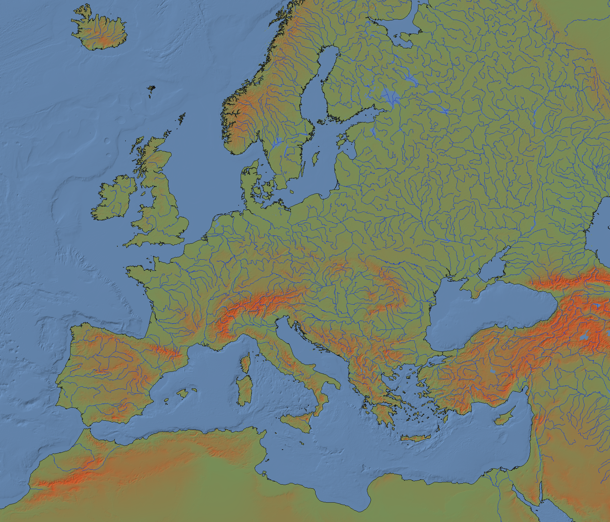
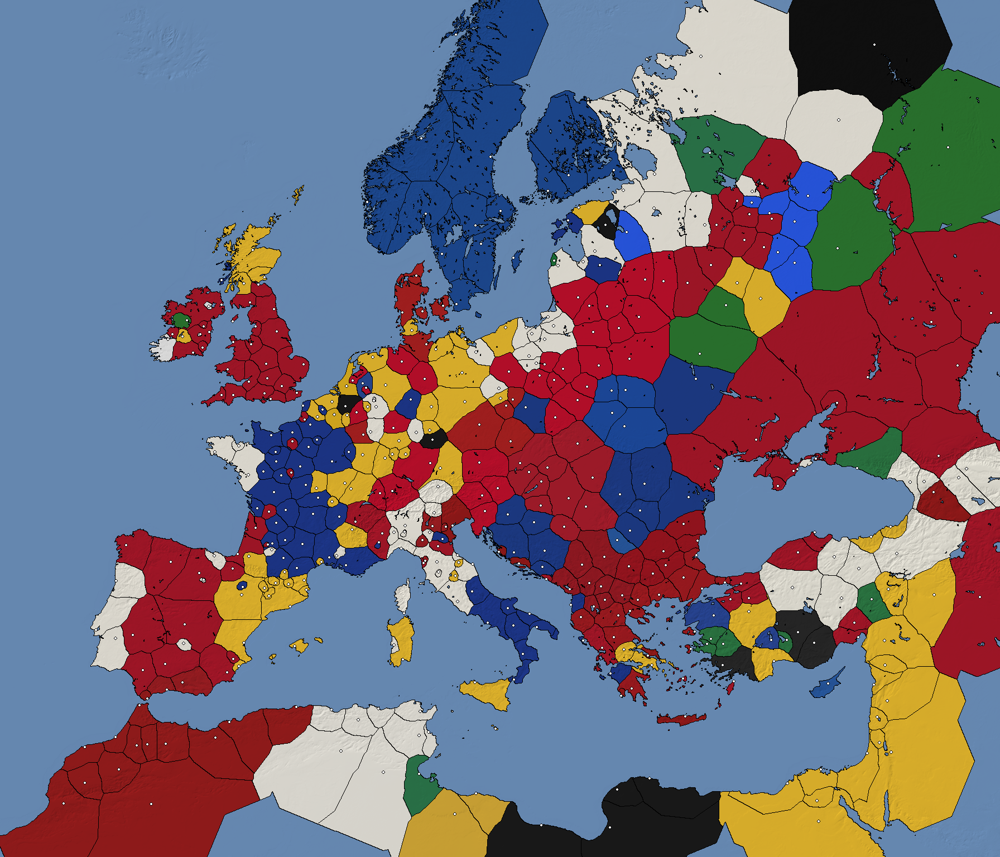
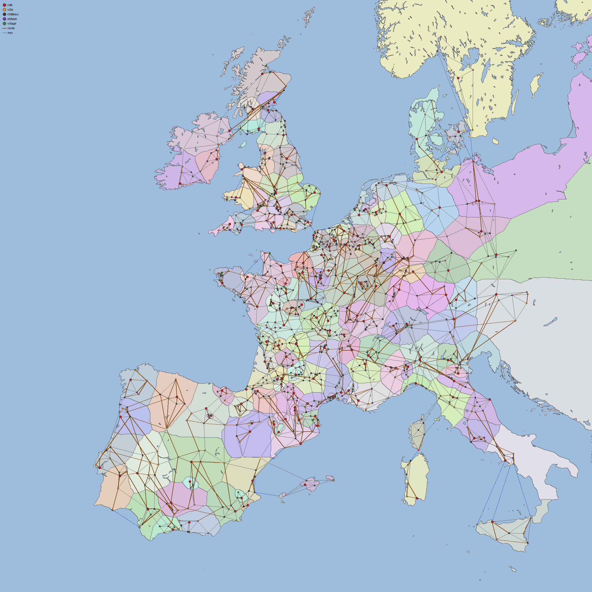

# Pipeline géographique (`tools/cent_ans_tools/geo`)

Construit le terrain de la carte de campagne (`data/map/`) depuis des données ouvertes,
conformément au contrat de `docs/design/m1-campaign-map.md`, puis les provinces
(`provinces.geojson`, `province_ids.png`, voir la section « Provinces » ci-dessous) à partir
de ces sorties (grille, masque terre, rivières) et des seeds de `data/provinces/`.



## Sources de données

| Donnée | Source | Licence | Fichiers |
|---|---|---|---|
| Relief (terre + bathymétrie) | [ETOPO 2022 v1](https://www.ncei.noaa.gov/products/etopo-global-relief-model), NOAA NCEI, grille « ice surface », 15 secondes d'arc, tuiles GeoTIFF 15° × 15° nommées par leur coin nord-ouest | Domaine public (données du gouvernement des États-Unis) ; citation : *NOAA National Centers for Environmental Information. 2022: ETOPO 2022 15 Arc-Second Global Relief Model. doi:10.25921/fd45-gt74* | `https://www.ngdc.noaa.gov/mgg/global/relief/ETOPO2022/data/15s/15s_surface_elev_gtif/ETOPO_2022_v1_15s_<NlatWlon>_surface.tif` (12 tuiles, ~300 Mo) |
| Voies romaines (routes) | [Itiner-e](https://itiner-e.org), *A High-Resolution Dataset of Roads of the Roman Empire*, version statique 2024 v1.3 (de Soto, Pažout, Brughmans et al.), Zenodo [doi:10.5281/zenodo.17122148](https://doi.org/10.5281/zenodo.17122148) | CC BY 4.0 ; citation : *de Soto P., Pažout A., Brughmans T. et al. (2025). Itiner-e: A high-resolution dataset of roads of the Roman Empire. Scientific Data. doi:10.1038/s41597-025-06140-z* | `https://zenodo.org/api/records/17122148/files/itinere_roads.gpkg/content` (GeoPackage, 34 Mo, sans compte) |
| Hameaux | [GeoNames](https://www.geonames.org/) `cities500.zip` (lieux habités de 500 habitants et plus) | CC BY 4.0, © GeoNames (https://www.geonames.org) | `https://download.geonames.org/export/dump/cities500.zip` (14 Mo) |
| Terre, côte, rivières, lacs | [Natural Earth](https://www.naturalearthdata.com/) 10 m physical, servi par `https://naciscdn.org/naturalearth/10m/physical/<couche>.zip` | Domaine public | `ne_10m_land`, `ne_10m_coastline`, `ne_10m_rivers_lake_centerlines`, `ne_10m_rivers_europe`, `ne_10m_lakes`, `ne_10m_lakes_europe` |

Pourquoi ETOPO 2022 plutôt que GMTED2010 : téléchargement HTTPS direct sans compte, tuiles
légères, bathymétrie incluse (utile pour ombrer la mer) et résolution (≈ 300–460 m) plus fine
que le pixel de la carte (≈ 719 m), donc rééchantillonnage par moyenne sans artefact.

Les fichiers bruts sont mis en cache dans `tools/geo/raw/` (ignoré par git). Un fichier déjà
présent n'est jamais retéléchargé sauf avec `--force`.

## Commandes

```sh
uv run --project tools cent-ans geo build            # télécharge (cache) puis génère data/map/ (terrain, provinces, relief 8192², routes, colonies, hameaux) et docs/img/*-preview.png
uv run --project tools cent-ans geo build --force    # retélécharge les données brutes
uv run --project tools cent-ans geo provinces        # provinces seules (≈ 10 s), après modification de seeds ou de poids
uv run --project tools cent-ans geo relief           # relief 8192² en 16 × 16 tuiles (≈ 10 s)
uv run --project tools cent-ans geo roads            # routes (Itiner-e + complément calculé) puis graphe des colonies
uv run --project tools cent-ans geo roads --computed # routes entièrement calculées (repli)
uv run --project tools cent-ans geo settlements      # graphe des colonies seul (≈ 3 s), après modification de data/settlements
uv run --project tools cent-ans geo hamlets          # hameaux GeoNames (≈ 5 s)
uv run --project tools cent-ans geo info             # métadonnées, plage d'altitudes, fraction de terre, tailles
uv run --project tools pytest tests/test_geo.py      # tests sans réseau (grille, encodage des altitudes)
```

La construction complète prend quelques minutes (téléchargement inclus la première fois).

## Projection et convention de pixels

- CRS : **EPSG:3035** (Lambert azimutale équivalente Europe, centre 10° E / 52° N).
- Emprise géographique demandée : longitude −11° → 16°, latitude 35° → 60°. Projetée, cette
  emprise fait ≈ 2 464 km de large pour 2 945 km de haut : elle n'est pas carrée. Comme la
  heightmap est carrée (4096²) avec un seul `meters_per_px`, l'emprise **est élargie
  symétriquement en X** jusqu'à obtenir un carré (`project.squared_bounds`). L'emprise finale
  est stockée dans `map.json` (`bounds_projected`, mètres entiers) et couvre un peu plus
  d'Atlantique et de Germanie que demandé. **C'est l'unique écart au contrat.**
- Grille : 4096 × 4096 pixels, `meters_per_px` ≈ 719 m (isotrope).
- Coordonnées carte : origine au coin **nord-ouest** de `bounds_projected`, X vers l'est,
  Y vers le sud, unité = pixel. Conversion : `px = (x − minx) / mpp`, `py = (maxy − y) / mpp`.
  Le pixel entier `(i, j)` couvre `[i, i+1[ × [j, j+1[`, son centre est `(i + 0,5 ; j + 0,5)`.
  Transformée affine rasterio équivalente : `Affine(mpp, 0, minx, 0, −mpp, maxy)`.
- Helpers : `MapGrid.projected_to_pixel`, `pixel_to_projected`, `lonlat_to_pixel`,
  `pixel_to_lonlat` (`cent_ans_tools.geo.project`).

## Sorties (`data/map/`)

| Fichier | Fabrication |
|---|---|
| `map.json` | Contrat (`crs`, `bounds_projected`, `size_px`, `meters_per_px`, `height_min_m`, `height_max_m`) + `extent_lonlat`, `sources`, `generated_at`. |
| `heightmap.png` | Mosaïque des tuiles ETOPO → reprojection EPSG:3035 par **moyenne** (`rasterio.warp.reproject`) → encodage linéaire 16 bits : `v = round((h + 200) × 65535 / 5000)`, borné à [0, 65535] (−200 m → 0, 4800 m → 65535, pas ≈ 7,6 cm). Les fonds marins sous −200 m sont donc écrêtés à 0. |
| `land_mask.png` | Rasterisation des polygones `ne_10m_land` (255) puis retrait des lacs `ne_10m_lakes` + `ne_10m_lakes_europe` (0). Un pixel est terre si son centre tombe dans un polygone. |
| `rivers.geojson` | `ne_10m_rivers_lake_centerlines` + `ne_10m_rivers_europe`, projetés, découpés à l'emprise, convertis en pixels (1 décimale). Propriétés : `name`, `scalerank`, `featurecla`, `source`. Sans CRS (coordonnées carte). |
| `coastline.geojson` | `ne_10m_coastline` idem, propriétés `scalerank`, `featurecla`. |

Relevé de la construction du 2026-09-23 : `heightmap.png` 14,4 Mo (altitudes présentes −200 → 4549 m,
Mont Blanc moyenné sur 719 m), `land_mask.png` 0,1 Mo (41 % de terre), `rivers.geojson` 0,6 Mo
(485 tronçons, dont Rhin, Loire, Seine, Rhône, Garonne, Èbre, Tamise), `coastline.geojson` 0,6 Mo
(289 tronçons). Construction : ≈ 10 s hors téléchargement.

`docs/img/map-preview.png` : aperçu 1024² (relief hypsométrique + ombrage, côte en noir,
rivières en bleu) pour vérification visuelle.

## Régénérer

1. `uv run --project tools cent-ans geo build` (ajouter `--force` pour ignorer le cache).
2. Vérifier `uv run --project tools cent-ans geo info` et l'aperçu.
3. Commiter `data/map/*` et `docs/img/map-preview.png` ensemble : les provinces en dépendent.

Pour changer l'emprise ou la résolution, modifier les constantes de
`cent_ans_tools/geo/project.py` (`LON_MIN`… `SIZE_PX`) et la plage d'altitudes dans
`terrain.py`, puis reconstruire et mettre à jour le contrat de design.

## Provinces (`cent_ans_tools/geo/provinces.py`)



Entrées : `data/map/` (grille, `land_mask.png`, `rivers.geojson`) et, pour chaque
`data/provinces/*.json`, `geo.seed_lonlat`, `geo.capital_lonlat`, `geo.voronoi_weight`, `owner`,
`name.display`. Les provinces sont indexées de 1 à 132 dans l'ordre alphabétique des ids
(`index` dans les propriétés du GeoJSON).

### Méthode : Voronoï pondéré par distance de coût

1. **Grille de travail 1024²** (blocs de 4 px, terre si ≥ 8 des 16 pixels sont terre). Chaque
   province a deux sources : son seed et sa capitale (la capitale appartient par définition à
   sa province ; un seed en mer est ramené sur la terre la plus proche, cas de Gênes).
2. **Coût par cellule** : terre = 1, cellule traversée par un fleuve majeur (`scalerank ≤ 4`,
   rastérisé) = 4, mer = infranchissable. Pour chaque province, `skimage.graph.MCP_Geometric`
   (Dijkstra géodésique, 8-connexité) donne la distance de coût depuis ses sources ; la cellule
   va à la province minimisant `coût / voronoi_weight`. Les provinces ne sautent donc jamais
   un détroit (Manche, Pyrénées contournées par les cols…) et les fleuves font frontière douce.
   132 propagations sur 1024² ≈ 8 s.
3. **Retour à 4096²** : suréchantillonnage au plus proche, masquage par `land_mask.png`,
   puis remplissage des pixels terre sans étiquette (îles sans seed — Man, Wight, Anglesey,
   Baléares mineures — et pixels perdus par le sous-échantillonnage) par l'étiquette la plus
   proche (distance euclidienne), **sauf** les masses continentales sans seed de plus de
   64 000 px (≈ 33 000 km²) qui restent à 0 : c'est l'Afrique du Nord (≈ 600 000 px), qui n'est
   pas jouable. Lissage des frontières par filtre majoritaire 5 × 5 (la mer est d'abord
   remplie par le plus proche voisin pour ne pas éroder les côtes, puis remasquée).
4. **Vectorisation** : `rasterio.features.shapes` (coins de pixels, 4-connexité) → union →
   `simplify(1,5 px, topologie préservée)` → parties < 30 px² supprimées (au moins une partie
   conservée). Les polygones sont simplifiés indépendamment : de minuscules écarts entre
   voisins sont possibles ; `province_ids.png` reste la référence pour le picking.
5. **Propriétés** : `centroid` = centroïde de la plus grande partie si elle le contient, sinon
   `representative_point` ; `capital_px` = projection de `capital_lonlat`, ramenée au pixel le
   plus proche de sa province si elle tombe en mer ou ailleurs (le rapport de construction le
   signale) ; `neighbors` = provinces partageant ≥ 3 paires de pixels adjacents (4-connexité)
   ; `sea_neighbors` = provinces non voisines par terre dont des pixels côtiers (1 sur 4,
   KD-tree) sont à moins de 60 px (≈ 43 km) ; `area_px` = nombre de pixels.

### Sorties

| Fichier | Contenu |
|---|---|
| `data/map/province_ids.png` | PNG RGB 4096² : `R = index & 255`, `G = index >> 8`, `B = 0`, 0 = mer ou aucune. |
| `data/map/provinces.geojson` | `FeatureCollection` en coordonnées carte (1 décimale), propriétés `id`, `index`, `name`, `owner`, `centroid`, `capital_px`, `neighbors`, `sea_neighbors`, `area_px`. |
| `docs/img/provinces-preview.png` | 1024² : remplissage par `heraldry.primary_color` du propriétaire sur ombrage du relief, frontières noires, capitales en points blancs. |

Relevé de la construction du 2026-09-23 : 10 s, 0,35 Mo de GeoJSON (34 multipolygones), 302
arêtes terrestres (0 à 10 voisins, 4,6 en moyenne ; la Sardaigne n'a que des liaisons
maritimes), 15 liaisons maritimes (Kent–Boulonnais, Boulonnais–Flandre, Flandre–Hollande,
Corse–Sardaigne, Normandie–Ponthieu, Galloway–Highlands…). Seed déplacé : Gênes (en mer sur la
grille de travail). Capitales ramenées : Corse (Ajaccio) et Vénétie (Venise), toutes deux en mer
sur le masque.

Pour retoucher une frontière : modifier `seed_lonlat` / `voronoi_weight` dans
`data/provinces/<id>.json`, relancer `cent-ans geo provinces`, vérifier l'aperçu, commiter
`data/map/provinces.geojson`, `data/map/province_ids.png` et `docs/img/provinces-preview.png`
ensemble.

## Colonies (`cent_ans_tools/geo/settlements.py`, lot C3)



Entrées : `data/settlements/*.json`, `data/provinces/` (terrain, `capital_city`, ports),
`province_ids.png`, `provinces.geojson` (`neighbors`, `sea_neighbors`) et `roads.geojson` s'il
existe. Une province sans fichier (ou sans `city`) reçoit **la même cité de repli que le chargeur
Rust** (`Settlement::fallback_city`) : id `set_<slug>` (slug identique à `slugify` Rust), ou
`set_<slug>_<province>` si l'id est déjà pris par un fichier, `port` si la province est côtière
avec ports. Le graphe couvre donc toujours les 132 provinces ; relancer la commande quand des
fichiers de colonies arrivent.

1. **Position de jeu** : `lonlat` projeté (`MapGrid.lonlat_to_pixel`), tronqué au dixième de pixel.
   Si le pixel n'appartient pas à la province de la colonie (`province_ids.png`), la position est
   ramenée au pixel de la province le plus proche situé à ≥ 3 px de sa frontière et à ≥ 4 px des
   autres colonies (pour ne pas empiler Rye, Winchelsea et Hastings) ; le rapport le signale. Le
   `lonlat` des données n'est jamais modifié.
2. **Graphe** (spec § 4.4), non orienté, une entrée par paire (`from < to`) :
   - dans une province : triangulation de Delaunay ; arêtes > 2,5 × la médiane de la province
     retirées sauf si elles appartiennent à l'arbre couvrant minimal (graphe interne connexe) ;
   - entre provinces voisines (`neighbors`) : 1 à 3 paires les plus proches, sans colonie
     commune, à moins de 1,5 × la distance de la plus proche. Si le segment passe à plus de 50 %
     sur l'eau (détroits de Messine, Øresund…) et relie deux ports, l'arête devient `sea` ; sinon
     elle reste terrestre et le rapport le signale ;
   - entre `sea_neighbors` : la paire de colonies `port` la plus proche (`sea: true`) ; si l'une
     des provinces n'a aucun port, le rapport le signale.
3. **Coût** (sans unité, le cœur le rééchelonne) : longueur en km × coût du terrain
   (`terrain_cost` de `movement.rs` : 2 pour `mountains` et `marsh`, 1 sinon ; moyenne des deux
   provinces pour une arête frontalière), ÷ 2 si `road`. Arête `sea` : 100 (embarquement et
   débarquement, ≈ une traversée de province) + km.
4. **Route** : une arête terrestre porte `road: true` si la distance moyenne de son segment au
   réseau de `roads.geojson` (transformée de distance sur 4096²) est < max(3 km, 4 % de sa
   longueur) — la tolérance relative évite de rater une voie qui serpente le long d'une arête
   de 200 km entre deux cités de repli.

| Fichier | Contenu |
|---|---|
| `data/map/settlement_graph.json` | `{"edges": [{"from", "to", "cost", "road", "sea"}]}`, format du lot C1 (chargé par `settlement_load.rs`, aucun autre champ). |
| `data/map/settlements_px.json` | `{"set_…": [x, y]}` : position de jeu en pixels carte 4096 (1 décimale), pour Godot. |
| `docs/img/settlements-preview.png` | 2048² : provinces, colonies par type (cité rouge, ville orange, château gris, abbaye violette, village vert ; contour blanc = position ramenée), arêtes grises, routes brunes, liaisons maritimes en tirets bleus. |

Relevé du 2026-09-24 (132 fichiers de colonies, aucune cité de repli) : 568 colonies,
1 345 arêtes terrestres dont 634 sur route, 28 maritimes, graphe connexe ; 71 colonies ramenées
dans leur province (côtes et frontières du Voronoï : Saint-Malo, La Rochelle, Plymouth, Venise,
Alicante… ; certaines sont peut-être rattachées à la mauvaise province dans les données, par ex.
Galway en Ulster, Lund en Sjælland, Auch en Rouergue, Mantoue et Modène à Ferrare).

## Routes (`cent_ans_tools/geo/roads.py`)

Source retenue : **Itiner-e** (voir « Sources de données »), téléchargeable sans compte via l'API
Zenodo. Les tronçons `Hypothetical` sont écartés ; `Certain` et `Conjectured` (voies principales
et secondaires) sont reprojetés en pixels carte, découpés à l'emprise, simplifiés (0,4 px) et
gardés s'ils passent pour moitié au moins dans une province jouable.

Itiner-e s'arrête au limes (Irlande, Écosse, Germanie à l'est du Rhin, Danemark, Suède,
Bohême…). Les provinces qu'il ne couvre pas (densité < 4 px de route pour 1 000 px de province)
reçoivent des **routes calculées** : plus court chemin de coût (`skimage.graph.MCP_Geometric`,
grille 2048², coût = 1 + 25 × pente de `heightmap.png` + 6 sur un fleuve de `scalerank` ≤ 6, mer
infranchissable) le long des arêtes terrestres du graphe entre colonies `city`/`town`. Le même
calcul sert de repli complet si Itiner-e est indisponible (3 tentatives) ou avec `--computed`.

`data/map/roads.geojson` : `FeatureCollection` sans CRS, `LineString` en pixels carte
(1 décimale), propriétés `name`, `type` (`main`, `secondary`, `computed`), `certainty`,
`source` (`itiner-e` ou `computed`). Relevé du 2026-09-24 : 2,3 Mo, 6 834 tronçons Itiner-e et
70 tronçons calculés, ≈ 153 000 km.

## Hameaux (`cent_ans_tools/geo/hamlets.py`)

Décor sans état de jeu (spec § 3.3). Source : GeoNames `cities500` (CC BY 4.0, © GeoNames).

1. Classe `P`, codes `PPL`, `PPLA`–`PPLA5`, `PPLC`, `PPLF`, `PPLG`, `PPLL`, `PPLR`, `PPLS`
   (sections, lieux historiques, abandonnés ou détruits exclus), dans une province jouable ;
2. à plus de 3 km de toute colonie ;
3. ≈ 3 000 au total, répartis entre provinces pour moitié selon la surface, pour moitié selon
   la population de 1337 (`data/provinces`) ;
4. dans une province, candidats dans un ordre pseudo-aléatoire fixe (graine 1337 ; la population
   moderne favoriserait les villes industrielles), acceptés avec un espacement
   max(6 km, 0,6 × √(surface / quota)), puis complétés à 6 km si le quota n'est pas atteint.
   L'espacement de 6 km vaut aussi d'une province à l'autre.

`data/map/hamlets.json` : `[{"name", "px": [x, y], "province"}]`, nom GeoNames `name` (forme
locale, pas `asciiname`), une entrée par ligne. Relevé du 2026-09-24 : 2 999 hameaux dans les 132
provinces (71 306 candidats), 0,2 Mo.

## Relief en tuiles (`cent_ans_tools/geo/relief.py`)

Relief **8192²** (≈ 360 m/px) sur la même emprise (`bounds_projected` inchangé : 1 px 8192 = ½ px
4096), ETOPO 2022 15″ rééchantillonné **bilinéairement** (la cible est aussi fine que la
source ; une moyenne laisserait des marches), même encodage 16 bits que `heightmap.png`.
Découpé en 16 × 16 tuiles PNG de 512² : `data/map/height/h_<col>_<row>.png` couvre les pixels
`[col × 512, (col + 1) × 512[` en X et `[row × 512, (row + 1) × 512[` en Y, sans recouvrement
(pour coudre deux maillages, lire la première ligne ou colonne de la tuile voisine).
`map.json` déclare :

```json
"height_tiles": {"size_px": 8192, "tile_px": 512, "dir": "height", "pattern": "h_{col}_{row}.png"}
```

`heightmap.png` (4096²) est conservé pour la compatibilité. Relevé du 2026-09-24 : 256 tuiles,
50,5 Mo au total (pas de LFS dans le dépôt ; sous le seuil de 150 Mo, PNG 16 bits conservé),
≈ 10 s. Écart moyen avec `heightmap.png` après moyenne 2 × 2 : 0,5 m.

