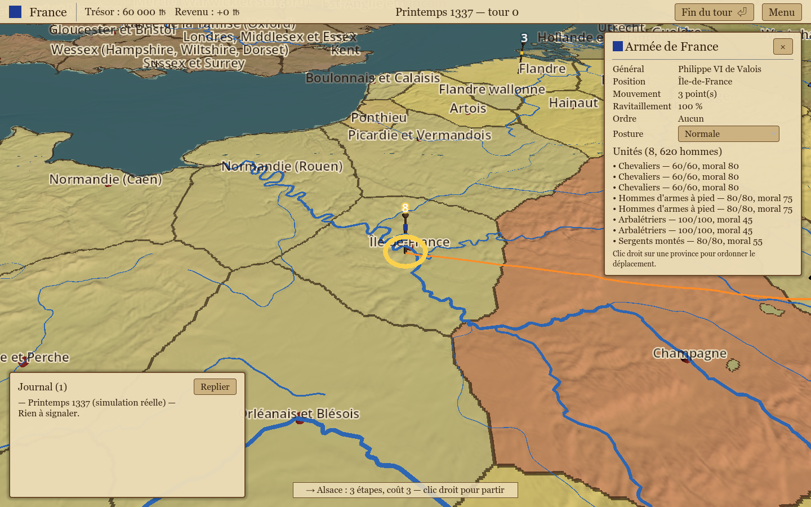
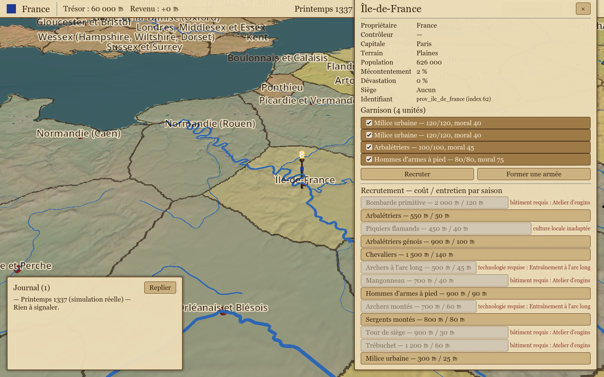
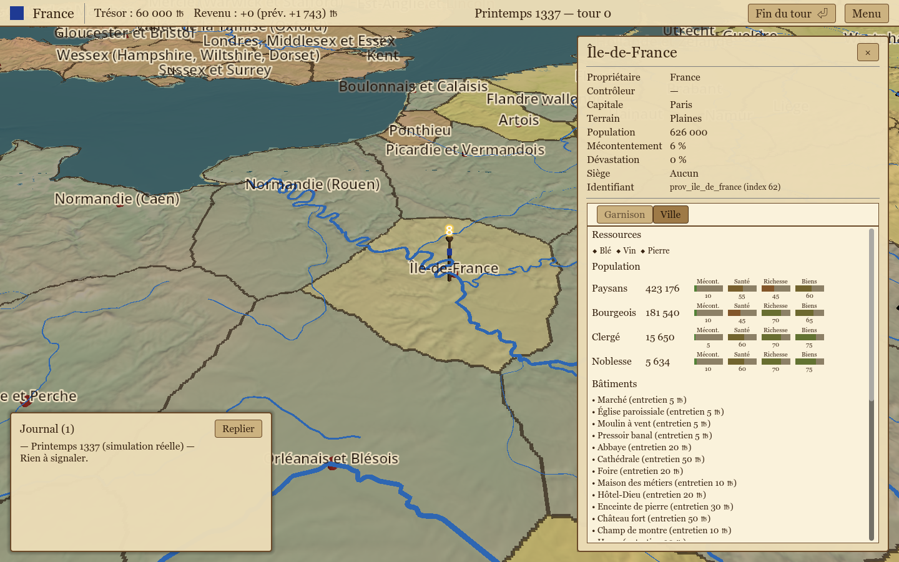
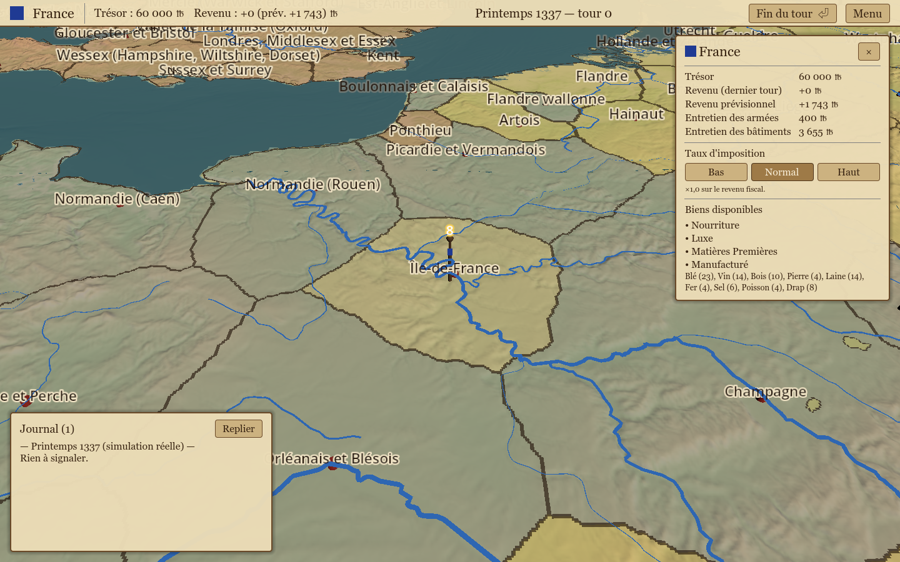
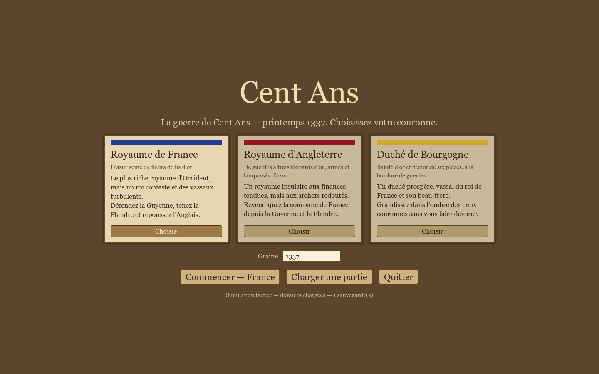
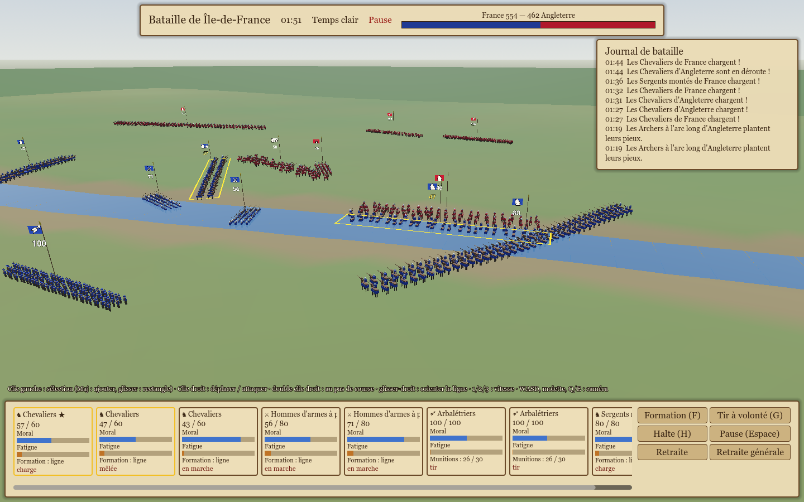
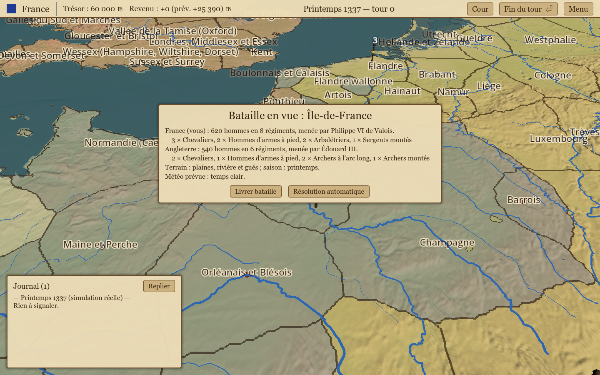

# Carte et interface de campagne Godot (M1 + M2 + M3)

Rendu et interaction de la carte de campagne dans `game/` (GDScript). Aucune règle de jeu
ici : la scène lit `data/map/` (images + GeoJSON), affiche, remonte des identifiants et soumet
des ordres à la simulation Rust (`CampaignSim`) via l'autoload `SimFacade`.
Contrats : `docs/design/m1-campaign-map.md` (données carte), `docs/design/m2-campaign-loop.md`
(§ 2 API `CampaignSim`, § 3 interface), `docs/design/m3-cities-economy.md` (§ 2 API villes et
économie, § 3 interface).



## Scènes

| Scène | Rôle |
|---|---|
| `scenes/start_menu.tscn` (scène principale) | Écran de démarrage : 3 cartes de faction (nom, blason, couleur depuis `GameDataStore.get_faction`, accroche en deux lignes), graine, « Commencer », « Charger une partie », « Quitter ». |
| `scenes/campaign_map.tscn` | Carte 3D + HUD de campagne. |
| `scenes/ui/province_panel.tscn` | Panneau parchemin de province (identité, état) avec deux onglets : « Garnison » (garnison, recrutement, formation d'armée) et « Ville » (population par classe, bâtiments, construction, constructible, ressources — M3). |
| `scenes/ui/faction_panel.tscn` | Panneau de faction (clic sur le blason/nom de la barre) : trésor, revenu, revenu prévisionnel, entretien armées/bâtiments, sélecteur d'impôt, biens par catégorie (M3). |
| `scenes/ui/army_panel.tscn` | Panneau d'armée (général, position, mouvement, ravitaillement, ordre, posture, unités). |
| `scenes/ui/save_load_dialog.tscn` | Dialogue sauver / charger (`user://saves/*.json`). |
| `scenes/map/army_marker.tscn` | Marqueur d'armée : hampe + bannière billboard (couleur de faction), nombre d'unités, halo de sélection. |
| `scenes/ui/parchment_theme.tres` | Thème commun (police serif système, panneaux, boutons, champs, onglets). |

## Architecture de `campaign_map.tscn`

```
CampaignMap (Node3D, scripts/map/campaign_map.gd)   assemble tout, relie UI ↔ SimFacade.sim
├── WorldEnvironment / Sun (DirectionalLight3D)
├── Terrain     (TerrainBuilder)   16 × 16 tuiles ArrayMesh depuis la heightmap, 2 LOD
├── Sea         (Sea)              plan d'eau Y = 0 (shader animé) + fond opaque à −4,5
├── Rivers      (RiversRenderer)   rubans bleus (largeur selon importance ; mineurs masqués de loin)
├── Coast       (CoastRenderer)    ruban brun sur le trait de côte
├── Cities      (CityMarkers)      cylindre + Label3D par capitale (`capital_px`)
├── PathPreview (PathPreview)      ruban orange : chemin prévisualisé / ordre en cours
├── Armies      (ArmyMarkers)      un `army_marker.tscn` par armée au centroïde de sa province
├── ConstructionMarkers (ConstructionMarkers) Label3D « ⚒ » sur les provinces en construction (M3)
├── CameraRig   (CampaignCamera)   caméra RTS ; enfant Camera3D
├── Picker      (ProvincePicker)   rayon → terrain → `province_ids.png` → signaux (clic gauche / droit)
└── UI          (MapUI, CanvasLayer)
    ├── TopBar         couleur + nom de faction (clic → panneau de faction), trésor,
    │                  « Revenu : +X (prév. Y) », date, « Fin du tour ⏎ », Menu
    ├── Toast          notification (ordre refusé, sauvegarde, bataille), 3,5 s
    ├── HoverLabel     province survolée, ou « → cible : n étapes, coût c » avec une armée sélectionnée
    ├── EventLog       journal du tour (bas gauche, repliable, plus récent en haut ; couleurs dédiées
    │                  batailles, révolte, peste, famine, bâtiment achevé)
    ├── ArmyPanel      scenes/ui/army_panel.tscn
    ├── ProvincePanel  scenes/ui/province_panel.tscn (onglets Garnison / Ville)
    ├── FactionPanel   scenes/ui/faction_panel.tscn (M3)
    └── SaveLoadDialog scenes/ui/save_load_dialog.tscn
```

### Autoloads

- `MapPaths` (`scripts/map/map_paths.gd`) : `data_dir` = `<dépôt>/data` par défaut, surchargé par
  la variable d'environnement `CENT_ANS_DATA_DIR` ; `MapPaths.map_dir()` = `data_dir/map`.
- `SimFacade` (`scripts/sim/sim_facade.gd`) : point d'accès unique à la simulation.
  - `sim` = la vraie `CampaignSim` (GDExtension) si `ClassDB.class_exists("CampaignSim")` et
    qu'elle expose `get_army_ids` (API M2), sinon `CampaignSimMock` (`scripts/sim/campaign_sim_mock.gd`,
    même API, données factices : voisinage depuis `provinces.geojson`, 3 armées, batailles à pile ou
    face). `is_real` indique le moteur ; l'écran de démarrage l'affiche (« Simulation réelle/factice »).
  - `store` = `GameDataStore` chargé sur `MapPaths.data_dir` (null sur les fixtures de test).
  - `new_campaign(faction, seed)` recrée une simulation neuve ; si la vraie refuse (dossier de données
    incomplet), repli sur le mock avec avertissement.
  - `pending_faction` / `pending_seed` / `pending_load_path` : requête transmise du menu à la carte.
  - Sauvegardes : `save_game(nom)` écrit `user://saves/<nom>.json` =
    `{version, engine: "real"|"mock", faction, date, turn, timestamp, state: sim.save_to_string()}` ;
    `load_game(chemin)` restaure (`load_from_string`) ; `list_saves()` trié par date décroissante.
    Une sauvegarde `real` ne se charge pas avec le mock (erreur explicite).

### Chargement (`MapData`, `scripts/map/map_data.gd`)

- `map.json` → taille, bornes d'altitude, CRS.
- `heightmap.png` 16 bits : décodé par `GameDataStore.load_heightmap_u16` (crate `png` côté Rust,
  ~100 ms pour 4096²) en little-endian ; l'image est stockée en `Image.FORMAT_LA8` avec
  `height_little_endian = true` (L = octet faible, A = octet fort). Repli sans GDExtension :
  `Png16` (`scripts/map/png16.gd`, décodage GDScript big-endian + cache `user://cache/`), puis
  `Image.load_from_file` 8 bits en dernier recours. `MapData.height_decoder` ∈ {rust, png16, 8bit}.
  Le shader et le constructeur de maillage lisent l'ordre d'octets via `height_little_endian`.
- `province_ids.png` (RGB8, index = R + 256·G, 0 = mer), `land_mask.png` (optionnel).
- `provinces.geojson`, `rivers.geojson`, `coastline.geojson` via `JSON.parse_string`. Importance d'une
  rivière = `strahler` si présent, sinon `12 − scalerank` (Natural Earth) ; ≥ 3 = fleuve majeur toujours
  affiché, sinon affiché seulement sous 0,35 × taille de carte.
- Accès : `height_m_at(x, y)` (bilinéaire), `height_world_at`, `surface_world_at` (≥ 0),
  `province_index_at(x, y)`, `get_province(index)`, `index_of_id(id)`, `centroid_of_id(id)`.

**Convention d'index** : l'index raster d'une province est la position 1-based de sa feature dans
`provinces.geojson`, sauf si la propriété `index` est présente (recommandé pour `tools/geo`).
Les noms d'affichage (`display_name`, `capital`, `terrain`, `owner_display_name`) viennent de
`GameDataStore.get_province` (`CampaignMap.province_info`) ; les propriétés GeoJSON `name`, `owner`,
`terrain`, `capital_name` ne servent que de repli (fixtures).

### Coordonnées

X monde = x carte (pixel), Z monde = y carte, Y monde = altitude (m) × `MapData.HEIGHT_SCALE`
(0,02). La mer est à Y = 0. Origine au coin nord-ouest, comme la heightmap.

### Terrain (`TerrainBuilder`, `shaders/terrain.gdshader`)

- 256 tuiles (`CHUNKS = 16`) de `size/16` pixels ; sommets tous les `far_step` px (LOD lointain,
  construit au chargement) ou `near_step` px (LOD proche, construit à la demande quand la caméra
  est à moins de `near_distance` du centre de tuile, au plus 4 tuiles par frame, puis mis en cache).
  Pas réglés par la scène selon la taille : 4096² → 4/8, 512² → 1/2.
- Les maillages ne portent que positions + indices ; le shader dérive la normale de la heightmap
  (différences finies sur ±2 px), donc aucune couture entre tuiles ni entre LOD.
- Shader : palette par altitude, pentes tirant vers la roche, teinte parchemin ; frontières par
  comparaison `texelFetch` des voisins de `province_ids` (largeur ~constante à l'écran grâce à
  `fwidth`) ; surbrillance `hovered_id` / `selected_id`.
- **Couleurs de faction** : texture 1D `faction_colors` (largeur = nombre de provinces + 1) remplie par
  `TerrainBuilder.set_province_colors(PackedColorArray)` depuis `CampaignMap._refresh_owner_colors` :
  base `GameDataStore.get_province_owner_colors(ids)`, puis couleur héraldique du propriétaire courant
  selon `CampaignSim.get_province_state(id).owner` (les conquêtes recolorent la carte). Sans
  `GameDataStore` (fixtures), palette de repli déterministe par propriétaire.
- **Masque atteignable** : texture 1D `province_mask` (R8, indexée par province) posée par
  `set_reachable(reachable, path)` : ~0,5 = atteignable ce tour (teinte jaune), 1 = sur le chemin
  prévisualisé (orange), 0 = assombri (×0,7) tant qu'une armée est sélectionnée.

### Armées (`ArmyMarkers`, `ArmyMarker`, `PathPreview`)

- `ArmyMarkers.refresh(sim, color_of, player_faction)` reconstruit tous les marqueurs depuis
  `get_army_ids` / `get_army` (après chaque fin de tour, ordre ou chargement). Position = centroïde de la
  province ; armées empilées décalées en anneau (rayon 6 × échelle). Échelle = distance caméra × 0,014
  (bornée 0,8..14) pour rester lisible ; le `Label3D` du nombre d'unités compense l'échelle.
- `pick_screen(pos)` : armée la plus proche du curseur (< 26 px après projection), prioritaire sur la
  province via `ProvincePicker.click_interceptor`.
- `PathPreview.show_path([départ, …chemin], distance)` : ruban `PolylineMesh` posé sur le relief,
  segments subdivisés tous les 12 px.

### Picking (`ProvincePicker`)

Rayon caméra → intersection avec Y = 0, puis point fixe `t = (h(x(t), z(t)) − o.y) / d.y` (≤ 8
itérations, arrêt sous 0,02 unité). Lecture ensuite de `province_ids` au pixel. Signaux
`province_hovered(index)`, `province_selected(index)` (clic gauche sans glisser, sauf si
`click_interceptor` a consommé le clic) et `province_right_clicked(index)`. Pas de corps physique.

## Boucle de jeu côté Godot (`campaign_map.gd`)

| Action | Appel simulation | Rafraîchissement |
|---|---|---|
| Clic gauche sur une armée | `get_army`, `get_reachable` (si armée du joueur) | panneau d'armée, halo, masque atteignable, chemin en cours |
| Survol d'une province, armée sélectionnée | `find_path(armée, cible)` | ruban + provinces du chemin en orange, étiquette « n étapes, coût c » |
| Clic droit sur une province | `find_path` puis `submit_order({"type": "move_army", "army", "path"})` | `refresh_all()` ; erreur → notification |
| Posture (panneau d'armée) | `submit_order({"type": "set_stance", …})` | idem |
| « Recruter » → ligne | `get_recruitable(province)` puis `submit_order({"type": "recruit", …})` | idem ; lignes indisponibles désactivées avec la raison |
| « Former une armée » | `submit_order({"type": "create_army", "province", "units_from_garrison": [indices cochés]})` | sélectionne la nouvelle armée si la réponse contient `army` |
| Panneau de province, onglet Ville → « Construire » | `submit_order({"type": "build", "province", "building"})` | idem ; lignes indisponibles désactivées avec la raison (M3) |
| Onglet Ville → « Annuler » (construction en cours) | `submit_order({"type": "cancel_build", "province"})` | idem, remboursement à moitié affiché par le trésor (M3) |
| Panneau de faction → sélecteur d'impôt | `submit_order({"type": "set_tax_rate", "rate": "low"\|"normal"\|"high"})` | panneau de faction rafraîchi (M3) |
| Clic sur le blason/nom de faction (barre) | `get_faction_economy(faction)` (si disponible) | ouvre le panneau de faction (M3) |
| Touche M | `get_province_city` sur chaque province (si disponible) | bascule la teinte des provinces (faction ↔ mécontentement, M3) |
| « Fin du tour » / Entrée | `end_turn()` → événements | journal (plus récent en haut), notification de bataille, tout rafraîchi |
| Menu → Sauvegarder / Charger | `SimFacade.save_game` / `load_game` | carte, HUD et journal restaurés |

## Contrôles

| Action | Entrée |
|---|---|
| Déplacement | W A S D (positions physiques : Z Q S D en AZERTY), flèches, bords d'écran (F2 pour désactiver), glisser bouton du milieu |
| Zoom | molette, borné 30..1500 unités |
| Rotation | Q / E (positions physiques : A / E en AZERTY) |
| Inclinaison | automatique : 35° en vue rapprochée → 70° à `pitch_far_distance` |
| Sélection | clic gauche : armée (prioritaire) ou province ; survol = surbrillance + nom ; Échap désélectionne l'armée |
| Ordre de déplacement | clic droit sur une province avec une armée sélectionnée |
| Fin du tour | bouton ou Entrée (action `campaign_end_turn`, désactivée pendant un dialogue) |
| Mode mécontentement (M3) | M (action `map_toggle_unrest`) ; ignoré avec un message si `get_province_city` est indisponible |
| Capture d'écran | F12 → `docs/img/godot-map-<timestamp>.png` |

Options de ligne de commande (après `--`) :
- `--screenshot=<chemin.png>` : capture après 40 frames puis quitte. Sur `campaign_map.tscn`, met en
  scène la première armée du joueur sélectionnée avec l'aperçu de chemin vers la province atteignable la
  plus coûteuse ; avec `--stage=province`, sélectionne la capitale du joueur et ouvre le recrutement ;
  avec `--stage=city`, capitale du joueur et onglet Ville du panneau de province ; avec `--stage=faction`,
  panneau de faction ouvert. `--stage=city`/`faction` basculent sur `CampaignSimMock` si la simulation
  active n'expose pas encore `get_province_city` (`_ensure_city_capable_sim`). Sur `start_menu.tscn`,
  capture l'écran de démarrage.
- `--focus=<x>,<y>,<distance>` : placement initial de la caméra.

```sh
godot --path game                                   # menu de démarrage
godot --path game res://scenes/campaign_map.tscn -- --screenshot=docs/img/godot-campaign-hud.png
godot --path game res://scenes/campaign_map.tscn -- --screenshot=out.png --stage=province
godot --path game res://scenes/campaign_map.tscn -- --screenshot=docs/img/godot-city-panel.png --stage=city
godot --path game res://scenes/campaign_map.tscn -- --screenshot=docs/img/godot-faction-panel.png --stage=faction
```






## Pointer sur les vraies données

Par défaut la scène lit `<dépôt>/data/`. Pour un autre dossier :

```sh
CENT_ANS_DATA_DIR=/chemin/vers/data godot --path game
```

Après tout changement de script GDScript sur un clone frais, générer le cache des classes
globales une fois : `godot --headless --path game --import` (sinon `class_name` inconnus).

## Données synthétiques et tests

- `game/tools/gen_synthetic_map.gd` : `godot --headless --path game --script res://tools/gen_synthetic_map.gd`
  écrit dans `game/tests/fixtures/map/` une île 512² (bosses gaussiennes + bruit), 6 provinces de
  Voronoï, 2 rivières, trait de côte, `map.json`. Le PNG 16 bits est encodé à la main.
- `game/tests/smoke.gd` (`godot --headless --path game --script res://tests/smoke.gd` → code 0) :
  1. `CampaignSim` : 10 tours, date « Automne 1339 » (API M2 `new_campaign(data, "fac_france", 1337)`
     sur `data/` si disponible, sinon ancienne signature) ;
  2. carte sur les fixtures : décodeur 16 bits (imprimé), 256 tuiles, 2 rivières, 6 marqueurs, picking
     de la province 3, panneau de province ;
  3. écran de démarrage : 3 cartes, France par défaut ;
  4. boucle de campagne France via `SimFacade` (réelle sur `data/` si disponible, sinon mock sur les
     fixtures — imprimé « REAL »/« MOCK ») : sélection de la première armée du joueur, atteignables non
     vides, aperçu de chemin, ordre de déplacement, 4 fins de tour, sauvegarde `user://saves/smoke.json`,
     un tour de plus, rechargement, égalité des dates (sim et étiquette du HUD) ;
  5. villes et économie (M3), sur la vraie simulation si elle expose `get_province_city` (sinon un
     `CampaignSimMock` dédié sur `data/` — imprimé « REAL »/« MOCK ») : 20 tours de stabilisation, choix
     du constructible le moins cher à effet économique direct (trade_income/tax_income/wealth, sinon le
     moins cher disponible) à `prov_ile_de_france`, `submit_order({"type": "build", ...})`, tours jusqu'à
     achèvement, vérifie l'apparition dans `buildings`, puis une fenêtre de tours après achèvement où l'on
     retient le meilleur `projected_income` observé (la richesse converge sur plusieurs saisons, § 1.1) et
     vérifie qu'il dépasse celui d'avant construction ; `set_tax_rate` à « high » et vérifie la hausse
     immédiate de `projected_income` (comparaison sans fin de tour, isolée de la dérive de fond).
  6. batailles (M7) : voir « Batailles (M7) » ci-dessous.
  Un script `--script` est compilé avant l'enregistrement des autoloads : le test accède à `SimFacade`
  et `MapPaths` par `/root/...` (seules les constantes/statics sont utilisables directement).

## Villes et économie (M3)

- `CampaignSimMock` (`scripts/sim/campaign_sim_mock.gd`) étend l'API mock avec `get_province_city`,
  `get_faction_economy` et les ordres `build`/`cancel_build`/`set_tax_rate` (mêmes formes que
  `docs/design/data-model.md` § 7.4, y compris `effects: {clé: {flat, percent}}`) : population par
  classe lue depuis `data/provinces/<id>.json` (non exposé par `GameDataStore.get_province`), catalogues
  `data/buildings/*.json` / `data/resources/*.json`, dérive simplifiée des jauges de classe, révolte /
  peste / famine / bâtiment achevé en fin de tour.
- L'interface appelle systématiquement `sim.has_method("get_province_city" / "get_faction_economy")`
  avant d'utiliser l'API M3 (`CampaignMap._city_available` / `_economy_available`) : avec un
  `CampaignSim` réel qui ne les exposerait pas encore, l'onglet Ville reste vide, le panneau de faction
  affiche « Non disponible », la touche M est sans effet (notification) et aucun marteau n'apparaît —
  aucun crash. Depuis l'atterrissage de `get_province_city`/`get_faction_economy` côté `core/` (bridge),
  la vraie simulation est utilisée pour tout, y compris le smoke test et les captures.
- `--stage=city`/`--stage=faction` (capture d'écran) basculent sur un `CampaignSimMock` dédié
  (`_ensure_city_capable_sim`) si jamais la simulation active ne les expose pas, pour garder des captures
  exploitables pendant le développement.

## Personnages et dynasties (M4)

- **Cour** (bouton « Cour », touche C) : `scenes/ui/court_panel.tscn`. Liste des personnages vivants
  de la faction (portrait = couleur de faction + initiales, âge, titre, activité), tri Rang/Âge/Nom,
  filtre Généraux/Gouverneurs/À la cour. Le journal est masqué tant que la cour est ouverte.
- **Fiche personnage** : `scenes/ui/character_sheet.tscn`. Compétences, XP, points, traits (info-bulles),
  famille, boutons « Nommer gouverneur », « Donner le commandement », « Marier », et l'arbre de
  compétences en trois colonnes (appris / disponible / verrouillé) ; un clic envoie `learn_skill`.
- Panneau province : ligne « Gouverneur : X » ; panneau armée : compétences du général.
- Journal : couleurs dédiées pour naissances, morts, successions, régences, traits acquis.
- Captures : `--stage=court` et `--stage=skills` (`docs/img/godot-court.png`, `godot-skill-tree.png`).
  Le mock `campaign_sim_mock.gd` n'est plus utilisé que si l'extension n'expose pas `get_character`.

## Batailles (M7)

Contrat : `docs/design/m7-battles.md` ; API : `docs/design/data-model.md` § 7.6. Toutes les règles
sont dans `BattleSim` (Rust) ; la scène ne fait qu'afficher et envoyer des commandes.




- **Fin de tour** (`campaign_map.gd`, section « Batailles (M7) ») : après `end_turn`, si
  `get_pending_battles()` n'est pas vide, `scenes/battle/pre_battle_dialog.tscn` s'ouvre (forces en
  présence, composition, général, terrain, saison, météo prévue lue sur un `BattleSim` construit avec
  la graine de la bataille). « Résolution automatique » → `auto_resolve_battle` ; « Livrer bataille » →
  la carte est mise en sommeil (`visible = false`, `PROCESS_MODE_DISABLED`, HUD caché ; la simulation
  n'est pas recréée) et `scenes/battle/battle.tscn` est ajoutée à la racine (`configure(sim, index,
  seed)`). « Retour à la campagne » appelle `resolve_battle` puis signal `returned` → la carte revient,
  journal et marqueurs rafraîchis, bataille suivante proposée. Une fin de tour avec un dialogue ouvert
  le ferme : la simulation auto-résout d'elle-même les batailles restées en attente.
- **Scène** (`scripts/battle/`) :

```
Battle (Node3D, battle_scene.gd)   tick, rendu, entrées, écran de fin
├── WorldEnvironment / Sun          ciel procédural ; brouillard/pluie/neige selon get_weather
├── Terrain (BattleTerrain)         grille get_terrain() colorée par sommet (herbe/altitude, sous-bois,
│                                   boue, berges, gués), ruban d'eau, arbres MultiMesh, sol lointain
├── CameraRig (BattleCamera)        caméra RTS ; enfant Camera3D
├── HUD (BattleHud, CanvasLayer)    barre du haut, journal, cartes d'unité, ordres, écran de fin
├── attacker_infantry … defender_siege   8 MultiMeshInstance3D (camp × famille), buffer = get_soldier_buffer
└── BannerN + anneau de sélection   hampe, drapeau (couleur de faction, blanc en déroute), icône, effectif
```

- **Maillages** : `BattleMeshes` (SurfaceTool) construit fantassin, archer, cavalier, engin, arbre et
  hampe en pavés low-poly ; surface 0 = livrée (couleur de faction via le matériau), surface 1 = neutre
  (couleurs de sommets sRGB). Les triangles sont orientés selon la normale (`BattleMeshes.tri`).
- **Contrôles** :

| Action | Entrée |
|---|---|
| Caméra | W A S D (positions physiques), bords d'écran, glisser bouton du milieu ; molette ; Q / E rotation |
| Sélection | clic gauche (unité ou carte d'unité), rectangle en glissant, Maj pour ajouter / retirer ; Échap vide |
| Déplacer / attaquer | clic droit au sol / sur une unité ennemie ; double clic droit = au pas de course |
| Orienter la ligne | glisser-droit : les régiments s'alignent sur le segment, front à l'opposé de la caméra |
| Formation | F (cycle autorisé : ligne → colonne → schiltron pour l'infanterie, ligne → coin → colonne pour la cavalerie) |
| Tir à volonté | G (bascule pour les tireurs sélectionnés) |
| Halte / retraite | H ; boutons « Retraite » (sélection) et « Retraite générale » |
| Temps | Espace = pause (ordres possibles en pause), 1 / 2 / 3 = ×1 / ×2 / ×4 |
| Capture | F12 → `docs/img/godot-battle-<horodatage>.png` |

- **Ligne de commande** :

```sh
godot --path game res://scenes/battle/battle.tscn                       # démo France–Angleterre
godot --path game res://scenes/battle/battle.tscn -- --screenshot=/chemin/absolu/godot-battle.png
godot --path game res://scenes/campaign_map.tscn -- --screenshot=/chemin/absolu/godot-battle-dialog.png --stage=battle
godot --path game --disable-vsync res://scenes/battle/battle.tscn -- --units=20 --benchmark
```

  Seule, la scène crée une campagne France 1337 et met en scène (`debug_stage_battle`) la plus grande
  armée française contre la plus grande anglaise. `--screenshot` joue les deux IA jusqu'au premier
  contact + 12 s puis capture ; `--units=n` complète chaque camp à n régiments de 120 soldats (banc
  d'essai, pas de retour campagne) ; `--benchmark` mesure les FPS sur 600 images ; `--autoplay` confie
  aussi le camp du joueur à l'IA.
- **Performances** (M4 Pro, Metal, bibliothèque Rust en debug) : 2 × 20 régiments de 120 soldats
  (4 800 soldats, 8 MultiMesh mis à jour à chaque image) : **60 FPS** vsync (58,7 de moyenne sur 600
  images, démarrage compris), **141 FPS** de moyenne sans vsync (pointe 188). Pas de simulation :
  0,12 ms en debug, 0,02 ms en release pour 40 régiments.
- **Smoke** (§ 6 de `tests/smoke.gd`) : bataille réelle France–Angleterre, 2 000 ticks headless de
  `BattleSim` avec les deux IA (fin atteinte, ~1 800 ticks), `resolve_battle` accepté ; puis la boucle
  complète par la carte : dialogue visible, « Livrer bataille », `battle.tscn` 60 images (soldats
  dessinés), un ordre, fin de bataille, écran de fin, « Retour à la campagne », bataille résolue.

## Performances mesurées (M4 Pro)

| Jeu de données | Chargement | Terrain (LOD lointain) | Tuile proche |
|---|---|---|---|
| Fixtures 512², 6 provinces | 5 ms | 17 ms (74 k sommets, pas 2) | < 1 ms |
| Réel 4096², 132 provinces, décodage Rust | 0,23 s (heightmap 107 ms, masques 98 ms) | 96 ms (279 k sommets, pas 8) | 0,9 ms (pas 4) |
| Idem, repli `Png16` GDScript, cache froid | 5,3 s | idem | idem |

20 000 lectures pick + hauteur : 23 ms. Mémoire résidente ≈ 120 Mo.

## Limites connues

- Frontières en escalier de près (résolution de `province_ids`) ; lissage possible plus tard.
- Pas de jupes entre tuiles de LOD différents : petites fissures possibles vues de très près.
- Rivières, côte, chemin et marqueurs sont rendus sans test de profondeur (visibles à travers le relief).
- Étiquettes de capitales sans dé-chevauchement ; elles peuvent recouvrir un marqueur d'armée.
- Le mock ne connaît ni liens maritimes ni coûts de terrain (1 point par lien) ; ses batailles sont
  aléatoires. Tout cela est remplacé par `core/` dès que `CampaignSim` expose l'API M2.
- « Former une armée » prend les unités cochées de la garnison ; pas encore de fusion/scission d'armées
  ni d'affectation de général depuis l'interface (`MergeArmies`, `SplitArmy`, `AssignGeneral` du § 1.2).
- Un `Label3D` de compte est affiché même quand plusieurs armées se superposent exactement ; l'anneau
  de décalage n'est appliqué qu'aux armées d'une même province.
- macOS arm64 uniquement testé (Metal, Forward+).
- Mode mécontentement (M) : réutilise la texture 1D de couleur de province (`set_province_colors`)
  plutôt qu'une seconde texture dédiée (approche « la moins chère » suggérée par la spec § 3) ; recalculée
  à chaque bascule et à chaque `refresh_all`, pas par frame.
- `ConstructionMarkers.refresh` appelle `get_province_city` pour chaque province de la carte à chaque
  rafraîchissement (après chaque ordre ou fin de tour) : correct mais O(provinces) ; à revoir si le
  nombre de provinces grandit beaucoup au-delà des ~130 de la carte 1337.
- Le panneau de faction n'affiche pas le détail catégorie → liste de ressources (juste les catégories
  puis la liste complète des ressources) : `get_faction_economy` ne donne pas la catégorie par ressource,
  seulement `goods_categories` global.
