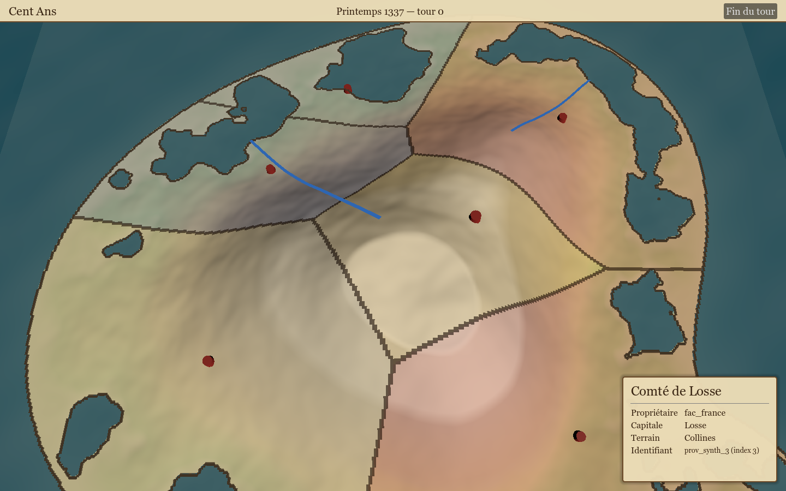
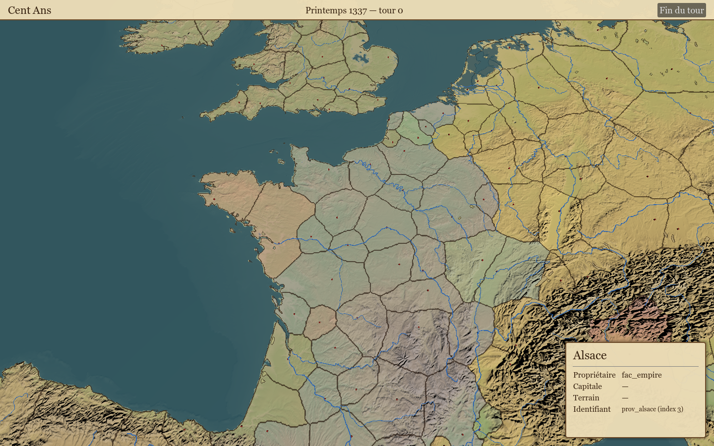

# Carte de campagne Godot (M1)

Rendu et interaction de la carte de campagne dans `game/` (GDScript). Aucune règle de jeu
ici : la scène lit `data/map/` (images + GeoJSON), affiche, et remonte des identifiants.
Contrat de données : `docs/design/m1-campaign-map.md`.



## Architecture de la scène `scenes/campaign_map.tscn`

```
CampaignMap (Node3D, scripts/map/campaign_map.gd)   assemble tout, gère le cycle de vie
├── WorldEnvironment / Sun (DirectionalLight3D)
├── Terrain   (TerrainBuilder)   16 × 16 tuiles ArrayMesh depuis la heightmap, 2 LOD
├── Sea       (Sea)              plan d'eau Y = 0 (shader animé) + fond opaque à −4,5
├── Rivers    (RiversRenderer)   rubans bleus (largeur selon importance ; mineurs masqués de loin)
├── Coast     (CoastRenderer)    ruban brun sur le trait de côte
├── Cities    (CityMarkers)      cylindre + Label3D par capitale (`capital_px`)
├── CameraRig (CampaignCamera)   caméra RTS ; enfant Camera3D
├── Picker    (ProvincePicker)   rayon → terrain → `province_ids.png` → signaux
└── UI        (MapUI, CanvasLayer)
    ├── TopBar        date de campagne (CampaignSim, Rust) + bouton « Fin du tour »
    ├── HoverLabel    nom de la province survolée
    └── ProvincePanel (scenes/ui/province_panel.tscn) panneau parchemin de sélection
```

Autoload `MapPaths` (`scripts/map/map_paths.gd`) : `data_dir` = `<dépôt>/data` par défaut,
surchargé par la variable d'environnement `CENT_ANS_DATA_DIR` ; `MapPaths.map_dir()` = `data_dir/map`.

### Chargement (`MapData`, `scripts/map/map_data.gd`)

- `map.json` → taille, bornes d'altitude, CRS.
- `heightmap.png` : Godot 4.7 réduit les PNG 16 bits à 8 bits. `Png16` (`scripts/map/png16.gd`)
  décode donc le flux lui-même (inflate natif + défiltrage GDScript) et le stocke en
  `Image.FORMAT_LA8` (L = octet fort, A = octet faible), sans boucle de conversion. Le tampon brut
  est mis en cache dans `user://cache/heightmap_<md5>_<mtime>.u16be` ; les chargements suivants
  prennent quelques millisecondes. Si le PNG n'est pas en 16 bits gris, repli en L8 (avertissement).
- `province_ids.png` (RGB8, index = R + 256·G, 0 = mer), `land_mask.png` (optionnel).
- `provinces.geojson`, `rivers.geojson`, `coastline.geojson` via `JSON.parse_string`. Importance d'une
  rivière = `strahler` si présent, sinon `12 − scalerank` (Natural Earth) ; ≥ 3 = fleuve majeur toujours
  affiché, sinon affiché seulement sous 0,35 × taille de carte.
- Accès : `height_m_at(x, y)` (bilinéaire), `height_world_at`, `surface_world_at` (≥ 0),
  `province_index_at(x, y)`, `get_province(index)`.

**Convention d'index** : l'index raster d'une province est la position 1-based de sa feature dans
`provinces.geojson`, sauf si la propriété `index` est présente (recommandé pour `tools/geo`).
Les propriétés optionnelles `name`, `owner`, `terrain`, `capital_name` alimentent le panneau en
attendant que `core/` expose ces données (M2).

### Coordonnées

X monde = x carte (pixel), Z monde = y carte, Y monde = altitude (m) × `MapData.HEIGHT_SCALE`
(0,02). La mer est à Y = 0. Origine au coin nord-ouest, comme la heightmap.

### Terrain (`TerrainBuilder`, `shaders/terrain.gdshader`)

- 256 tuiles (`CHUNKS = 16`) de `size/16` pixels ; sommets tous les `far_step` px (LOD lointain,
  construit au chargement) ou `near_step` px (LOD proche, construit à la demande quand la caméra
  est à moins de `near_distance` du centre de tuile, au plus 4 tuiles par frame, puis mis en cache).
  Pas réglés par la scène selon la taille : 4096² → 4/8, 512² → 1/2.
- Les maillages ne portent que positions + indices ; le shader dérive la normale de la heightmap
  (différences finies sur ±2 px), donc aucune couture entre tuiles ni entre LOD.
- Shader : palette par altitude (mer, rivage, plaine, colline, montagne, neige > 2500 m), pentes
  tirant vers la roche, teinte parchemin ; frontières par comparaison `texelFetch` des voisins de
  `province_ids` (largeur ~constante à l'écran grâce à `fwidth`) ; teinte de faction depuis une
  texture 1D `faction_colors` (largeur = nombre de provinces + 1) ; surbrillance `hovered_id` /
  `selected_id`.
- Couleurs de faction : palette de repli déterministe par propriétaire (ordre d'apparition).
  `TerrainBuilder.set_owner_colors({fac_id: Color})` permettra à `core/` de fournir les vraies.

### Picking (`ProvincePicker`)

Rayon caméra → intersection avec Y = 0, puis point fixe `t = (h(x(t), z(t)) − o.y) / d.y` (≤ 8
itérations, arrêt sous 0,02 unité). Converge car pente × cot(tangage) < 1 avec l'exagération 0,02.
Lecture ensuite de `province_ids` au pixel. Signaux `province_hovered(index)` et
`province_selected(index)` (clic gauche sans glisser). Pas de corps physique.

## Contrôles

| Action | Entrée |
|---|---|
| Déplacement | W A S D (positions physiques : Z Q S D en AZERTY), flèches, bords d'écran (F2 pour désactiver), glisser bouton du milieu |
| Zoom | molette, borné 30..1500 unités |
| Rotation | Q / E (positions physiques : A / E en AZERTY) |
| Inclinaison | automatique : 35° en vue rapprochée → 70° à `pitch_far_distance` (0,45 × taille de carte, ≤ 1500) |
| Sélection | clic gauche sur une province ; survol = surbrillance + nom |
| Capture d'écran | F12 → `docs/img/godot-map-<timestamp>.png` |

Options de ligne de commande (après `--`) : `--screenshot=<chemin.png>` (capture après 40 frames,
sélectionne la province 3, puis quitte), `--focus=<x>,<y>,<distance>` (placement initial de la caméra).

## Pointer sur les vraies données

Par défaut la scène lit `<dépôt>/data/map/`. Pour un autre dossier :

```sh
CENT_ANS_DATA_DIR=/chemin/vers/data godot --path game
```

Après tout changement de script GDScript sur un clone frais, générer le cache des classes
globales une fois : `godot --headless --path game --import` (sinon `class_name` inconnus).

## Données synthétiques et tests

- `game/tools/gen_synthetic_map.gd` : `godot --headless --path game --script res://tools/gen_synthetic_map.gd`
  écrit dans `game/tests/fixtures/map/` une île 512² (bosses gaussiennes + bruit), 6 provinces de
  Voronoï (polygones tracés depuis le raster), 2 rivières (descente de gradient), trait de côte,
  `map.json`. Le PNG 16 bits est encodé à la main (Godot n'écrit que du 8 bits).
- `game/tests/smoke.gd` : CampaignSim (10 tours) + chargement de la scène sur les fixtures,
  256 tuiles, 2 rivières, 6 marqueurs, picking au centroïde de la province 3 par coordonnées monde
  et par projection écran. `godot --headless --path game --script res://tests/smoke.gd` → code 0.

## Performances mesurées (M4 Pro)

| Jeu de données | Chargement | Terrain (LOD lointain) | Tuile proche |
|---|---|---|---|
| Fixtures 512², 6 provinces | 4 ms | 17 ms (74 k sommets, pas 2) | < 1 ms |
| Synthétique 4096², 120 provinces, PNG 16 bits filtré Paeth, cache froid | 5,0 s (décodage GDScript) | 62 ms (279 k sommets, pas 8) | 0,9 ms (pas 4) |
| Idem, cache chaud | 36 ms | 62 ms | 0,9 ms |

20 000 lectures pick + hauteur : 23 ms. Mémoire résidente ≈ 120 Mo (heightmap LA8 32 Mo +
ids RGB8 48 Mo + copies CPU).

## Données réelles (`tools/geo`)

Le jeu `data/map/` produit par le pipeline géo se charge tel quel (4096², 132 provinces, 485 rivières,
289 lignes de côte) : 5,3 s au premier lancement (décodage 16 bits), 0,2 s ensuite.



## Limites connues

- Premier chargement d'une heightmap 16 bits : ~5 s si les lignes PNG sont filtrées (Paeth…),
  quasi nul avec le filtre 0. Piste M2 : `core/` (crate `png`) décode et transmet un
  `PackedByteArray`, supprimant `Png16` et le cache.
- Frontières en escalier de près (résolution de `province_ids`) ; lissage possible plus tard.
- Pas de jupes entre tuiles de LOD différents : petites fissures possibles vues de très près.
- Rivières et côte sont rendues sans test de profondeur (visibles à travers le relief) ; largeur en
  unités monde, non adaptée au zoom.
- Le panneau affiche « — » pour capitale et terrain avec les données réelles (propriétés absentes du
  GeoJSON) : ces champs viendront de `core/` (données `data/provinces/`) en M2.
- Étiquettes masquées au-delà de 0,35 × taille de carte ; pas de dé-chevauchement.
- Panneau alimenté par les propriétés GeoJSON ; le vrai propriétaire viendra de `CampaignSim`.
- macOS arm64 uniquement testé (Metal, Forward+).
