# Carte et interface de campagne Godot (M1 + M2 + M3)

Rendu et interaction de la carte de campagne dans `game/` (GDScript). Aucune règle de jeu
ici : la scène lit `data/map/` (images + GeoJSON), affiche, remonte des identifiants et soumet
des ordres à la simulation Rust (`CampaignSim`) via l'autoload `SimFacade`.
Contrats : `docs/design/m1-campaign-map.md` (données carte), `docs/design/m2-campaign-loop.md`
(§ 2 API `CampaignSim`, § 3 interface), `docs/design/m3-cities-economy.md` (§ 2 API villes et
économie, § 3 interface).


## Scènes

| Scène | Rôle |
|---|---|
| `scenes/start_menu.tscn` (scène principale) | Écran de démarrage : 3 cartes de faction (nom, blason, couleur depuis `GameDataStore.get_faction`, accroche en deux lignes), graine, « Commencer », « Charger une partie », « Quitter ». |
| `scenes/campaign_map.tscn` | Carte 3D + HUD de campagne. |
| `scenes/ui/province_panel.tscn` | Panneau parchemin de province (identité, état) avec deux onglets : « Garnison » (garnison, recrutement, formation d'armée) et « Ville » (population par classe, bâtiments, construction, constructible, ressources — M3). |
| `scenes/ui/faction_panel.tscn` | Panneau de faction (clic sur le blason/nom de la barre) : trésor, revenu, revenu prévisionnel, entretien armées/bâtiments, sélecteur d'impôt, biens par catégorie (M3). |
| `scenes/ui/army_strip.tscn`, `general_seal.tscn` | HUD F10b : bandeau d'ost (régiments en cartes) et sceau du chef (portrait/écu, compétences, posture, ravitaillement, mouvement) de l'armée sélectionnée. |
| `scenes/ui/end_turn_cluster.tscn` | HUD F10b : cloche de fin de saison (Entrée) et éventail d'alertes. |
| `scenes/ui/news_letters.tscn` | HUD F10b : lettres scellées (nouvelles marquantes du tour). |
| `scenes/ui/save_load_dialog.tscn` | Dialogue sauver / charger (`user://saves/*.json`). |
| `scenes/map/army_marker.tscn` | Marqueur d'armée : hampe + bannière billboard (couleur de faction), nombre d'unités, halo de sélection. |
| `scenes/ui/parchment_theme.tres` | Thème commun (police serif système, panneaux, boutons, champs, onglets). |

## Architecture de `campaign_map.tscn`

```
CampaignMap (Node3D, scripts/map/campaign_map.gd)   assemble tout, relie UI ↔ SimFacade.sim
├── WorldEnvironment / Sun (DirectionalLight3D)
├── Terrain     (TerrainBuilder)   16 × 16 tuiles ArrayMesh depuis la heightmap, 2 LOD + relief fin 8192² (C6)
├── Sea         (Sea)              plan d'eau Y = 0 (shader animé) + fond opaque à −4,5
├── Rivers      (RiversRenderer)   rubans bleus (largeur selon importance ; mineurs masqués de loin)
├── Coast       (CoastRenderer)    ruban brun sur le trait de côte
├── Cities      (CityMarkers)      noms de provinces au palier loin (C6 : `labels_only`)
├── Roads       (RoadRenderer)     créé par le code (C6) : routes principales, rubans drapés
├── Settlements (SettlementLayer)  créé par le code (C6) : icônes, maquettes, hameaux, étiquettes
├── PathPreview (PathPreview)      ruban orange : chemin prévisualisé / ordre en cours
├── Armies      (ArmyMarkers)      un `army_marker.tscn` par armée au centroïde de sa province
├── ConstructionMarkers (ConstructionMarkers) Label3D « ⚒ » sur les provinces en construction (M3)
├── CameraRig   (CampaignCamera)   caméra RTS ; enfant Camera3D
├── Picker      (ProvincePicker)   rayon → terrain → `province_ids.png` → signaux (clic gauche / droit)
└── UI          (MapUI, CanvasLayer)
    ├── TopBar         couleur + nom de faction (clic → panneau de faction), trésor,
    │                  solde net par saison, date, Cour, Technologies, Chronique, Diplomatie, Menu
    ├── Toast          notification (ordre refusé, sauvegarde, bataille), 3,5 s
    ├── HoverLabel     province survolée, ou « → cible : n étapes, coût c » avec une armée sélectionnée
    │                  (au-dessus du bandeau ; sinon position et ordre en cours de l'armée)
    ├── EventLog       journal du tour (bas gauche, replié par défaut, plus récent en haut ; remonte
    │                  au-dessus du sceau quand une armée est sélectionnée)
    ├── ArmyActions    boîte au-dessus du bandeau (assaut de siège, M8), créée par `MapUI`
    ├── ArmyStrip      bandeau d'ost (bas centre, armée sélectionnée ; F10b)
    ├── GeneralSeal    sceau du chef (bas gauche ; clic → fiche, posture → `set_stance`)
    ├── NewsLetters    lettres scellées (haut droite ; masquées sous un panneau de droite)
    ├── EndTurnCluster cloche de fin de saison + alertes (bas droite ; seul porteur de `campaign_end_turn`)
    ├── ProvincePanel  scenes/ui/province_panel.tscn (onglets Garnison / Ville)
    ├── FactionPanel   scenes/ui/faction_panel.tscn (M3)
    └── SaveLoadDialog scenes/ui/save_load_dialog.tscn
```

### Autoloads

- `MapPaths` (`scripts/map/map_paths.gd`) : `data_dir` = `<dépôt>/data` par défaut, surchargé par
  la variable d'environnement `CENT_ANS_DATA_DIR` ; `MapPaths.map_dir()` = `data_dir/map`.
- `SimFacade` (`scripts/sim/sim_facade.gd`) : point d'accès unique à la simulation.
  - `sim` = la vraie `CampaignSim` (GDExtension) si `ClassDB.class_exists("CampaignSim")` et
    qu'elle expose `get_army_ids` (API M2), sinon `CampaignSimMock` (`scripts/sim/campaign_sim_mock.gd`,
    même API, données factices : voisinage depuis `provinces.geojson`, 3 armées, batailles à pile ou
    face). `is_real` indique le moteur ; l'écran de démarrage l'affiche (« Simulation réelle/factice »).
  - `store` = `GameDataStore` chargé sur `MapPaths.data_dir` (null sur les fixtures de test).
  - `new_campaign(faction, seed)` recrée une simulation neuve ; si la vraie refuse (dossier de données
    incomplet), repli sur le mock avec avertissement.
  - `pending_faction` / `pending_seed` / `pending_load_path` : requête transmise du menu à la carte.
  - Sauvegardes : `save_game(nom)` écrit `user://saves/<nom>.json` =
    `{version, engine: "real"|"mock", faction, date, turn, timestamp, state: sim.save_to_string()}` ;
    `load_game(chemin)` restaure (`load_from_string`) ; `list_saves()` trié par date décroissante.
    Une sauvegarde `real` ne se charge pas avec le mock (erreur explicite).

### Chargement (`MapData`, `scripts/map/map_data.gd`)

- `map.json` → taille, bornes d'altitude, CRS.
- `heightmap.png` 16 bits : décodé par `GameDataStore.load_heightmap_u16` (crate `png` côté Rust,
  ~100 ms pour 4096²) en little-endian ; l'image est stockée en `Image.FORMAT_LA8` avec
  `height_little_endian = true` (L = octet faible, A = octet fort). Repli sans GDExtension :
  `Png16` (`scripts/map/png16.gd`, décodage GDScript big-endian + cache `user://cache/`), puis
  `Image.load_from_file` 8 bits en dernier recours. `MapData.height_decoder` ∈ {rust, png16, 8bit}.
  Le shader et le constructeur de maillage lisent l'ordre d'octets via `height_little_endian`.
- `province_ids.png` (RGB8, index = R + 256·G, 0 = mer), `land_mask.png` (optionnel).
- `provinces.geojson`, `rivers.geojson`, `coastline.geojson` via `JSON.parse_string`. Importance d'une
  rivière = `strahler` si présent, sinon `12 − scalerank` (Natural Earth) ; ≥ 3 = fleuve majeur toujours
  affiché, sinon affiché seulement sous 0,35 × taille de carte.
- Accès : `height_m_at(x, y)` (bilinéaire), `height_world_at`, `surface_world_at` (≥ 0),
  `province_index_at(x, y)`, `get_province(index)`, `index_of_id(id)`, `centroid_of_id(id)`.

**Convention d'index** : l'index raster d'une province est la position 1-based de sa feature dans
`provinces.geojson`, sauf si la propriété `index` est présente (recommandé pour `tools/geo`).
Les noms d'affichage (`display_name`, `capital`, `terrain`, `owner_display_name`) viennent de
`GameDataStore.get_province` (`CampaignMap.province_info`) ; les propriétés GeoJSON `name`, `owner`,
`terrain`, `capital_name` ne servent que de repli (fixtures).

### Coordonnées

X monde = x carte (pixel), Z monde = y carte, Y monde = altitude (m) × `MapData.HEIGHT_SCALE`
(0,02). La mer est à Y = 0. Origine au coin nord-ouest, comme la heightmap.

### Terrain (`TerrainBuilder`, `shaders/terrain.gdshader`)

- 256 tuiles (`CHUNKS = 16`) de `size/16` pixels ; sommets tous les `far_step` px (LOD lointain,
  construit au chargement) ou `near_step` px (LOD proche, construit à la demande quand la caméra
  est à moins de `near_distance` du centre de tuile, au plus 4 tuiles par frame, puis mis en cache).
  Pas réglés par la scène selon la taille : 4096² → 4/8, 512² → 1/2.
- Les maillages ne portent que positions + indices ; le shader dérive la normale de la heightmap
  (différences finies sur ±2 px), donc aucune couture entre tuiles ni entre LOD.
- Shader : palette par altitude, pentes tirant vers la roche, teinte parchemin ; frontières par
  comparaison `texelFetch` des voisins de `province_ids` (largeur ~constante à l'écran grâce à
  `fwidth`) ; surbrillance `hovered_id` / `selected_id`.
- **Couleurs de faction** : texture 1D `faction_colors` (largeur = nombre de provinces + 1) remplie par
  `TerrainBuilder.set_province_colors(PackedColorArray)` depuis `CampaignMap._refresh_owner_colors` :
  base `GameDataStore.get_province_owner_colors(ids)`, puis couleur héraldique du propriétaire courant
  selon `CampaignSim.get_province_state(id).owner` (les conquêtes recolorent la carte). Sans
  `GameDataStore` (fixtures), palette de repli déterministe par propriétaire.
- **Masque atteignable** : texture 1D `province_mask` (R8, indexée par province) posée par
  `set_reachable(reachable, path)` : ~0,5 = atteignable ce tour (teinte jaune), 1 = sur le chemin
  prévisualisé (orange), 0 = assombri (×0,7) tant qu'une armée est sélectionnée.

### Armées (`ArmyMarkers`, `ArmyMarker`, `PathPreview`)

- `ArmyMarkers.refresh(sim, color_of, player_faction)` reconstruit tous les marqueurs depuis
  `get_army_ids` / `get_army` (après chaque fin de tour, ordre ou chargement). Position = centroïde de la
  province ; armées empilées décalées en anneau (rayon 6 × échelle). Échelle = distance caméra × 0,014
  (bornée 0,8..14) pour rester lisible ; le `Label3D` du nombre d'unités compense l'échelle.
- `pick_screen(pos)` : armée la plus proche du curseur (< 26 px après projection), prioritaire sur la
  province via `ProvincePicker.click_interceptor`.
- `PathPreview.show_path([départ, …chemin], distance)` : ruban `PolylineMesh` posé sur le relief,
  segments subdivisés tous les 12 px.

### Picking (`ProvincePicker`)

Rayon caméra → intersection avec Y = 0, puis point fixe `t = (h(x(t), z(t)) − o.y) / d.y` (≤ 8
itérations, arrêt sous 0,02 unité). Lecture ensuite de `province_ids` au pixel. Signaux
`province_hovered(index)`, `province_selected(index)` (clic gauche sans glisser, sauf si
`click_interceptor` a consommé le clic) et `province_right_clicked(index)`. Pas de corps physique.

## Boucle de jeu côté Godot (`campaign_map.gd`)

| Action | Appel simulation | Rafraîchissement |
|---|---|---|
| Clic gauche sur une armée | `get_army`, `get_reachable` (si armée du joueur) | panneau d'armée, halo, masque atteignable, chemin en cours |
| Survol d'une province, armée sélectionnée | `find_path(armée, cible)` | ruban + provinces du chemin en orange, étiquette « n étapes, coût c » |
| Clic droit sur une province | `find_path` puis `submit_order({"type": "move_army", "army", "path"})` | `refresh_all()` ; erreur → notification |
| Posture (panneau d'armée) | `submit_order({"type": "set_stance", …})` | idem |
| « Recruter » → ligne | `get_recruitable(province)` puis `submit_order({"type": "recruit", …})` | idem ; lignes indisponibles désactivées avec la raison |
| « Former une armée » | `submit_order({"type": "create_army", "province", "units_from_garrison": [indices cochés]})` | sélectionne la nouvelle armée si la réponse contient `army` |
| Panneau de province, onglet Ville → « Construire » | `submit_order({"type": "build", "province", "building"})` | idem ; lignes indisponibles désactivées avec la raison (M3) |
| Onglet Ville → « Annuler » (construction en cours) | `submit_order({"type": "cancel_build", "province"})` | idem, remboursement à moitié affiché par le trésor (M3) |
| Panneau de faction → sélecteur d'impôt | `submit_order({"type": "set_tax_rate", "rate": "low"\|"normal"\|"high"})` | panneau de faction rafraîchi (M3) |
| Clic sur le blason/nom de faction (barre) | `get_faction_economy(faction)` (si disponible) | ouvre le panneau de faction (M3) |
| Touche M | `get_province_city` sur chaque province (si disponible) | bascule la teinte des provinces (faction ↔ mécontentement, M3) |
| Cloche / Entrée | `end_turn()` → événements | journal (plus récent en haut), lettres scellées, alertes, notification de bataille, tout rafraîchi ; si une décision de chronique attend, la cloche ouvre la chronique au lieu de finir la saison |
| Menu → Sauvegarder / Charger | `SimFacade.save_game` / `load_game` | carte, HUD et journal restaurés |

## Contrôles

| Action | Entrée |
|---|---|
| Déplacement | W A S D (positions physiques : Z Q S D en AZERTY), flèches, bords d'écran (F2 pour désactiver), glisser bouton du milieu |
| Zoom | molette (±15 % par cran), borné 22..1500 unités ; avec la pyramide de relief (ZG4), jusqu'à 5 (E2), 1,5 (E4), 0,3 (zones E5-E7) |
| Rotation | Q / E (positions physiques : A / E en AZERTY) |
| Inclinaison | automatique : 30° à 22 unités → 70° à `pitch_far_distance` ; ZG4 : de plus en plus rasante sous 22 (11° à 0,3) |
| Sélection | clic gauche : armée (prioritaire) ou province ; survol = surbrillance + nom ; Échap désélectionne l'armée |
| Ordre de déplacement | clic droit sur une province avec une armée sélectionnée |
| Fin de saison | cloche en bas à droite ou Entrée (action `campaign_end_turn`, désactivée pendant un dialogue ; bloquée par une décision de chronique) |
| Mode mécontentement (M3) | M (action `map_toggle_unrest`) ; ignoré avec un message si `get_province_city` est indisponible |
| Cour (M4) | C |
| Diplomatie (M5) | P ; modes de carte N (diplomatie) et R (religion) |
| Objectifs (M10) | O (ou Menu → Objectifs) ; écran de fin de campagne automatique |
| Chronique (M10) | bouton « Chronique (n) » ; la fenêtre s'ouvre seule en fin de tour quand une décision attend |
| Capture d'écran | F12 → `docs/img/godot-map-<timestamp>.png` |

Options de ligne de commande (après `--`) :
- `--screenshot=<chemin.png>` : capture après 40 frames puis quitte. Sur `campaign_map.tscn`, met en
  scène la première armée du joueur sélectionnée avec l'aperçu de chemin vers la province atteignable la
  plus coûteuse ; avec `--stage=province`, sélectionne la capitale du joueur et ouvre le recrutement ;
  avec `--stage=city`, capitale du joueur et onglet Ville du panneau de province ; avec `--stage=faction`,
  panneau de faction ouvert. `--stage=city`/`faction` basculent sur `CampaignSimMock` si la simulation
  active n'expose pas encore `get_province_city` (`_ensure_city_capable_sim`). Sur `start_menu.tscn`,
  capture l'écran de démarrage.
- `--focus=<x>,<y>,<distance>` : placement initial de la caméra ; `--camera-yaw=<degrés>` (ZG4 : 0 = regard
  vers le nord, 90 = vers l'ouest, -90 = vers l'est).
- ZG4 : `--static-exaggeration` (relief ×4,3 à tous les zooms, captures « avant »),
  `--rescale-settle-ms=N` (délai avant recalage des calques, mesures), `--dump-near` (après une capture,
  liste les géométries visibles autour de la caméra : diagnostic des objets démesurés en vue rasante).

```sh
godot --path game                                   # menu de démarrage
godot --path game res://scenes/campaign_map.tscn -- --screenshot=docs/img/godot-campaign-hud.png
godot --path game res://scenes/campaign_map.tscn -- --screenshot=out.png --stage=province
godot --path game res://scenes/campaign_map.tscn -- --screenshot=docs/img/godot-city-panel.png --stage=city
godot --path game res://scenes/campaign_map.tscn -- --screenshot=docs/img/godot-faction-panel.png --stage=faction
```


## Pointer sur les vraies données

Par défaut la scène lit `<dépôt>/data/`. Pour un autre dossier :

```sh
CENT_ANS_DATA_DIR=/chemin/vers/data godot --path game
```

Après tout changement de script GDScript sur un clone frais, générer le cache des classes
globales une fois : `godot --headless --path game --import` (sinon `class_name` inconnus).

## Données synthétiques et tests

- `game/tools/gen_synthetic_map.gd` : `godot --headless --path game --script res://tools/gen_synthetic_map.gd`
  écrit dans `game/tests/fixtures/map/` une île 512² (bosses gaussiennes + bruit), 6 provinces de
  Voronoï, 2 rivières, trait de côte, `map.json`. Le PNG 16 bits est encodé à la main.
- `game/tests/smoke.gd` (`godot --headless --path game --script res://tests/smoke.gd` → code 0) :
  1. `CampaignSim` : 10 tours, date « Automne 1339 » (API M2 `new_campaign(data, "fac_france", 1337)`
     sur `data/` si disponible, sinon ancienne signature) ;
  2. carte sur les fixtures : décodeur 16 bits (imprimé), 256 tuiles, 2 rivières, 6 marqueurs, picking
     de la province 3, panneau de province ;
  3. écran de démarrage : 3 cartes, France par défaut ;
  4. boucle de campagne France via `SimFacade` (réelle sur `data/` si disponible, sinon mock sur les
     fixtures — imprimé « REAL »/« MOCK ») : sélection de la première armée du joueur, atteignables non
     vides, aperçu de chemin, ordre de déplacement, 4 fins de tour, sauvegarde `user://saves/smoke.json`,
     un tour de plus, rechargement, égalité des dates (sim et étiquette du HUD) ;
  5. villes et économie (M3), sur la vraie simulation si elle expose `get_province_city` (sinon un
     `CampaignSimMock` dédié sur `data/` — imprimé « REAL »/« MOCK ») : 20 tours de stabilisation, choix
     du constructible le moins cher à effet économique direct (trade_income/tax_income/wealth, sinon le
     moins cher disponible) à `prov_ile_de_france`, `submit_order({"type": "build", ...})`, tours jusqu'à
     achèvement, vérifie l'apparition dans `buildings`, puis une fenêtre de tours après achèvement où l'on
     retient le meilleur `projected_income` observé (la richesse converge sur plusieurs saisons, § 1.1) et
     vérifie qu'il dépasse celui d'avant construction ; `set_tax_rate` à « high » et vérifie la hausse
     immédiate de `projected_income` (comparaison sans fin de tour, isolée de la dérive de fond).
  6. batailles (M7) : voir « Batailles (M7) » ci-dessous.
  7. chronique (M10, `_run_chronicle`) : 60 tours France sur la vraie simulation, au moins une décision
     historique et une aléatoire, la première résolue par `submit_order({"type": "choose_event_option"})`,
     les autres par `choose_event_option`, refus d'une décision inconnue, fenêtre instanciée.
  Un script `--script` est compilé avant l'enregistrement des autoloads : le test accède à `SimFacade`
  et `MapPaths` par `/root/...` (seules les constantes/statics sont utilisables directement).

## Villes et économie (M3)

- `CampaignSimMock` (`scripts/sim/campaign_sim_mock.gd`) étend l'API mock avec `get_province_city`,
  `get_faction_economy` et les ordres `build`/`cancel_build`/`set_tax_rate` (mêmes formes que
  `docs/design/data-model.md` § 7.4, y compris `effects: {clé: {flat, percent}}`) : population par
  classe lue depuis `data/provinces/<id>.json` (non exposé par `GameDataStore.get_province`), catalogues
  `data/buildings/*.json` / `data/resources/*.json`, dérive simplifiée des jauges de classe, révolte /
  peste / famine / bâtiment achevé en fin de tour.
- L'interface appelle systématiquement `sim.has_method("get_province_city" / "get_faction_economy")`
  avant d'utiliser l'API M3 (`CampaignMap._city_available` / `_economy_available`) : avec un
  `CampaignSim` réel qui ne les exposerait pas encore, l'onglet Ville reste vide, le panneau de faction
  affiche « Non disponible », la touche M est sans effet (notification) et aucun marteau n'apparaît —
  aucun crash. Depuis l'atterrissage de `get_province_city`/`get_faction_economy` côté `core/` (bridge),
  la vraie simulation est utilisée pour tout, y compris le smoke test et les captures.
- `--stage=city`/`--stage=faction` (capture d'écran) basculent sur un `CampaignSimMock` dédié
  (`_ensure_city_capable_sim`) si jamais la simulation active ne les expose pas, pour garder des captures
  exploitables pendant le développement.

## Personnages et dynasties (M4)

- **Cour** (bouton « Cour », touche C) : `scenes/ui/court_panel.tscn`. Liste des personnages vivants
  de la faction (portrait = couleur de faction + initiales, âge, titre, activité), tri Rang/Âge/Nom,
  filtre Généraux/Gouverneurs/À la cour. Le journal est masqué tant que la cour est ouverte.
- **Fiche personnage** : `scenes/ui/character_sheet.tscn`. Compétences, XP, points, traits (info-bulles),
  famille, boutons « Nommer gouverneur », « Donner le commandement », « Marier », et l'arbre de
  compétences en trois colonnes (appris / disponible / verrouillé) ; un clic envoie `learn_skill`.
- Panneau province : ligne « Gouverneur : X » ; panneau armée : compétences du général.
- Journal : couleurs dédiées pour naissances, morts, successions, régences, traits acquis.
- Captures : `--stage=court` et `--stage=skills` (`docs/img/godot-court.png`, `godot-skill-tree.png`).
  Le mock `campaign_sim_mock.gd` n'est plus utilisé que si l'extension n'expose pas `get_character`.

## Technologies (M6)

- **Technologies** (bouton « Technologies », touche T, ou clic sur la jauge de recherche de la barre) :
  `scenes/ui/tech_panel.tscn` (`TechPanel`). Onglets Militaire et Civil ; chaque onglet est un
  `TechTreeView` (`scripts/ui/tech_tree_view.gd`) : colonnes par rang, nœuds reliés par des lignes de
  prérequis (vertes si le prérequis est acquis ; les sauts de rang passent dans l'interligne), états
  colorés (vert acquise, or en cours, clair disponible, gris verrouillée). Info-bulle : description,
  effets, déblocages, année historique, coût (surcoût anachronique signalé). Clic sur une tech
  disponible = ordre `research`. En tête : recherche en cours, progression, points par tour.
- Barre supérieure : jauge de la recherche en cours (nom + barre, détail en info-bulle) ; masquée si la
  simulation n'expose pas `get_tech_tree` (mock).
- Journal : couleur violette dédiée ⚙ pour `technology_researched`. Le journal est masqué tant que
  le panneau est ouvert.
- Captures : `--stage=tech` (`docs/img/godot-tech-tree.png`), `--stage=tech_civil` (onglet Civil) :
  lance la première tech militaire disponible, joue deux tours, ouvre le panneau.
- Le mock `CampaignSimMock` n'implémente pas les technologies : bouton et jauge affichent
  « indisponible », le smoke test saute l'étape (message imprimé).

## Diplomatie et religion (M5)

- **Diplomatie** (bouton « Diplomatie », touche P ; D est prise par la caméra) : `scripts/ui/diplomacy_panel.gd`,
  construit en code et branché par `scripts/map/diplomacy_controller.gd`. Liste des factions (couleur,
  statut, barre d'attitude), fiche (raisons de l'attitude, score de guerre, casus belli, prétentions,
  religion, loyauté des vassaux) et actions : guerre, paix (provinces à céder/exiger, tribut), alliance,
  rupture, embargo, vassalité, libération, présents, médiation pontificale, don à l'Église. Le survol
  d'une action affiche le verdict de la simulation (« Accepterait / Refuserait » et raisons).
- **Propositions reçues** : en tête du panneau (Accepter / Refuser) ; le panneau s'ouvre en fin de tour
  quand il y en a. Le choix d'obédience du Grand Schisme arrive par ce canal.
- **Modes de carte** : N diplomatie (or = soi, rouge = guerre, bleu = allié, violet = vassal/suzerain,
  jaune = trêve, gris = paix) ; R religion (bleu = Église/Avignon, or = Rome, vert = hérésie).
- Journal : couleurs pour guerre, paix, alliances, rébellions, embargos, offres, excommunication, schisme, hérésie.
- Captures : `--stage=diplomacy` (`docs/img/godot-diplomacy.png`), `--stage=diplomacy_map`
  (`docs/img/godot-diplomacy-map.png`).
## Batailles (M7)

Contrat : `docs/design/m7-battles.md` ; API : `docs/design/data-model.md` § 7.6. Toutes les règles
sont dans `BattleSim` (Rust) ; la scène ne fait qu'afficher et envoyer des commandes.


- **Fin de tour** (`campaign_map.gd`, section « Batailles (M7) ») : après `end_turn`, si
  `get_pending_battles()` n'est pas vide, `scenes/battle/pre_battle_dialog.tscn` s'ouvre (forces en
  présence, composition, général, terrain, saison, météo prévue lue sur un `BattleSim` construit avec
  la graine de la bataille). « Résolution automatique » → `auto_resolve_battle` ; « Livrer bataille » →
  la carte est mise en sommeil (`visible = false`, `PROCESS_MODE_DISABLED`, HUD caché ; la simulation
  n'est pas recréée) et `scenes/battle/battle.tscn` est ajoutée à la racine (`configure(sim, index,
  seed)`). « Retour à la campagne » appelle `resolve_battle` puis signal `returned` → la carte revient,
  journal et marqueurs rafraîchis, bataille suivante proposée. Une fin de tour avec un dialogue ouvert
  le ferme : la simulation auto-résout d'elle-même les batailles restées en attente.
- **Scène** (`scripts/battle/`) :

```
Battle (Node3D, battle_scene.gd)   tick, rendu, entrées, écran de fin
├── WorldEnvironment / Sun          ciel procédural ; brouillard/pluie/neige selon get_weather
├── Terrain (BattleTerrain)         grille get_terrain() colorée par sommet (herbe/altitude, sous-bois,
│                                   boue, berges, gués), ruban d'eau, arbres MultiMesh, sol lointain
├── CameraRig (BattleCamera)        caméra RTS ; enfant Camera3D
├── HUD (BattleHud, CanvasLayer)    barre du haut, journal, cartes d'unité, ordres, écran de fin
├── attacker_infantry … defender_siege   8 MultiMeshInstance3D (camp × famille), buffer = get_soldier_buffer
└── BannerN + anneau de sélection   hampe, drapeau (couleur de faction, blanc en déroute), icône, effectif
```

- **Maillages** : `BattleMeshes` (SurfaceTool) construit fantassin, archer, cavalier, engin, arbre et
  hampe en pavés low-poly ; surface 0 = livrée (couleur de faction via le matériau), surface 1 = neutre
  (couleurs de sommets sRGB). Les triangles sont orientés selon la normale (`BattleMeshes.tri`).
- **Contrôles** :

| Action | Entrée |
|---|---|
| Caméra | W A S D (positions physiques), bords d'écran, glisser bouton du milieu ; molette ; Q / E rotation |
| Sélection | clic gauche (unité ou carte d'unité), rectangle en glissant, Maj pour ajouter / retirer ; Échap vide |
| Déplacer / attaquer | clic droit au sol / sur une unité ennemie ; double clic droit = au pas de course |
| Orienter la ligne | glisser-droit : les régiments s'alignent sur le segment, front à l'opposé de la caméra |
| Formation | F (cycle autorisé : ligne → colonne → schiltron pour l'infanterie, ligne → coin → colonne pour la cavalerie) |
| Tir à volonté | G (bascule pour les tireurs sélectionnés) |
| Halte / retraite | H ; boutons « Retraite » (sélection) et « Retraite générale » |
| Temps | Espace = pause (ordres possibles en pause), 1 / 2 / 3 = ×1 / ×2 / ×4 |
| Capture | F12 → `docs/img/godot-battle-<horodatage>.png` |

- **Ligne de commande** :

```sh
godot --path game res://scenes/battle/battle.tscn                       # démo France–Angleterre
godot --path game res://scenes/battle/battle.tscn -- --screenshot=/chemin/absolu/godot-battle.png
godot --path game res://scenes/campaign_map.tscn -- --screenshot=/chemin/absolu/godot-battle-dialog.png --stage=battle
godot --path game --disable-vsync res://scenes/battle/battle.tscn -- --units=20 --benchmark
```

  Seule, la scène crée une campagne France 1337 et met en scène (`debug_stage_battle`) la plus grande
  armée française contre la plus grande anglaise. `--screenshot` joue les deux IA jusqu'au premier
  contact + 12 s puis capture ; `--units=n` complète chaque camp à n régiments de 120 soldats (banc
  d'essai, pas de retour campagne) ; `--benchmark` mesure les FPS sur 600 images ; `--autoplay` confie
  aussi le camp du joueur à l'IA.
- **Performances** (M4 Pro, Metal, bibliothèque Rust en debug) : 2 × 20 régiments de 120 soldats
  (4 800 soldats, 8 MultiMesh mis à jour à chaque image) : **60 FPS** vsync (58,7 de moyenne sur 600
  images, démarrage compris), **141 FPS** de moyenne sans vsync (pointe 188). Pas de simulation :
  0,12 ms en debug, 0,02 ms en release pour 40 régiments.
- **Smoke** (§ 8 de `tests/smoke.gd`) : bataille réelle France–Angleterre, jusqu'à 12 000 ticks headless
  de `BattleSim` avec les deux IA (fin atteinte, ≈ 3 500 ticks depuis l'IA M9), `resolve_battle` accepté ; puis la boucle
  complète par la carte : dialogue visible, « Livrer bataille », `battle.tscn` 60 images (soldats
  dessinés), un ordre, fin de bataille, écran de fin, « Retour à la campagne », bataille résolue.
- **IA de bataille** (M9, `m9-ai.md` § 2) : le camp que le joueur ne commande pas (les deux en
  `--autoplay`) est joué par l'IA tactique de `sim-battle` (rôles, posture défensive sur hauteur avec
  pieux quand il est plus faible, duel d'archers, charges de flanc, réserve, retraits) ; aucune règle côté
  Godot.

### Batailles de siège (M8 § 2)

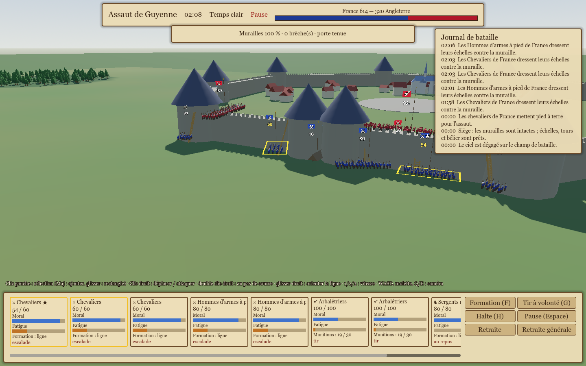

- **Entrée** : bouton « Donner l'assaut » du panneau d'armée (`siege_controller.gd`) → avec les
  batailles interactives, l'assaut attend en bataille de siège et le dialogue s'ouvre aussitôt
  (« Assaut en vue », fortifications et brèche, « Livrer l'assaut » / « Résolution automatique ») ; un
  assaut de l'IA contre une place du joueur arrive au même dialogue en fin de tour.
- **Scène** : `battle.tscn` détecte `get_terrain().siege` et ajoute un nœud `Siege`
  (`scripts/battle/battle_siege.gd`, `BattleSiege`) : courtines crénelées (une par pan, axe local X le long
  du pan, Z vers l'extérieur), tours rondes à toit conique, porte (linteau et vantaux), place pavée avec
  puits, maisons et église dans la moitié arrière (modèle M10 `assets/models/cathedral.glb` s'il
  existe). `update(get_siege(), units)` à chaque image : pans battus assombris et abaissés, effondrés en
  éboulis (brèche), vantaux disparus (porte enfoncée) ; beffroi et bélier dessinés d'un seul tenant
  (`render` = `tower` / `ram`, pas de MultiMesh de soldats), échelles appuyées devant les régiments qui
  escaladent. Les défenseurs sur le chemin de ronde sont dessinés à sa hauteur (`y` du pont). HUD : ligne
  « Murailles x % · n brèche(s) · porte tenue/enfoncée · place centrale tenue t / 60 s », titre
  « Assaut de … ».
- **Ligne de commande** : `godot --path game res://scenes/battle/battle.tscn -- --siege
  --screenshot=/chemin/absolu/godot-siege-battle.png` (démo : la plus grande armée française assiège la
  Guyenne, `debug_stage_siege` ; capture 10 s après les premières échelles, vue sur la façade).
- **Smoke** (§ 11) : assaut réel de la Guyenne headless (murailles, défenseurs sur le rempart, fin,
  `resolve_battle`), puis `battle.tscn` sur un second assaut (murailles maillées, ligne d'état, fin,
  retour).

## Chronique : événements historiques et aléatoires (M10)

- **Fenêtre « Chronique »** : `scenes/ui/chronicle_window.tscn` + `scripts/ui/chronicle_window.gd`
  (`ChronicleWindow`, parchemin construit en code), branchée par `scripts/map/chronicle_controller.gd`
  (`ChronicleController` ; `campaign_map.gd` n'appelle que `setup`, `refresh`, `after_end_turn`, blocs
  marqués M10). Rubrique (« Chronique du temps » pour un historique, « Nouvelles du royaume » pour un
  aléatoire), titre, province et délai (« à décider sous 2 tours »), texte d'époque en italique, un bouton
  par choix avec ses effets en info-bulle et résumés en petit dessous. « Plus tard » / × referme sans
  répondre : sans choix, le premier s'applique d'office à l'expiration (2 tours).
- **File** : la fenêtre montre la première décision de `get_pending_decisions()` ; après chaque choix
  (`choose_event_option`), la suivante s'affiche, puis la fenêtre se ferme. Elle s'ouvre seule en fin de
  tour s'il y a une décision ; le bouton « Chronique (n) » de la barre la rouvre (grisé à 0, masqué si la
  simulation n'expose pas l'API, par exemple le mock).
- Journal : couleur brune dédiée « § » pour `chronicle` (déclenchements, choix, choix d'office).
- Capture : `--stage=chronicle` (`docs/img/godot-chronicle.png`) : joue jusqu'à la première décision
  historique (au plus 60 tours, les décisions aléatoires tranchées au premier choix), puis ouvre la fenêtre.

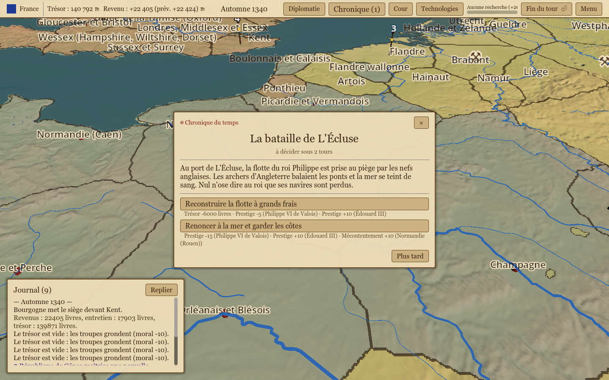

## Assets, sons et musique (M10, partie 2)

Tout est facultatif : un fichier absent laisse le placeholder d'origine (le smoke test vérifie les
replis). Les points d'accroche dans les scripts existants sont marqués `# M10 assets`.

- **`ModelLibrary`** (`scripts/map/model_library.gd`) : charge `res://assets/models/*.glb` (cache).
  `CityMarkers` pose `city_model(province_id)` à la place du cylindre, à l'échelle 6,5 : `castle` pour
  la capitale d'une faction (`data/factions/*.json` → `capital`), `cathedral` si la province a
  `bld_cathedral`, `town` si murailles ou `fortification_level ≥ 2`, sinon `village` (lecture des
  données au rendu seulement). `ArmyMarker.setup` appelle `dress_army_marker` : porte-étendard
  (échelle 3,2, bannière et caparaçon au matériau `Banner` teintés à la couleur de faction par
  duplication du maillage, mis en cache par couleur), camp de siège ajouté si `stance == "siege"`,
  cogue si l'armée expose `embarked`/`at_sea` ; hampe, bannière billboard et pommeau sont masqués
  (la bannière reste le point de picking).
- **`PortraitLoader`** (`scripts/ui/portrait_loader.gd`) : `res://assets/portraits/<personnage>.png`
  puis, à défaut, `res://assets/heraldry/<faction>.png` (personnages générés ou pas encore peints) ;
  import Godot si présent, sinon `Image.load_from_file`. Utilisé par la Cour (48 px), la fiche
  personnage (96 px), la barre supérieure, la liste de la Diplomatie et les cartes du menu de départ.
- **`AudioDirector`** (autoload, `scripts/audio/audio_director.gd`) : bus « Musique » et « Effets »,
  volumes 0..1 persistés dans `user://settings.cfg` (section `audio`), curseurs sous les boutons du
  menu de départ et entrée « Son… » du menu de la carte (onglet Son des réglages, Q2). Musique en boucle avec fondu de 1,5 s :
  `campaign` (menu et paix), `war` dès que `get_diplomacy(joueur)` contient un statut `war`, `court`
  tant que le panneau de la Cour est ouvert. Effets : clic sur tout bouton (`SceneTree.node_added`),
  page tournée à l'ouverture d'un panneau de la carte, cloche de fin de tour puis, 0,7 s après,
  l'effet de l'événement le plus marquant (bataille → choc d'armes, siège/guerre → cor, prise de
  province/paix/naissance/mariage → fanfare, mort/succession/religion → chœur). En headless, les flux
  sont chargés mais pas joués.
- Accès depuis les scripts : `get_node_or_null("/root/AudioDirector")` (compatible smoke test).

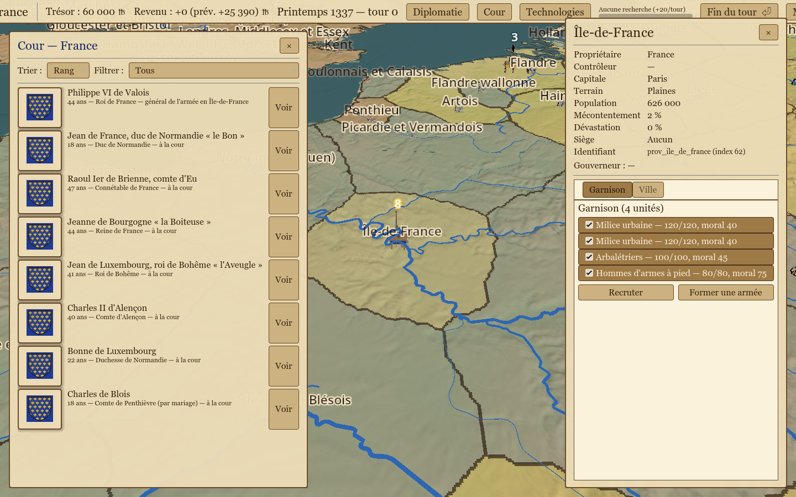
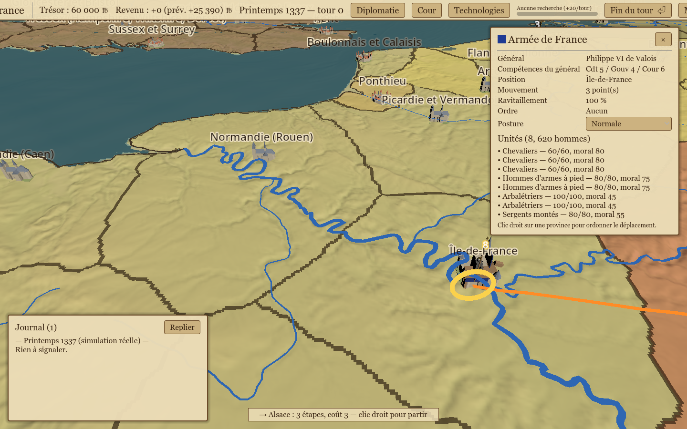

```sh
godot --path game res://scenes/campaign_map.tscn -- --screenshot=$PWD/docs/img/godot-portraits.png --stage=court
godot --path game res://scenes/campaign_map.tscn -- --screenshot=$PWD/docs/img/godot-campaign-models.png --focus=2150,1880,230
```

## Écrans et flux (F3)

Enveloppe du jeu autour de la carte ; aucune règle de jeu (lecture de l'état, demandes existantes).

- **Illustration** : `uv run --project tools cent-ans assets menu-art` rend depuis `data/map/` une
  carte ancienne 2560 × 1440 (`game/assets/ui/menu_map.jpg`, Pillow + numpy, déterministe) : parchemin,
  lignes d'eau le long des côtes, lignes de rhumb et rose des vents placée en mer, lavis d'ombrage et
  hachures de relief, taupinières au-dessus de 1300 m, côtes à l'encre, rivières, frontières, capitales
  des factions, cartouche « Cent Ans », cadre gradué. `menu_map.json` donne le rectangle du cartouche.
  `MenuBackground` (`scripts/ui/menu_background.gd`) l'affiche calée en haut à droite, avec un lent
  zoom ; repli brun uni sans image.
- **Menu de départ** (`start_menu.gd`) : fond illustré, cartes de faction (écu, blason, accroche,
  objectifs historiques ; double clic = commencer), Continuer (sauvegarde la plus récente
  chargeable), Commencer, Charger, Réglages, Crédits, Quitter ; fondu à l'ouverture et vers le
  chargement. Options : `--menu-stage=settings|credits|loading`, `--screenshot=`, `--autostart`.
- **Chargement** (`loading_screen.gd`, `LoadingScreen.start(tree)`) : `CanvasLayer` persistant qui
  charge `campaign_map.tscn` en tâche de fond (progression du `ResourceLoader`), dessine l'étape
  « relief, provinces, terrain, campagne » puis instancie la carte (le `_ready` de la carte est
  synchrone, ≈ 0,5 s), attend les premières images et se fond. `--loading-shot=<png>` pour la capture.
- **`FlowController`** (`scripts/map/flow_controller.gd`) : créé par `campaign_map.gd`, qui n'appelle
  que `setup`, `refresh` (fin de `refresh_all`), `before_end_turn` et `after_end_turn(events)`.
  - Menu pause (Échap, action `campaign_pause`, ou Menu → Menu pause) : `PauseMenu`, arbre en pause
    (les fenêtres de la pause tournent en `PROCESS_MODE_ALWAYS`), Reprendre / Sauvegarder / Charger /
    Réglages / Aide / Menu principal / Quitter ; confirmation si des tours n'ont pas été sauvegardés.
    Échap ferme d'abord la fenêtre ouverte (réglages, rapport, confirmation) et laisse la carte
    désélectionner une armée.
  - Réglages : autoload `Settings` (`scripts/ui/settings.gd`), `user://settings.cfg` partagé avec
    `AudioDirector` (section `audio` conservée) — plein écran, résolution, vsync, échelle
    d'interface (`content_scale_factor`), pan par bords, vitesse de caméra, sauvegarde auto
    (0/1/2/4/8 tours), confirmation de fin de tour, rapport de saison, batailles 3D ou résolution
    automatique (`CampaignSim.set_interactive_battles`). Fenêtre `SettingsMenu` (4 onglets), aussi
    dans le menu de départ et Menu → Réglages….
  - Sauvegardes (`SaveSlots`, `scripts/ui/save_slots.gd`) : à côté de `user://saves/<nom>.json`, une
    fiche `<nom>.meta.json` (faction, date de jeu, tour, date réelle, moteur) et une vignette
    `<nom>.png` 320 × 180 (capture avant l'ouverture de la pause, ou image suivant la fermeture du
    dialogue). Sauvegarde automatique après la fin de tour, tous les N tours, sur `auto_1..3`
    tournants. Le dialogue `SaveLoadDialog` liste vignette, nom, faction, date, tour et date réelle,
    confirme l'écrasement et la suppression.
  - Rapport de saison (`SeasonReport`) : événements du tour groupés (batailles et sièges, diplomatie
    et Église, cour, royaume, chronique), ceux qui concernent le joueur plus les nouvelles du monde ;
    clic → caméra et sélection (province ou armée) ; « Ne plus afficher ».
  - Alertes (`CampaignAlerts.collect`, `scripts/ui/alerts.gd`) affichées par la cloche du HUD (F10b,
    pastilles groupées par type) : armée ennemie dans ou au contact d'une province du joueur, province
    assiégée, trésor négatif, aucune recherche, bâtiment terminé ce tour, décision de chronique
    (bloquante) ; clic → caméra, panneau ou chronique (`HudController`).
  - Captures : `--flow-stage=pause|save|settings|report|alerts|confirm --flow-shot=<png>`.
- **Crédits** (`credits_screen.gd`) : `CREDITS.md` à la racine (ou à côté de `data/` dans le jeu
  exporté), sinon texte intégré ; Markdown simple → BBCode, défilement automatique.

Captures : `docs/img/godot-start-menu.png`, `godot-loading.png`, `godot-credits.png`,
`godot-flow-pause.png`, `godot-flow-settings.png`, `godot-flow-save.png`, `godot-flow-report.png`,
`godot-flow-alerts.png`.

## Paliers de zoom, colonies, hameaux et routes (lot C6)

Spec : `docs/design/2026-09-24-echelle-colonies.md` § 6. Rendu seulement : positions et types lus dans
`data/`, contrôleur par `CampaignSim.settlements()`, dévastation par `get_province_state`.

| Palier | Distance du rig (unités = px carte 4096) | Visible |
|---|---|---|
| **Loin** | > 620 (fondu 550-690) | provinces colorées, noms de provinces en capitales (`CityMarkers.labels_only`, parenthèses retirées) |
| **Moyen** | 150-620 | icônes de colonies (forme par type, couleur du contrôleur, cité plus grande), noms des cités, puis des villes sous 380, routes principales en traits deux tons, secondaires en traits pâles sous 420 (lot C7b) |
| **Près** (vue comté) | < 150 (fondu 130-170) ; min 22 sans pyramide | maquettes 3D, hameaux, toutes les routes en rubans drapés, noms de toutes les colonies, relief fin sous 170 |
| **Vallée** (ZG4, pyramide en cache) | < 8 (fondu 6,5-9,5) | comme « près » ; frontières et voile du brouillard de guerre à 50-70 %, étiquettes de colonies et plaques d'armées limitées à 40 × la distance, routes commerciales masquées, marqueurs d'armée à taille écran bornée, arbres rétrécis (`campaign_prop_scale`) |
| **Site** (ZG4) | < 1,8 (fondu 1,4-2,2) ; min 1,5 sur E4, 0,3 en zone E5-E7 | relief seul : maquettes, hameaux, villes emblématiques, rubans de routes, ponts, moulins, fumées, navires et oiseaux (à l'échelle de la carte, des centaines de mètres) masqués en attendant ZG5b / ZG6 / VH4 ; frontières à 20 %, voile à 35 % |

Réglages : `game/resources/zoom_tiers.tres` (`ZoomTiers` : seuils, largeurs de fondu, distance des noms
de villes, relief fin, portées des maquettes et hameaux ; ZG4 : seuils vallée / site, opacités résiduelles,
portée des étiquettes, échelle des arbres). Caméra : `min_distance` 22 (≈ 40 km visibles, un comté),
tangage 30° de près → 70° de loin ; avec la pyramide de relief, caméra rapprochée du lot ZG4 (ci-dessous,
« Caméra rapprochée et exagération verticale »).

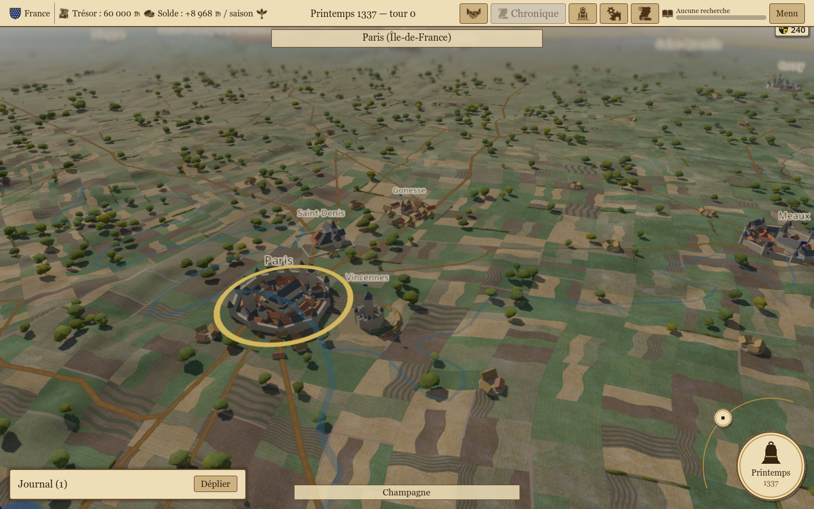

Captures des trois paliers : `docs/img/colonies/{ile-de-france,flandre,guyenne}-{pres,moyen,loin}.png`.

### Composants

| Script | Rôle |
|---|---|
| `scripts/map/zoom_tiers.gd` | Ressource des paliers : `tier_at`, `near_weight` / `medium_weight` / `far_weight` (somme 1, fondus en `smoothstep`). |
| `scripts/map/settlement_data.gd` | Lecture de `data/settlements/*.json`, `data/map/settlements_px.json`, `hamlets.json`, `roads.geojson` ; tri par priorité d'étiquette ; `apply_live(sim)`. |
| `scripts/map/settlement_layer.gd` (`CampaignMap/Settlements`, créé par le code) | Icônes (`MultiMesh`, `shaders/settlement_icon.gdshader`, taille constante à l'écran, sans test de profondeur), étiquettes `Label3D` dé-chevauchées (cité > ville > château > abbaye > village), maquettes, hameaux, picking, sélection. |
| `scripts/map/road_renderer.gd` (`CampaignMap/Roads`) | Palier moyen : routes principales (`type` = `main`) et secondaires / calculées en traits `shaders/road_line.gdshader` (lot C7b, ci-dessous) ; palier près : rubans de chemin de terre (`shaders/road.gdshader`) par tuile de terrain. |
| `scripts/map/fine_terrain_job.gd` | Maillage de relief fin d'une tuile, construit dans `WorkerThreadPool`. |
| `tools/blender_scripts/settlements.py` | Générateur Blender headless des maquettes (voir ci-dessous). |

### Relief fin (`TerrainBuilder`, 3ᵉ niveau)

- Sous `fine_terrain_distance`, les `max_fine_chunks` (4) tuiles les plus proches du point visé (rayon
  `fine_radius` 150) passent en relief fin : tuile `data/map/height/h_{col}_{row}.png` (512² en 16 bits,
  alignée sur les 16 × 16 tuiles de terrain) décodée par `GameDataStore.load_heightmap_u16` (repli
  `Png16`), maillage construit hors fil principal (sommet toutes les 0,5 unité, moyenne 2 × 2 des pixels
  8192, ≈ 240 ms par tuile dans un fil), cache LRU de 10 tuiles, 2 tâches simultanées.
- Pas de fissure : le pourtour d'une tuile fine reprend exactement le profil du LOD proche 4096
  (pas 4), plus une jupe de 1,5 unité (double face) contre un voisin lointain.
- `surface_height_at(x, y)` rend la hauteur exacte de la surface affichée (interpolation dans le triangle
  du maillage courant, quel que soit le niveau) ; le signal `chunk_surface_changed(index)` recale
  maquettes, hameaux et rubans de la tuile. Les normales restent tirées de la heightmap 4096 (shader).
- Options de mesure : `--no-fine-terrain`, `--fine-step=2` (sommet par unité).

### Maquettes et hameaux

> Carte de campagne : maquettes remplacées par les villes 1:1 du chantier VT (ADR 0138, section
> « Villes 1:1 à toutes les hauteurs »). Les `.glb` ci-dessous ne servent plus qu'en repli.

- `blender --background --python tools/blender_scripts/settlements.py -- game/assets/models/settlements`
  produit 13 `.glb` (réutilise les aides de `models.py`, dont le `main()` est désormais protégé) :
  `city_a/b` (enceinte, cathédrale, donjon, faubourg), `town_a` (enceinte irrégulière, église, halle),
  `town_b` (bastide carrée en damier), `castle_a` (motte, donjon, basse-cour), `castle_b` (donjon carré
  sur butte, chemise, village au pied), `abbey_a/b` (abbatiale, cloître, bâtiments conventuels, jardins,
  enclos ; `b` avec moulin), `village_a/b` (église, chaumières, granges, lanières de champs),
  `hamlet_a/b/c` (2 à 5 bâtiments de ferme). 500 à 2 050 triangles (plafond 5 000), matériau `Banner`
  teinté à la couleur du contrôleur.
- `ModelLibrary.settlement_model(kind, graine)` : variante déterministe par id, échelle monde
  `SETTLEMENT_SCALE` (cité 5, ville/château 4,4, abbaye 4,2, village 3,8), repli sur les modèles M10.
  Lacet déterministe ; posée au point le plus bas de son emprise (fondations sous z = 0 : rien ne flotte).
  Deux maquettes trop proches (Paris / Vincennes / Saint-Denis) sont réduites au prorata du poids du type
  (jusqu'à 55 %). Visibles au palier près, `visibility_range_end` = 420.
- Hameaux : `MultiMesh` par tuile de terrain (niveau proche ou fin) et par (variante, brûlé) ; variante,
  orientation et échelle déterministes (hachage nom + position). **Brûlés** : une part des hameaux égale à
  la dévastation de la province (à partir de 10 %) prend un matériau calciné.
- Végétation : cercles d'exclusion autour des colonies (rayon de la maquette) et des hameaux
  (`Vegetation.extra_exclusions`, filtrés par tuile avant le semis).

### Routes au palier moyen (lot C7b)

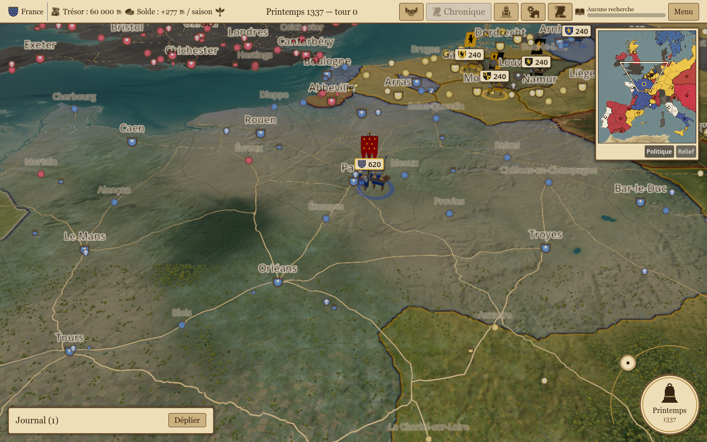

Avant : `docs/img/colonies/c7b-avant-routes.png` (traits bruns de 1,8 px, presque invisibles).

- `shaders/road_line.gdshader` : même maillage que les fleuves (`PolylineMesh.build_screen_lines`),
  largeur à l'écran selon la distance caméra → sommet (`near_px` à 150, `far_px` à 620, jamais
  moins que la largeur monde), liseré sombre et cœur ocre clair, opacité réduite au loin
  (`far_alpha`), le tout multiplié par le poids du palier moyen.
- Routes principales : 4,2 → 2,2 px, opacité 70 % au loin. Secondaires et calculées (seules routes
  des régions hors Itiner-e) : trait brun pâle 1,5 → 0,9 px, effacé au-delà de 420.
- Ordre : secondaires (`render_priority` 0) < principales et côte (1) < fleuves et icônes (2) <
  étiquettes (3). Pas de test de profondeur matériel (la ligne est posée sur la heightmap
  bilinéaire, le maillage lointain la hacherait) mais un **test souple** contre la texture de
  profondeur : un fragment n'est masqué que par un objet plus proche de 2,5 unités + 0,6 % de la
  distance (crête, maquette, figurine d'armée), pas par le relief sous la route ni par les arbres.

### Picking et sélection

`CampaignMap._try_select_army` (intercepteur du picker) essaie les armées, puis
`SettlementLayer.pick_screen` : icône (rayon 12 px × échelle du type) au palier moyen, emprise projetée de
la maquette au palier près. Une colonie cliquée → `select(id)` : icône surlignée, anneau doré au sol,
journal (`print`), toast « nom (province) » et signal `settlement_selected(id)` (le panneau de colonie
viendra au lot C5). Ailleurs, picking de province inchangé. `--select-settlement=<id>` pour les captures.

### Performances (M4 Pro, 1600 × 900, `--fps-probe`)

| Vue | FPS | Primitives / appels de rendu |
|---|---|---|
| Comté, Île-de-France (d = 55, 4 tuiles fines) | 60-70 | 9,5 M / 1 075 |
| Comté, Île-de-France sans relief fin | 60-63 | 3,2 M / 1 064 |
| Comté, Île-de-France, relief fin pas 2 | 60 | 4,7 M / 1 073 |
| Dézoom maximal (d = 1 500) | 62 | 0,3 M / 549 |

Les FPS restent collés à la fréquence de l'écran (synchro verticale imposée par Metal) : la mesure ne
révèle pas de goulot. Les couches C6 coûtent ≈ 0,3 ms de CPU par image (LOD du terrain 0,16 ms,
colonies + routes 0,14 ms). Le gros des primitives vient des passes d'ombre du relief fin
(2,1 M triangles pour 4 tuiles) ; `--fine-step=2` divise ce coût par 4 si besoin.

Lot C7b, mesure A/B (`main` `ff21e60` puis C7b, même machine chargée par d'autres sessions, 1440 × 900,
`--fps-probe`) : comté Île-de-France (d = 55) 32,2 → 32,8 FPS, 9,78 → 9,77 M primitives ; Chartreuse
(d = 30) 36,3 → 37,7 FPS ; palier moyen Île-de-France (d = 400) 48,2 → 45,6 FPS, 1,84 → 1,89 M
primitives (traits des routes secondaires, copie de la profondeur). Écarts dans le bruit de mesure ;
couches C6 + C7b 1,37 → 1,42 ms de CPU au palier moyen.

`godot --headless --path game --script res://tests/settlements_render_test.gd` : charge colonies,
hameaux et routes réels, construit le relief fin près de Paris, vérifie qu'aucune maquette ne flotte,
les hameaux, les rubans, le picking de Paris et les poids des paliers ; lot C7b : tracés routiers des
arêtes (orientation), arbres posés sur la surface affichée (écart < 0,05, relief fin puis LOD proche
après changement de niveau).

### Limites (C6)

- Arbres (corrigé au lot C7b) : semés sur la grille du maillage affiché
  (`TerrainBuilder.surface_grid`) et recalés à chaque changement de niveau d'une tuile (relief fin,
  LOD proche ou lointain) par une tâche `VegetationGroundJob` ; nouveaux tampons `MultiMesh`
  installés en une fois, tuiles hors champ recalées à leur retour. ≈ 6 ms de fil par tuile ;
  tampons CPU gardés (64 o par instance, ≈ 1 Mo par tuile). Les candidats qui débordaient de leur
  tuile (écart de 0,28 unité mesuré, bande de bord deux fois plus dense) sont écartés.
- Les marqueurs d'armée (lot C4) utilisent encore `MapData.surface_world_at`, pas `surface_height_at`.
- Icônes, étiquettes et routes principales sont dessinées sans test de profondeur (comme les fleuves).
- Les rubans et hameaux ne sont construits que sur les tuiles au niveau proche ou fin (≤ 512 unités de
  la caméra), largement au-delà du champ utile en vue comté.

## Vue d'ensemble ZG : carte zoomable jusqu'à 1-5 m (ADR 0036)

Le chantier ZG rend la carte de campagne zoomable du continent jusqu'au terrain à quelques mètres,
en trois paliers de relief (1 : 180-90 m, 2 : 45-22 m, 3 : 11-2,8 m sur 34 zones historiques).
Tout est rendu seulement : aucune règle de jeu ne lit la pyramide.

| Lot | Contenu | Où lire |
|---|---|---|
| ZG0 | ADR, manifeste `data/map/relief_pyramid.json`, zones `detail_zones.json`, squelettes | ADR 0036 |
| ZG1 | Pyramide E1-E4 (`geo pyramid`) | `docs/geo.md`, « Pyramide de relief, paliers 1-2 » |
| ZG2 | Quadtree streamé, pages de hauteurs, surface côté processeur | ci-dessous, « Relief streamé » |
| ZG3 / ZG3b | Relief E5-E7 des zones (`geo detail-dem`), correctif du rehaussement | `docs/geo.md`, « Relief palier 3 » |
| ZG4 / ZG4b | Caméra rapprochée par étage, exagération verticale dynamique ; correctifs de recette | « Caméra rapprochée et exagération verticale » |
| ZG5a / ZG5b | Fleuves et routes fins, ancrages (données) ; rubans, lit creusé, parcellaire (rendu) | `docs/geo.md`, « Hydrographie fine » ; « Hydrographie fine, routes drapées… » |
| ZG6 | Villes ordinaires à l'échelle réelle vers 1340 | « Villes ordinaires à l'échelle réelle » |
| ZG7a / ZG7b | Perf et finitions ; cache absent, export, docs, crédits | ce paragraphe ; `docs/wip/zg7*.md` |
| ZG8 | Relief local exagéré « façon Total War » | « Relief exagéré façon Total War » |
| ZG7c | Recette aux 3 paliers, cache partiel, niveaux d'eau, plafond du relief local, clôture | « Recette finale et clôture (lot ZG7c) » |

**État final (chantier clos le 26/09/2026).** Du continent (parchemin, d = 1 500) au terrain à
quelques mètres (d = 0,3 dans les 34 zones E7) sans rupture : relief streamé E1-E7 (2,77 Go, cache
complet), fleuves et routes fins drapés, villes ordinaires 1:1, exagération dynamique ZG4 + relief
local ZG8 plafonné à 350 m, cache absent ou partiel signalé et toléré tuile par tuile. Limites connues
(suites, détail et captures dans `docs/wip/zg7c-recette.md`) :
- haute montagne au palier vallée : l'exagération ZG4 (×3,4 à d = 6) fait encore des murs dans les
  vallées pyrénéennes et galloises ; à rendre fonction de l'amplitude locale du relief ;
- fonds de vallée E1-E4 plaqués à 0,5 m près des plateaux (Seine de Paris à Rouen, Loire en
  Touraine), d'où une Loire fine ≈ 5 m sous les berges E7 d'Orléans : recuisson E0-E4 avec le plancher
  monotone du palier 3 (plusieurs heures), puis `geo hydro-fine` ;
- villes emblématiques au palier site (maquettes à la loupe sur relief 1:1, plancher caméra 2,6) :
  lot VH4 ;
- objets à l'échelle de la carte au palier vallée (moulins, hameaux, fumées, arbres près de la
  caméra) et disque d'emprise des villes ordinaires avant leurs maisons ;
- pics d'images > 50 ms dominés par les scripts (sélection / application du quadtree, recalages) ;
- aucune archive « Cent Ans relief » hébergée (à décider avant diffusion).

**Cache du relief fin.** Tuiles E1-E7 et fleuves/routes fins sous `data/map/pyramid/` (≈ 2,8 Go,
hors git). Une seule commande le régénère dans l'ordre, avec reprise :
`uv run --project tools cent-ans geo relief-all` (`--check` : ce qui manque ; `docs/geo.md`,
« Cache du relief fin »). Au chargement de la campagne, `ReliefCacheStatus`
(`scripts/map/relief_cache_status.gd`) lit le manifeste et cherche sur le disque au plus 24 tuiles
par étage (réparties, bornes comprises) et autant pour les fleuves et routes fins : états
`DISABLED` (pas de manifeste listant des tuiles : fixtures, essais), `COMPLETE`, `PARTIAL`,
`MISSING`. Le résultat est journalisé (`ReliefCache: …`, avertissement si incomplet) et, si le cache
manque en tout ou partie, `ReliefCacheNotice` (`scripts/map/relief_cache_notice.gd`) affiche sous
la barre supérieure un avis non bloquant « Relief rapproché limité / incomplet » : ce qui manque, la
commande (champ sélectionnable, bouton « Copier ») ou, dans le jeu exporté, « réinstallez le jeu
complet… », et « Fermer ». Une fois par session (`ReliefCacheNotice.shown_this_session`). Ignoré avec
`--no-pyramid` ou `--pyramid-dir=`. Test : `tests/zg7b_cache_test.gd`.

**Où le jeu cherche le relief** (`MapPaths.relief_root_for`, dossier contenant `pyramid/`) :
variable `CENT_ANS_RELIEF_DIR`, puis `data/map/` (dépôt ; jeu exporté avec le relief dans
`Cent Ans.app/Contents/Resources/data/map/pyramid`), puis un dossier « Cent Ans relief » à côté de
l'application (livraison séparée), puis `user://relief`. `TerrainBuilder` (pyramide) et
`FineGeoLayer` (fleuves, routes) lisent leurs tuiles sous cette racine ; les manifestes restent dans
`data/map/`. Export : `CENT_ANS_EXPORT_RELIEF=bundle|external|none tools/export_macos.sh`
(`cent-ans export-data`, voir l'addendum ZG7b de l'ADR 0036).

**Réglages** (ressources, modifiables sans code) :
- `resources/close_camera.tres` (`CloseCameraProfile`, ZG4/ZG4b) : distance minimale par étage E0-E7,
  plancher au-dessus des villes emblématiques (`landmark_min_distance`), exagération verticale loin /
  près et son pas de quantification, inclinaison, plans de découpe ;
- `resources/relief_exaggeration.tres` (`ReliefExaggerationProfile`, ZG8) : `enabled`, exagération
  de près (`near_exaggeration`), gains de relief local (`gain_far`, `gain_near`), calcul du fond de
  vallée (`floor_*`), écrasement des montagnes (`mountain_*`, SZ1), roche des falaises
  (`cliff_slope_*`), soleil de l'ombrage.

**Drapeaux de ligne de commande** (après `--`) :
- désactiver : `--no-pyramid` (relief E0 seul, comportement d'avant ZG), `--no-fine-geo` (ni
  fleuves ni routes fins), `--no-towns` (villes ZG6), `--no-relief-exaggeration` (ZG8 → rendu ZG4
  exact), `--no-mountain-squash` (sans l'écrasement des montagnes SZ1), `--static-exaggeration` (échelle ×4,3 fixe, captures « avant » ZG4) ;
- essais : `--pyramid-dir=<dossier>` (manifeste + `pyramid/` d'essai), `--camera-min=N`,
  `--qt-debug=1|2`, `--fine-debug`, `--town-lod=blocks|detail` ;
- banc : `--stage=map --hide-armies --bench-map` (panoramique + descentes ; `--bench-distance`,
  `--bench-seconds`, `--bench-descent-only`, `--bench-towns`), voir « Options, test et banc ».

**Tests headless** : `tests/zg2_quadtree_test.gd`, `zg4_camera_test.gd`, `zg5b_fine_geo_test.gd`,
`zg6_towns_test.gd`, `zg7a_test.gd`, `zg7b_cache_test.gd`, `zg7c_partial_cache_test.gd`,
`zg8_relief_test.gd`, tous sans le vrai cache (pyramides factices dans `user://`). Captures (fenêtre) :
`zg8_relief_shots.gd`, `zg7c_recette_shots.gd` (12 lieux × 3 paliers, parchemin, filtres).

## Relief streamé : pyramide et quadtree (lot ZG2, ADR 0036)

Quand la pyramide de relief est en cache (`data/map/relief_pyramid.json` + tuiles non versionnées
`data/map/pyramid/E{k}/{col}_{row}.png`, cuites par ZG1/ZG3), `TerrainBuilder` crée un
`ReliefQuadtree` qui dessine **tout** le terrain ; les 16 × 16 morceaux E0 sont masqués (ils restent
construits : repli, bornes, vue parchemin). Sans cache, ou avec `--no-pyramid`, rien ne change
(morceaux E0 + relief fin `FineTerrainJob`) : le test de fumée tourne sans cache.

| Fichier | Rôle |
|---|---|
| `scripts/map/relief_pyramid.gd` | Manifeste (RLE → ensembles de tuiles par étage), E0 = `data/map/height/`, `has_tile`, `finest_level_at`, `max_level_under`, `finest_ancestor`, chemins. |
| `scripts/map/relief_quadtree.gd` | Sélection, pages, décodage, instances, surface côté processeur. |
| `shaders/relief_quadtree.gdshaderinc` | `qt_vertex` (déplacement + morphing), `qt_relief` (altitude et normale depuis la page), `qt_debug_color`. |
| `core/crates/godot-bridge/src/relief_decoder.rs` | `ReliefDecoder` : décodage PNG 16 bits dans des fils natifs Rust. |
| `scripts/dev/map_bench.gd` | Banc `--bench-map`. |
| `tests/zg2_quadtree_test.gd`, `tests/fixtures/zg2/make_pyramid.py` | Test headless (pyramide factice), pyramide synthétique pour les essais visuels. |

### Arbre et sélection

- Racine = toute la carte (4 096 unités), nœud (n, col, row) de côté `4096 / 2^n`, **aligné sur la
  grille des tuiles** (tuile (k, col, row) sur [col·T, (col + 1)·T], sans décalage depuis SZ2b,
  ADR 0086) : profondeur n ↔ étage L = n − 4 (un nœud de
  profondeur 4 est une tuile E0 de 256 unités). Profondeur maximale d'un nœud : étage de données le plus
  fin de son sous-arbre (`max_level_under`, sinon l'ancêtre existant) + `extra_depth` (3), plafond 14.
- **CDLOD** : un nœud est accepté quand l'espacement de ses sommets (côté / 64) projeté à l'écran
  `s × K / d ≤ max_vertex_px` (4 px ; K = demi-hauteur de la vue / tan(fov / 2)). En distance : le
  niveau n sert jusqu'à `R_n = 2 × s_n × K / seuil` (≥ 3 côtés) et le parent se divise quand la boîte
  d'un enfant coupe la sphère `R_{n+1}` ; un enfant hors portée est dessiné comme quadrant du parent
  (demi-patch). Une page de l'étage du nœud a 8 pixels par sommet : ses pixels font ≤ 0,5 px à l'écran.
- Budget `max_items` (700) : au-delà, le seuil s'élargit (×1,2 par image, retour ÷1,1 sous 60 %).
- Boîtes englobantes : bornes par morceau E0 (maillages lointains, en mètres, marges larges) × facteur
  vertical ; élagage par le tronc de vue (6 plans) avant toute demande de page.

### Géométrie : patch partagé, morphing, jupes

- Deux maillages partagés : patch 64 × 64 quads (65² sommets) et demi-patch 32 × 32, en coordonnées de
  grille entières, plus une jupe (sommets y = −1, même disposition que `FineTerrainJob`). Chaque nœud est
  un `MeshInstance3D` (réutilisé) avec le **matériau partagé du terrain** (splat, forêts, frontières,
  brouillard, surbrillance, météo : tout reste), transformation = origine + échelle s.
- Paramètres du nœud en `instance uniform` : origine et espacement, pages fine (étage du nœud) et
  grossière (celle du parent) avec couche du `Texture2DArray`, emprise et **couches des 8 voisines de
  même étage** (table des pages), début et longueur du morphing, fondu, profondeur de jupe. Seuls les
  paramètres qui changent sont renvoyés au serveur de rendu.
- **Morphing géomorphe** (vertex shader) : k = f(distance caméra–sommet) sur `[0,7 R_n, R_n]` ; les
  sommets impairs glissent sur les pairs (grille du parent) et la hauteur passe de la page fine à la
  page du parent. À k = 1 le bord coïncide exactement avec le voisin plus grossier : ni fissure ni saut.
  La distance vient de l'uniforme `qt_camera` (caméra principale) : même géométrie dans la passe d'ombre.
- Bilinéaire **inter-pages** : un échantillon au bord d'une tuile lit les texels de la voisine
  (`texelFetch` dans sa couche) ; pas de marche aux bords de tuiles de même étage.
- Jupes (1,5 espacement, ≤ 4 unités) contre les écarts restants (voisine non chargée, fondu en cours).
- Profondeur < 4 (nœuds plus grands qu'une tuile E0) : hauteurs de la heightmap 4096 (mipmap assorti à
  l'espacement, cohérent entre parent et enfant) ; au fragment, chemin actuel (heightmap + `relief_shade`).

### Pages de hauteurs

- `Texture2DArray` de `max_pages` (256) couches 512², **`FORMAT_R16`** (entier 16 bits normalisé,
  même codage que les PNG : aucune conversion, pas de 7,6 cm sur 5 000 m ; pas de demi-flottant)
  **avec mipmaps** (0,67 Mo par couche : 171 Mo de VRAM pour 256 couches, plafond ADR 256 Mo).
- Le vertex shader lit le niveau 0 (bilinéaire manuel, `texelFetch`) ; le fragment dérive la normale
  de la page par différences finies au pas de l'empreinte du pixel écran (mipmap assorti, différences
  décentrées au bord de la tuile) : vallées et crêtes à la résolution de l'étage. Altitude du fragment
  (`hc` : neige, roche, eau) tirée de la même page.
- Choix de page : la tuile de l'étage du nœud (ou de l'ancêtre le plus fin qui existe : pyramide
  creuse) ; en attendant qu'elle arrive, l'ancêtre chargé le plus fin (= la page du parent : continuité).
  Demandes triées par étage puis distance (le grossier d'abord). Fondu d'arrivée `fade_seconds` (0,35 s)
  de la page du parent vers la nouvelle page (hauteur et normale) : pas de saut à l'arrivée.
- LRU : une couche n'est reprise qu'à une page inutilisée depuis au moins une image.
- **Décodage** (godot-rust est mono-fil : aucun appel à l'extension hors fil principal) :
  1. `ReliefDecoder` (Rust, `max_jobs` fils natifs qui ne touchent pas à Godot) : `request` / `poll` ;
     le fil principal ne fait que la copie en `PackedByteArray`, l'`Image` R16 et ses mipmaps (≈ 0,1 ms) ;
  2. extension plus ancienne sans `ReliefDecoder` : `GameDataStore.load_heightmap_u16` sur le fil
     principal, ≤ 2 tuiles et ≤ 4 ms par image (≈ 3 ms par tuile) ;
  3. sans extension : `Png16` dans `WorkerThreadPool` (0,1 à 1 s par tuile : repli seulement).
  Téléversement `update_layer` ≤ `max_uploads_per_frame` (2) par image.

### Surface côté processeur et signaux

- Les octets des pages chargées sont gardés (0,5 Mo par page, ≤ 128 Mo). `surface_height_at(x, y)` rend
  la **surface bilinéaire de la page chargée la plus fine** (indépendante de la vue : la position d'un
  objet ne dépend pas du niveau du nœud qui le porte), repli heightmap 4096 hors pages ; ≈ 1,7 µs par
  appel (index par morceau de l'étage le plus fin chargé, cache de la dernière page).
- `surface_grid(index)` rend un **instantané** (dictionnaire `qt_pages` + repli `MapData`) lisible depuis
  un fil de travail ; `TerrainBuilder.grid_height` l'accepte (végétation, lot C7b, inchangée).
- `chunk_level` garde son sens (0 lointain, 1 proche, 2 « fin » = morceaux voisins du point visé sous
  `fine_terrain_distance`) : routes en rubans, hameaux, arbres et lit creusé des fleuves
  (`fine_chunk_rects`) suivent comme avant.
- `chunk_surface_changed(index)` : aux changements de niveau, et quand **l'étage le plus fin chargé**
  d'un morceau proche change (E1 → E2 → …), **après `surface_settle_ms` (700 ms) sans nouvelle page**
  dans ce morceau (toute la chaîne E1 → E4 donne un seul recalage), au plus 2 morceaux toutes les 250 ms (les recalages des
  couches sont synchrones et chers : maquettes L1 ≈ 50-300 ms par recalage). Nouveau signal
  `surface_rect_changed(rect)` à chaque page arrivée ou évincée, pour des recalages fins (ZG5).
- Échelle verticale : `MapData.vertical_scale()` est lu par le shader (paramètre global
  `campaign_vertical_scale`), le quadtree (boîtes, surface) et `surface_height_at` ; dynamique depuis ZG4
  (`TerrainBuilder.set_vertical_scale`, section « Caméra rapprochée et exagération verticale »).

### Options, test et banc

- `--pyramid-dir=<dossier>` (manifeste + `pyramid/` d'essai), `--no-pyramid`, `--qt-debug=1` (teinte par
  profondeur de nœud) / `2` (par étage de page), `--camera-min=N` (distance minimale, essais et captures
  seulement : la caméra rapprochée est le lot ZG4).
- Pyramide synthétique (E1-E4 sur Paris et la basse Seine, relief de bruit ajouté : **pas des données
  réelles**) : `uv run --project tools python game/tests/fixtures/zg2/make_pyramid.py <dossier>`.
- `godot --headless --path game --script res://tests/zg2_quadtree_test.gd` : pyramide factice écrite dans
  `user://zg2_test/` (tuiles E0 recopiées), manifeste, sélection, pages, `surface_height_at` comparée à un
  décodage direct, instantané, LRU borné, repli sans tuile.
- `godot --path game res://scenes/campaign_map.tscn -- --stage=map --hide-armies --bench-map` (fenêtré) :
  panoramique Caen → Rouen → Paris → Chartres → Évreux à d = 30 (`--bench-distance`, `--bench-seconds`)
  puis aller-retour de zoom 150 ↔ minimum sur Paris ; imprime i/s moyen, médiane et 99ᵉ centile des
  images, pire image, images > 50 ms, statistiques du quadtree et, avec `--bench-listeners`, le temps
  passé dans chaque écouteur de `chunk_surface_changed`.
  Aussi : coût CPU du rendu, primitives et appels de dessin (médianes), `update_ms_avg` du quadtree.
  ZG4 : puis parcours « descente » (`descent` dans le rapport) au-dessus de Rouen, de la Grande Chartreuse
  et de Paris (150 → 5 → distance minimale, pause, remontée ; `--bench-descent-only` pour lui seul ;
  `--bench-pan-only` s'arrête après le panoramique, mesure à une seule distance ; le rapport donne aussi
  `startup_total_ms` et `town_far`),
  recalages d'échelle verticale (`vertical_rescales`, `rescale_*`) et cuissons des maquettes
  (`landmark_bake_*`).
- Pyramide réelle d'essai tirée du cache partagé : dossier contenant un lien `pyramid` vers
  `data/map/pyramid`, puis `python3 game/tests/fixtures/zg2/manifest_from_cache.py
  <dossier>/relief_pyramid.json` et `--pyramid-dir=<dossier>`.

Mesures (25/09, machine partagée à une charge de 200+ : relatives seulement ; pyramide E1-E7 réelle,
11 943 tuiles) : quadtree 31,3-31,5 i/s, médiane 24,7-26,5 ms, 54 images > 50 ms, `update_view`
4,7 ms en moyenne, ≈ 6 ms de décodage par tuile (fils natifs), 9,5 M primitives ; repli E0 31,2-34,1 i/s,
médiane 24,3-26,3 ms, 57-63 images > 50 ms, 11 M primitives. Captures avant/après (repli E0 / quadtree
E1-E7) : `docs/img/zg2/` (Grande Chartreuse, Rouen, puy de Dôme).

## Caméra rapprochée et exagération verticale (lot ZG4, ADR 0036)

Quand la pyramide de relief est en cache (`TerrainBuilder.pyramid`), la caméra descend jusqu'au relief le
plus fin disponible et l'exagération verticale s'atténue de près. Sans cache (ou `--no-pyramid`) : rien
ne change (distance minimale 22, relief ×4,3, maillages E0 cuits à `HEIGHT_SCALE`). Rendu seulement.

Réglages : `game/resources/close_camera.tres` (`CloseCameraProfile`, `scripts/map/close_camera_profile.gd`)
et `game/resources/zoom_tiers.tres` (paliers vallée / site).

### Distance minimale par étage

| Étage le plus fin sous le point visé | E0 (mer) | E1 | E2 (180 → 90 m, toutes les terres) | E3 | E4 (22 m, cœur) | E5 | E6 | E7 (2,8 m, zones de détail) |
|---|---|---|---|---|---|---|---|---|
| Distance minimale (unités ; 1 = 719 m) | 22 | 9 | 5 | 2,6 | 1,5 (~1 km) | 0,8 | 0,5 | 0,3 (~200 m) |

- **Champ adouci** (`soft_min_distance`) : min sur les étages k de `level_min_distance[k] + 0,45 ×
  distance à la tuile d'étage k la plus proche` (rectangles exacts des tuiles du manifeste) : champ
  continu, qui croît d'au plus 0,45 unité par unité parcourue. En sortant d'une zone E7, la caméra
  remonte donc progressivement (0,5 à 1 unité du bord, 1,5 à 8 unités), jamais d'un coup ; le rig
  mémorise la valeur tant que le point visé bouge de moins de 2 % de la distance.
- `CampaignCamera.min_distance_at(point)` = min(`min_distance` (22, plafond ; `--camera-min` le baisse),
  zones L1 `close_zones` (7), champ par étage). `close_zones` reste valable sans pyramide.
- **Point visé au sol** (`ground_height` = `TerrainBuilder.surface_height_at`) ; **garde au sol** : la
  caméra reste à au moins `max(0,06 × distance, 0,004)` au-dessus de la surface sous elle.
- **Tangage** : courbe historique au-dessus de 22 unités ; en deçà, `lerp(11°, 30°, t)` avec t le
  logarithme normalisé de la distance entre 0,3 et 22 (23,5° à 5 ; 18° à 1,5 ; 11° à 0,3) ; la visée est
  relevée de `0,3 × (1 − t) × distance` au-dessus du point visé (`look_up` : crêtes et horizon dans le
  cadre). **Crêtes** : six échantillons de `surface_height_at` le long de la visée (au-delà de 25 % de la
  distance) ; si une crête cache le point visé, la caméra monte d'autant (vite), puis redescend lentement.
- **Plans** : `near = clamp(0,02 × distance, 0,002, 1)`, `far = min(4 × distance + 700, 6000)` (tampon
  de profondeur inversé de Godot 4 : aucune perte de précision à 0,006 / 700).
- Zoom multiplicatif (15 % par cran) et panoramique proportionnel à la distance (inchangés) : ~26 crans de
  22 à 0,3.

### Exagération verticale dynamique

- **Propriétaire unique** : `MapData.vertical_scale()` (unités monde par mètre), changé seulement par
  `TerrainBuilder.set_vertical_scale(v)` (qui appelle `MapData.set_vertical_scale`) ; paramètre global de
  shader `campaign_vertical_scale` (`project.godot`, défaut 0,006) lu par `terrain.gdshader` (via
  `#define height_scale`), le quadtree (`relief_quadtree.gdshaderinc`), `river_water.gdshader` (rubans cuits à
  `baked_vertical_scale` = 0,006, remis à l'échelle dans le vertex shader) et `landmark.gdshader`
  (`height_in_meters`). `MapData.vertical_exaggeration()` = échelle × 719.
- **Courbe** (`CloseCameraProfile.exaggeration_at`) : ×4,31 au-dessus de 45 unités (vue stratégique
  intacte), ×1,5 sous 0,45, smoothstep en logarithme de la distance entre les deux, interpolation
  géométrique : ×1,52 à 0,6 ; ×1,9 à 1,9 ; ×2,8 à 5,7 ; ×3,8 à 17,5.
- **Paliers** (`quantized_scale`) : pas géométrique de 4 % (27 paliers de ×4,31 à ×1,5), hystérésis de
  15 % de pas : l'échelle ne change qu'au franchissement d'un palier.
- **Recalage des calques** (`TerrainBuilder`) :
  1. `vertical_scale_changed(old, new)` tout de suite : objets ponctuels bon marché (`ArmyMarkers.reground`) ;
  2. `chunk_surface_changed(index)` pour les 256 morceaux, **une fois l'échelle stable depuis
     `rescale_settle_ms` (180 ms)** (un zoom continu franchit une quinzaine de paliers : un seul recalage à
     l'arrêt), morceaux proches du point visé d'abord dans `rescale_budget_ms` (3 ms) par image, morceaux
     lointains (niveau 0) un par image ; `rescaling_vertical` est vrai pendant ces émissions ;
  3. AABB des nœuds du quadtree remises à l'échelle (`ReliefQuadtree.on_vertical_scale_changed`).
- Calques invariants (rien à recalculer) : terrain et quadtree (shader), fleuves (shader), maquettes des
  villes emblématiques (`LandmarkModel` : hauteurs cuites **en mètres**, ignorent `rescaling_vertical`).
- `LandmarkModel` : la cuisson des hauteurs (96² texels, max centre + coins partagés : 2,5 fois moins
  d'appels à `surface_height_at`) est **étalée** sur plusieurs images (`bake_budget_ms` = 1,5 ms), l'ancienne
  texture restant affichée ; `flush_bake()` pour les captures (`SettlementLayer.flush`).
- `SettlementLayer` : hauteurs des étiquettes recalculées une fois par image (plus à chaque morceau).

### Paliers vallée et site

Voir le tableau des paliers (lot C6). `ZoomTiers.valley_weight` / `site_weight` sont cumulatifs (1 à ce palier
et en deçà), `border_alpha` / `fog_alpha` pilotent `province_border_alpha`, `realm_border_alpha`,
`fog_veil_amount` et `fog_cloud_amount` du matériau de terrain (valeurs par défaut du shader × facteur),
le paramètre global `campaign_prop_scale` l'échelle des arbres de `foliage.gdshaderinc` (depuis SZ4 :
`MapPropScale.tree_scale`, voir « Objets à l'échelle aux paliers intermédiaires » ; remis à 1 en quittant
la carte car les batailles partagent ce shader). Marqueurs d'armée : échelle proportionnelle à la distance sous 12 unités
(`ArmyMarkers.CLOSE_KNEE_DISTANCE`), plaques au-delà de 40 × la distance masquées sous 12. Pluie et neige
(`CampaignWeatherView`) : taille des gouttes proportionnelle à la distance sous 22. Atmosphère
(`CampaignAtmosphere`) sous 30 unités (pleinement sous 6) : brouillard de profondeur au moins de 18 à 240
unités (crêtes et horizon visibles en vue rasante), flou de profondeur coupé, ombres sur au moins 12 unités,
rayons SSAO / SSIL proportionnels à la distance.

### API pour ZG5b, ZG6 et VH

- `MapData.vertical_scale()` : échelle courante ; ne jamais cuire de hauteur monde sans réagir à
  `TerrainBuilder.vertical_scale_changed` / `chunk_surface_changed` ; préférer des hauteurs **en mètres**
  multipliées dans le shader par `global uniform float campaign_vertical_scale;` (comme `landmark.gdshader`)
  ou une remise à l'échelle `VERTEX.y *= campaign_vertical_scale / baked_vertical_scale` (comme
  `river_water.gdshader`) : aucun recalage à faire.
- Un écouteur de `chunk_surface_changed` qui ne dépend que des hauteurs en mètres ignore les émissions
  pendant lesquelles `terrain.rescaling_vertical` est vrai.
- `CampaignCamera.min_distance_at(point)` : distance minimale au-dessus d'un point ; `camera_rig.relief`
  (pyramide) et `camera_rig.ground_height` ; `CloseCameraProfile.min_distance_for_level(k)`.
- `ZoomTiers.valley_weight(d)` / `site_weight(d)` / `tier_at(d)` (`Tier.VALLEY`, `Tier.SITE`) : ce qui est
  masqué au palier site (maquettes à la loupe, rubans de routes, ponts, moulins, navires) doit être remplacé
  par sa version à l'échelle réelle (ZG5b : routes et fleuves drapés ; ZG6 / VH4 : villes).

### Test et mesures

`godot --headless --path game --script res://tests/zg4_camera_test.gd` : courbe d'exagération (bornes,
monotonie, paliers de 4 %, hystérésis), distances minimales par étage et continuité du champ adouci (pyramide
factice), caméra (point visé au sol, pas sous le relief, tangage rasant, `near`), paliers vallée / site,
`set_vertical_scale` sur une pyramide factice (paramètre global, surface proportionnelle, recalages étalés
puis vidés, repli sans pyramide).

Mesures (25/09, banc complet `--bench-map` = panoramique d = 30 + zoom Paris + descente, 1 440 × 900,
Apple Silicon partagé ; comparaisons appariées à charge égale seulement) :

| Essai | charge (1 min) | i/s global | i/s descente | médiane descente | > 50 ms (global / descente) |
|---|---|---|---|---|---|
| statique (`--static-exaggeration`) | 22 → 20 | 27,4 | 32,2 | 22,6 ms | 197 / 67 |
| dynamique | 25 → 24 | 26,5 | 29,6 | 27,1 ms | 236 / 103 |
| dynamique (machine plus calme) | 6 → 15 | 39,1 | 37,0 | 18,8 ms | 124 / 82 |

Recalages d'échelle : ≈ 180 changements de palier par banc, 740-920 émissions de morceaux, 150-190 ms au
total, ≤ 4,2 ms par image ; écouteurs : colonies 135 ms, ponts 115 ms, maquettes 7 ms (au lieu de
1,23 s pour les colonies quand chaque palier recalait tout). Cuissons des maquettes : ≈ 45 par banc,
≈ 60 ms de calcul chacune, ≤ 3-5,6 ms par image. Quadtree : ≈ 165 nœuds en vue rasante (budget 700
jamais atteint, `px_scale` 1), `update_view` 3,8-5,7 ms en moyenne. Coût net de l'exagération dynamique :
de l'ordre de 3 % d'i/s sur le banc complet et 8 % sur la descente (plus d'images > 50 ms pendant les
recalages), dans le bruit de la machine partagée pour la vue stratégique (échelle constante au-dessus de
45 unités).

Captures (`docs/img/zg4/`, été, temps clair, 1 440 × 900) : Rouen (zone E7, regard vers l'est), Grande
Chartreuse (E4, vers le nord), Paris (E7, vers le nord), puy de Dôme (E4, vers l'ouest), Douvres (E7, vers le
nord-ouest) ; pour chacun `-1_strategique` (60), `-2_vallee` (5), `-3_site_apres` (distance minimale,
exagération dynamique) et `-4_site_avant` (même vue, `--static-exaggeration`).

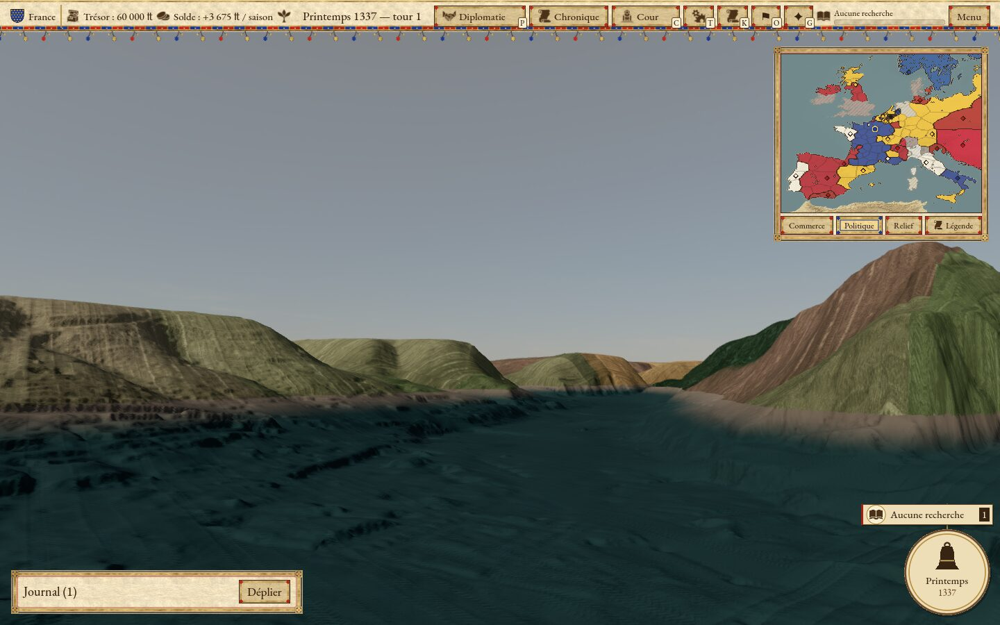
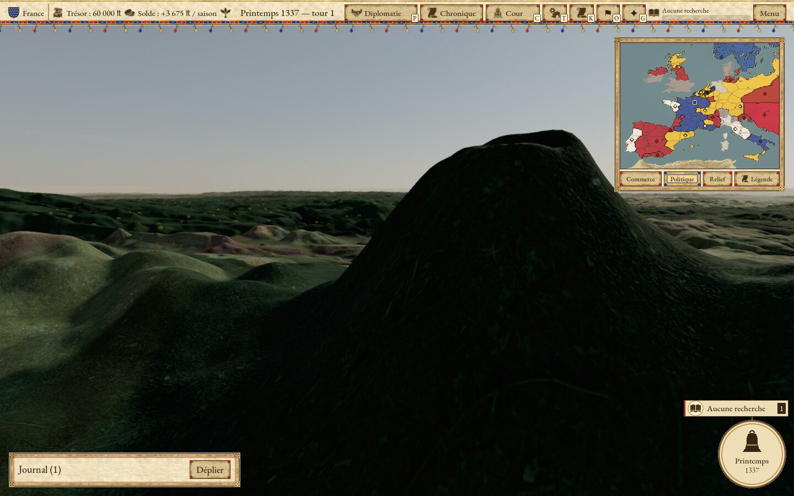

### Correctifs de recette (lot ZG4b)

Relevés par la recette Q3 (`docs/audit/q3-recette.md`, P1 n° 2) ; rendu seulement.

- **Plancher provisoire au-dessus des villes emblématiques** : `CloseCameraProfile.landmark_min_distance`
  (`game/resources/close_camera.tres`, **2,6 unités**, au-dessus du palier site qui masque les maquettes à
  la loupe) dans les cercles `SettlementLayer.landmark_zones()` (`camera_rig.close_zones`), adouci au-dehors
  avec `min_distance_slope` (`landmark_floor`). Avant, la caméra descendait à 0,3 unité au-dessus de Londres
  sur un sol vide (maquette masquée, rien de fin dans la zone). **Le lot VH4 le lève** (`landmark_min_distance
  = 0`) quand les villes emblématiques passent à l'échelle réelle.
- **Brouillard matinal de la météo (CM2) de près** : la nappe peinte sur le sol (`weather_ground`, jusqu'à
  80 % de gris) recouvrait tout le sol d'un beige uniforme de près (textures et parcellaire effacés : c'était
  le « sol beige nu » de Londres, région souvent dans la brume). Elle ne garde que `weather_mist_near` (20 %)
  quand l'empreinte d'un pixel passe sous `weather_mist_near_footprint` (0,06 unité, palier vallée) ;
  l'atmosphère de près (ZG4) donne le voile en profondeur. Joueur français : le voile beige sur Londres est
  le brouillard de guerre, normal.
- **Parcellaire des terres basses** : `fp_parcels` sautait `hc <= 0,5`, or ZG3b relève les terres sous le
  niveau de la mer au plancher `MIN_LAND_M` = 0,5 m (rives de la Tamise, polders) : test `hc < 0,25`.
- **Ponts-portes fins à l'échelle réelle** : `FineGeoLayer._build_gates` posait les ponts-portes (bords des
  emprises des colonies, fleuve fin) à l'échelle exagérée de la carte (×2 en hauteur et en tablier) ; ils
  suivent maintenant la règle des ponts ancrés (portée du fleuve fin, maillage `width / FINE_SCALE` réduit de
  `FINE_SCALE`, tablier à `GATE_DECK_RISE_M` = 7 m au-dessus de l'eau × échelle verticale, recalculé à chaque
  palier d'exagération).
- **Bascule des ponts étalée** : `RiverCrossings.set_fine_mode` remaillait tous les ponts construits d'un bloc
  (~35 ms) ; file d'attente vidée au moins d'un ouvrage par image puis tant que `FrameBudget.has_time()`
  (`pump_reshape`, vidée d'un coup par `FineGeoLayer.flush`), un maillage gardé par mode (le retour ne remaille
  rien), mode porté par chaque ouvrage (cohérent pendant la bascule).
- **Hors lot** : le ruban rouge et gris géant de Londres vers 20 unités (`en3-011`) n'est pas un pont mais la
  couche des routes commerciales C5 (`TradeRouteLayer`) : `refresh()` force `_wanted_visible = true`, la couche
  apparaît donc sans le mode Commerce (route active sépia + route coupée Calais-Londres grise par-dessus).
  L'aperçu de chemin d'armée (`PathPreview`, orange) reste lui aussi à l'échelle de la carte aux paliers
  vallée / site.

Captures (`docs/img/zg4b/`, 1 280 × 720) : `avant-londres-20` / `-8` / `-plus-pres` (recette Q3) ;
`apres-londres-20`, `-8`, `-0.3` (plancher : 2,6), `apres-paris-0.3`, `apres-pont-porte-orleans`.

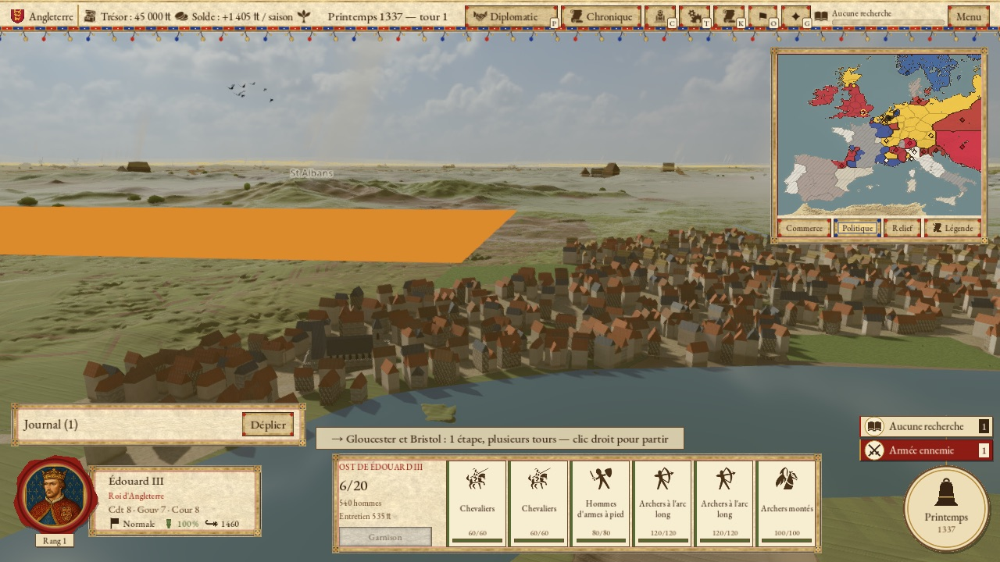

## Hydrographie fine, routes drapées, ancrages et parcellaire de près (lot ZG5b, ADR 0036)

Rendu seulement : les données viennent du lot ZG5a (`docs/geo.md`, « Hydrographie fine »), les règles
(`core/`, `navgrid.png`, positions des colonies) ne changent pas. Actif quand la pyramide de relief **et**
les tuiles ZG5a sont en cache (`data/map/pyramid/hydro_fine`, `roads_fine`), en deçà du palier comté
(`ZoomTiers.near_weight`) ; sans cache, avec `--no-pyramid` ou `--no-fine-geo`, rien ne change (rubans
V4 / C6, lit `river_bed.png`).

| Fichier | Rôle |
|---|---|
| `scripts/map/cafv_tile.gd` | Lecture d'une tuile CAFV v1 (en-tête de 28 octets), emprise et **rang** de chaque ligne. |
| `scripts/map/fine_geo_store.gd` | Index `rivers_fine.json` / `fine_anchors.json`, tuiles chargées dans `WorkerThreadPool`, cache LRU (64 tuiles par couche, verrou : lisible depuis les fils), ancrages. |
| `scripts/map/fine_bed_carver.gd` | Lit creusé dans les pages du quadtree (tâche de fil par page). |
| `scripts/map/fine_ribbon_job.gd` | Maillage des rubans d'une tuile E2 (fleuves + routes), dans un fil. |
| `scripts/map/fine_geo_layer.gd` | `Rivers/FineGeo` : tuiles voulues, construction, installation, fondu, ponts-portes, qualité. |
| `shaders/river_fine.gdshader`, `shaders/road_fine.gdshader` | Eau et routes de près. |
| `shaders/fine_parcels.gdshaderinc` | Parcellaire, bords de la splat, détail de près (3 crochets dans `terrain.gdshader`). |
| `tests/zg5b_fine_geo_test.gd` | Test headless (voir plus bas). |

### Streaming

- Tuiles E2 (64 unités ≈ 46 km) coupant un disque autour du point visé, rayon = distance × 1,3 (40 à
  170 unités, × 0,6 / 0,8 en qualité Basse / Moyenne), triées par distance ; lecture dans des fils
  (`FineGeoStore.request` / `poll`), puis maillage dans des fils (`FineRibbonJob`, 2 à la fois) ;
  installation des `ArrayMesh` sur le fil principal, au moins une par image puis dans le budget commun de
  PB1 (`FrameBudget.has_time()`), au plus 2. 40 tuiles maillées en cache (LRU).
- **Hauteurs en mètres** dans `VERTEX.y`, multipliées par `campaign_vertical_scale` (ZG4) dans les
  shaders : l'exagération dynamique ne demande aucun remaillage (boîtes `custom_aabb` calculées à l'échelle
  maximale `HEIGHT_SCALE`).
- Surface sous les rubans : instantané des pages (`ReliefQuadtree.surface_snapshot`) échantillonné dans le
  fil. Remaillage quand l'étage de page le plus fin qui touche la tuile change (jusqu'à E4 ; les arrivées
  E5-E7 et le va-et-vient du LRU des pages n'en déclenchent pas), 600 ms après la dernière page.
- **Rang** d'une ligne = max(ordre de Strahler, ordre équivalent à sa largeur maximale : 16 m → 5, 30 → 6,
  60 → 7, 120 → 8, 220 → 9) : l'ordre calculé par ZG5a sous-estime les grands fleuves (Seine à Rouen :
  ordre 4 pour 1 000 m de large). Affichage : rang ≥ 3 (≥ 4 en Moyenne, ≥ 5 en Basse), les petits rangs
  s'effacent avec la distance caméra → sommet (rang 3 sous 30 unités, × 2 par rang).

### Lit creusé : abaissement des pages

Choix : **retoucher les pages de hauteurs** plutôt qu'une texture de lit à part. `ReliefQuadtree.page_filter`
(crochet de ZG5b) appelle `FineBedCarver.carve_job(key)` quand une page est décodée : pour les pages
**≥ E3**, une tâche de fil lit les tuiles CAFV voisines (cache verrouillé) et abaisse, sous chaque ligne de
rang suffisant (≥ 5 à E3, ≥ 3 au-delà), les hauteurs sous le niveau d'eau `z` : fond parabolique
(0,6 m + 1,2 % de la largeur, ≤ 4 m ; 0,25 m sous l'eau au bord), berge fondue sur 35 % de la largeur
(1,5 pixel de page à 250 m) ; au moins 0,75 pixel de page de demi-largeur (sillon d'un ruisseau). Rien sous
les zones personnalisées des maquettes L1/L2 sans ville 1:1 (SZ2b : les emprises des colonies et les
zones des villes 1:1 sont creusées, voir « Nappe d'eau des fleuves (lot SZ2b) »). La page téléversée **et** les octets gardés pour
`surface_height_at` sont les mêmes : déplacement des patchs, normales (berges ombrées), morphing vers la
page parente (creusée à sa résolution), pose des ponts et des maquettes voient le même lit. Coût : ≈ 8-10 ms
de fil par page E4 réelle (Seine à Rouen, 11 700 pixels abaissés), 0 sur le fil principal.
Les pages E1-E2 ne sont pas creusées : l'eau y flotte 0,35 m au-dessus de la surface (lointain de la
vue comté). Le lit `river_bed.png` (719 m/px, tuiles de relief fin) n'est plus creusé quand le rendu fin
est actif, et ses berges peintes s'effacent dans le disque fin (large tranchée sombre des captures ZG4).

### Rubans et fondu

- Fleuves (`river_fine.gdshader`) : sommets doublés sur l'axe, demi-largeur réelle `w / 2` (au moins 1,2 px
  écran, estompé en dessous), eau à plat au niveau `z` (ou 0,35 m au-dessus de la surface si le lit n'est
  pas creusé à cet étage), léger décalage vers la caméra (0,15 % de la distance) contre les facettes du
  relief ; couleur selon l'épaisseur d'eau (tampon de profondeur), rides dans le sens du courant (lignes
  orientées vers l'aval), reflet du ciel. Drapeaux : **divagant** → grèves et bancs de sable dans le lit
  (bande de berge + 35 %), **marée** → eau saumâtre et vasières découvertes selon une marée de 90 s (bande
  + 80 %), **marais** → roselières (bande + 90 %), **intermittent** → lit de galets, filet d'eau au centre.
- Routes (`road_fine.gdshader`) : largeur réelle (6 / 4 / 3 m), au moins 2,2 px (3,2 px pour les voies
  principales) ; hauteur = max(surface, `z` de la tuile) + 0,25 m (remblais et tabliers) ; ornières, voie
  principale plus claire, **pavé** près des villes et cités (rayon de la maquette × 1,6 + 0,4), **chaussée**
  talutée en zone humide (drapeau 32). Densifiées tous les 0,08 unité (57 m).
- Fondu : disque `fine_zone` (centre = point visé, rayon = distance jusqu'à la première tuile voulue pas
  encore maillée, poids = palier près) passé aux nouveaux matériaux et aux anciens (`river_water`, berges
  de `river_banks.gdshaderinc` via `fine_zone_mask`, rubans de `road.gdshader`) : dedans le nouveau
  rendu, dehors l'ancien, fondu sur les 15 % extérieurs. Les traits du palier moyen ne changent pas.
- `--fine-debug` : fleuves en magenta (bord jaune), routes en jaune, opaques.

### Ancrages

- Colonies et hameaux : `SettlementLayer.apply_fine_anchors` pose les maquettes (hors villes
  emblématiques) et les hameaux aux `px` de `fine_anchors.json` (≤ 300 m hors des lits et des pentes
  fortes), recalés sur la surface affichée (le sol le plus fin chargé fait foi, pas le `z` du fichier) ;
  étiquettes de près au-dessus de la maquette ancrée. Icônes, étiquettes du palier moyen, picking,
  `world_position_of` (armées) et règles gardent les positions de `data`.
- Ponts (`RiverCrossings.set_fine_anchors` / `set_fine_mode`, bascule au poids du palier près ≥ 0,5) :
  ouvrages historiques et génériques sur le fleuve fin (position, perpendiculaires à `dir`, portée
  `width_m`), **à l'échelle réelle** (maillage d'une largeur `width / 0,14` réduit de 0,14 : culées de 50 m,
  tablier de 10-25 m), origine au niveau d'eau `z_water` × échelle verticale, hauteur mise à l'échelle pour
  que le tablier soit à `z_deck` (recalculée à chaque changement d'exagération). Ponts-portes V4 cachés,
  remplacés par des ponts-portes calculés sur le fleuve fin au bord des emprises des colonies
  (`FineRibbonJob` → `FineGeoLayer._build_gates`). Les ponts restent visibles au palier site avec le rendu
  fin (ZG4 les cachait).

### Parcellaire, splat et détail de près

Trois crochets d'une ligne dans `terrain.gdshader`, logique dans `fine_parcels.gdshaderinc` :

- `fp_splat` : de près (empreinte < 0,12 unité par pixel), la splat 4096² est lue en coordonnées
  déformées (bruit à 3 échelles, ± 0,8 px carte) : plus de damier de carrés de 719 m.
- `fp_tile_level` : l'échelle des textures de détail continue de diminuer de près (niveau ≥ −7, tuile
  ≈ 17 m au lieu de 2 km) : sol net aux paliers vallée / site.
- `fp_parcels` (empreinte < 0,05 unité par pixel, plein sous 0,015) : coordonnées locales en mètres par
  blocs de 8 unités (précision flottante, cellules alignées sur les blocs) ;
  **openfield** (où `landuse.b` est faible : nord, est) : quartiers de Voronoï (~400 m) de lanières de
  15-35 m orientées par quartier, un tenancier par lanière (teinte), soles de l'assolement triennal
  (~1,5 km : blé d'hiver, céréales de printemps, jachère, selon la saison de CV1), raies et tournières
  enherbées, sillons en relief ; **bocage** (`landuse.b` fort : ouest) : enclos irréguliers (~150 m,
  déformés) bordés de haies arborées de 5-10 m (houppiers bosselés, cœur sombre), prés et champs ;
  **vignes** sur les coteaux exposés au sud (pente 4-45 %, exposition tirée du gradient du relief fin,
  `landuse.r`), rangs de 1,8 m le long des courbes de niveau, terrasses sur les pentes > 25 % ; **prés de
  fauche** en fond de vallée (occlusion de `relief_shade` < 0 et pente < 5 %, prés humides de `wetlands`),
  andains ; **essarts** aux lisières (forêt partielle), souches ; **friches** loin des villages et hameaux
  (masque des terroirs CV1 : finage R et pâtures A faibles).
- Qualité (`FineGeoLayer.apply_render_quality`, déduite de `relief_items` du préréglage PF1) : Basse →
  `fp_quality` 0 (rien, ni splat déformée ni détail), Moyenne → 1 (pas d'enclos du bocage), Haute / Ultra → 2.

### Test, banc, captures

- `godot --headless --path game --script res://tests/zg5b_fine_geo_test.gd` : tuile CAFV écrite et relue
  (drapeaux, rang), store (index, chargement dans un fil, LRU borné, ancrages), lit creusé d'une page
  plate (fond sous l'eau, berge fondue, rien au loin, rien sous une colonie, E1-E2 jamais, rang 3 pas à
  E3), rubans (hauteur en mètres, relevée au-dessus d'une surface non creusée, coupe et ponts-portes au
  bord d'une emprise, route densifiée), pont sur son ancrage fin (position, niveau d'eau, axe, portée,
  tablier à `z_deck`, retour au tracé V4) ; avec le cache : tuile de Rouen, page E4 réelle creusée.
- Banc : `--bench-map` imprime aussi `fine_update_ms_avg/max`, `fine_builds`, `fine_build_ms_avg`,
  `fine_install_ms_max`, `carved_pages`.

Mesures (25/09, banc complet `--bench-map`, 1 280 × 720, machine partagée à une charge de 30-45 :
relatives seulement ; A/B `--no-fine-geo`) : 36,9 contre 41,6 i/s (descente 36,7 / 43,2), médiane
20,0 / 20,1 ms, 99ᵉ centile 167 / 115 ms ; `FineGeoLayer.update_view` 0,30 ms par image en moyenne
(35 ms au pire : bascule des ponts) ; installation d'une tuile ≤ 2,4 ms ; 874 pages creusées (≈ 20 ms de
fil chacune sous charge), 181 maillages de tuile (≈ 200 ms de fil) ; `update_view` du quadtree 4,1 contre
2,6 ms. Le surcoût vient surtout de la concurrence des fils de travail sur une machine saturée. En vue
stratégique (au-delà du palier comté), le calque est éteint ; seules les pages ≥ E3 (jamais chargées de
loin) sont creusées.

Captures avant / après (`docs/img/zg5b/<lieu>_<comte|pres>_<avant|apres>.jpg`, temps clair, été,
comté d = 22, près d = 1,2-1,5) : Rouen (Seine en aval de la ville), Orléans (Loire, pont de Beaugency),
Bordeaux (Garonne à marée : vasières), Londres (Tamise à marée en aval de la City), bocage normand
(Vire), openfield de Beauce. Villes emblématiques (zones personnalisées) : rien de fin dedans, comme V4
(London Bridge et les ponts de Rouen relèvent de VH4). La bande rouge verticale au-dessus de Rouen des
captures « comté » existe aussi sans ZG5b (autre calque).

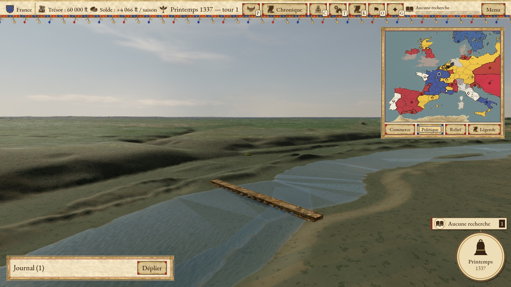
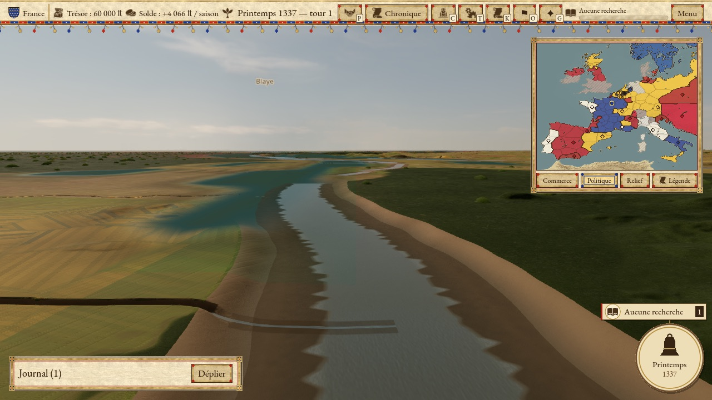
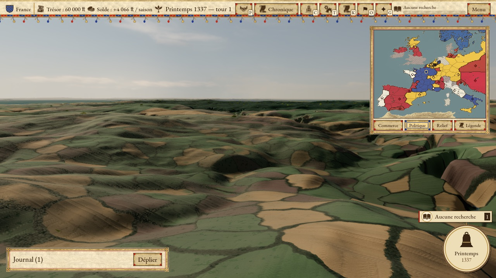

## Villes ordinaires à l'échelle réelle vers 1340 (lot ZG6, ADR 0036)

Les 562 colonies ordinaires (villes, bourgs, villages, châteaux, abbayes ; les villes emblématiques de
`data/landmarks/` restent au lot VH) sont rendues à l'échelle 1:1 aux paliers vallée et site.

**Données.** `data/rules/town_footprint.json` (schéma `town_footprint_rules.schema.json`) porte les
entrées sourcées : densités 80-230 hab./ha selon la population (Russell 1972, Bairoch 1988, Hohenberg &
Lees ; contrôles : Gand 64 000 hab. / 644 ha d'après Nicholas 1987, périmètre de Poitiers 6,5 km,
Chartres ~60 ha), 4,5 personnes par feu, modèle de population par type et bâtiments, poll tax anglaise
de 1377 × 1,6, règles d'enceinte, de site, de faubourgs, de finage (30 × √pop, 900-4 500 m) et de
parcellaire (façades 5-8 m, profondeurs 20-40 m, largeurs de rues). `uv run --project tools cent-ans geo
towns` (`tools/cent_ans_tools/geo/towns.py`, après `geo anchors-fine`) écrit `data/map/towns_1340.json`
(schéma `towns_1340.schema.json`) : population estimée, surfaces, enceinte (pierre, palissade, aucune)
et son polygone de rayons par gisement adapté au relief (éperon, méandre, mer), portes sur les routes
d'accès, faubourgs, monuments, paroisses, fleuve et pont (ancrages ZG5a), rayon de finage.

**Plan** (`town_plan.gd`, statique, sans état, fil de travail, déterministe par `seed`) : place du
marché, monuments réservés, grandes rues drapées (décalage latéral par Viterbi sur la pente) du marché
aux portes puis en faubourgs, rue des lices, rues secondaires qui suivent les courbes de niveau,
ruelles ; parcelles en lanières des deux côtés des rues (maison sur rue, annexe et arbre de jardin à
l'arrière), budget de maisons tiré des feux ; muraille (anneau tous les ~8 m, tours, portes), pont,
grille de sol. Hauteurs en mètres lues dans un instantané des pages du quadtree (`TownPlan.Heights`).

**Rendu** (`town_builder.gd`, `town_layer.gd`, `shaders/town_building.gdshader`,
`resources/town_render.tres`) : nœud racine à l'échelle 1/`meters_per_unit` (tout en mètres dessous),
hauteur de base en mètres dans `INSTANCE_CUSTOM.r` (MultiMesh) ou `UV2.x` (maillages drapés), ajoutée
dans le shader × `campaign_vertical_scale` : l'exagération dynamique ZG4 ne demande aucune
reconstruction (AABB recalées sur `vertical_scale_changed`). HLOD par cellule de 250 m : kit bas détail
(`game/assets/models/town_kit/`, `kit_export.py export-town`) jusqu'à `detail_range`, blocs (un cube à
toit par maison) jusqu'à `block_range`, fondu ; distances et ombres selon le préréglage de qualité (PF1).
Tant que la couche est active (poids vallée ≥ 0,5), les maquettes « à la loupe » des colonies
ordinaires sont masquées et leurs étiquettes posées au sol (accroche `_setup_towns` / `_update_towns`
dans `settlement_layer.gd`).

**Streaming et budget.** Villes dans un rayon `distance × stream_factor` (4-18 unités) : plan
(`TownPlan.generate`) puis préparation de la géométrie (`TownBuilder.prepare` : tampons MultiMesh,
tableaux via `SurfaceTool.commit_to_arrays`, sol en bandes de 24 rangées, rues par 40) dans le
`WorkerThreadPool` ; le fil principal ne crée que les nœuds, par tâches indivisibles de ≤ 1-2 ms,
sous `FrameBudget.has_time()` (PB1) et `build_budget_ms`. Recalage (`TownPlan.reground` + préparation,
fil) quand des pages plus fines arrivent (`chunk_surface_changed`, hors `rescaling_vertical`), puis
échange de constructeur sans trou. Cache LRU des plans (24). `flush` (captures) fait tout de façon
synchrone.

**Finage ↔ parcellaire ZG5b.** `TownLayer._push_finage` envoie au shader du terrain les 16 villes les
plus proches du point visé (`fp_towns[16]` : x, y, rayon de finage, rayon bâti en unités ;
`fp_town_count`) ; `fine_parcels.gdshaderinc` (`fp_finage`) remplace les friches par des terres
cultivées dans le finage et peint une couronne de jardins et vergers (carrés de 12 m) entre 0,9 et
1,4 × le rayon bâti. `TownLayer.finage_zones()` / `TownData.finage_zones()` exposent les cercles de toutes
les villes. Dans l'enceinte, le sol de la ville est vert (jardins, prés intra-muros) sauf autour des
maisons et des rues.

**Drapeaux.** `--no-towns` (désactive la couche : captures « avant »), `--town-lod=blocks|detail`
(force un niveau), `--bench-towns` (avec `--bench-map --bench-descent-only` : descente sur Amiens,
Troyes, Poitiers, Gand, pause 4 s).

**Mesures** (25/09, M4 Pro, 1 440 × 900, machine chargée par d'autres agents, charge ~25-60) :
descente `--bench-towns` avec villes : 48,2 i/s, p50 15,0 ms, p99 120 ms, 160 pics > 50 ms, 809 appels de
dessin ; sans (`--no-towns`) : 56,6 i/s, p50 11,7 ms, p99 117 ms, 158 pics, 241 appels. Les pics sont
ceux du relief (identiques avec et sans). Plan : 0,5-2 s par ville dans un fil (build debug, Gand 64 000
hab. ≈ 8 100 maisons) ; plus longue tâche du fil principal 1-10 ms (création d'un maillage de sol ou de
monuments sous forte charge). Aucun coût en vue stratégique (couche inactive au-delà du palier vallée).

Captures avant/après (`docs/img/zg6/`, `<ville>_{vallee,site}_{avant,apres}.jpg`) : Gand (grande ville
de plaine), Amiens (ville de plaine avec pont), Poitiers (ville close sur éperon), Carcassonne (ville
close de fleuve), Blois (petite ville de Loire avec pont).

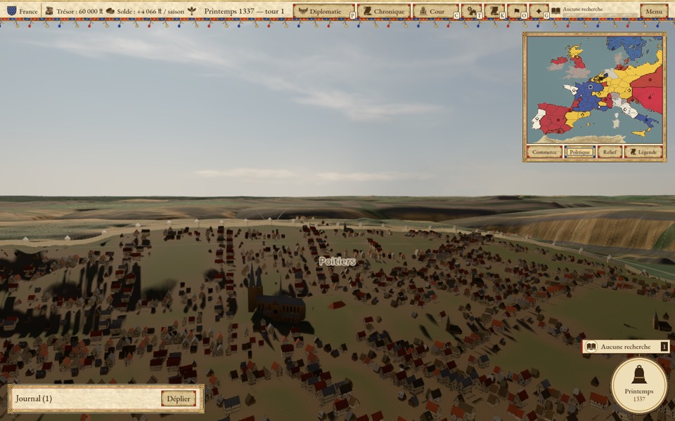
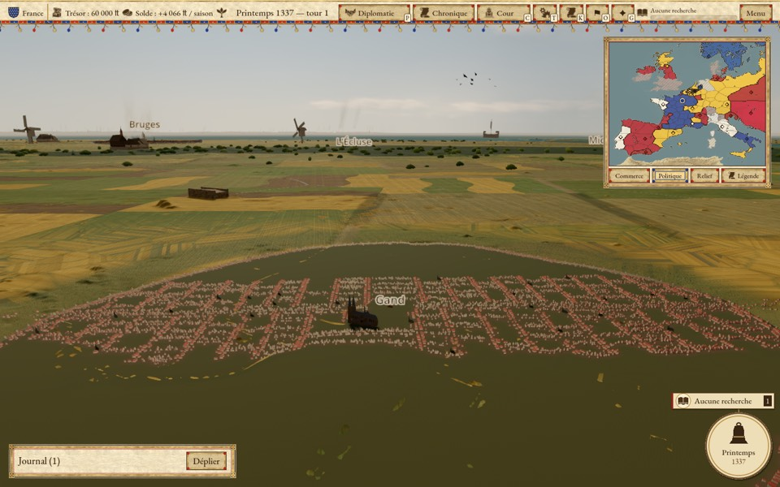
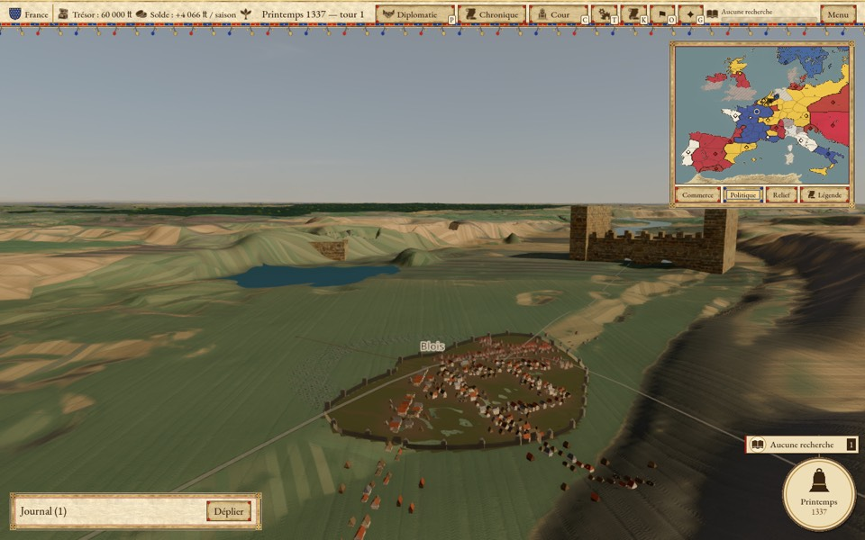

**Limites.** Populations estimées par type et bâtiments (pas encore calées sur l'état des feux de
1328) ; les villages restent des rues-villages simples ; certaines villes près de l'eau (Gand au sud,
Sully-sur-Loire : 5 maisons) perdent des parcelles aux zones d'eau ; rubans de routes et moulins aux
paliers proches relèvent de ZG5b / VH ; appels de dessin ×3 dans la descente (un MultiMesh par modèle
et par cellule).

## Relief exagéré « façon Total War » (lot ZG8, ADR 0036)

Purement visuel : rien dans `core/`, déplacement, vision et batailles restent en mètres réels. On
n'exagère plus seulement l'altitude absolue mais le relief **local**, hauteur au-dessus d'un fond de
vallée lissé : plaines et fonds de vallée restent plats, versants, escarpements et montagnes se
dressent, surtout de près (où ZG4 aplatissait à ×1,5).

```
y = s(d) · (h + g(d) · max(h − fond(x, z), 0))
```

- `s(d)` : échelle ZG4 (`MapData.vertical_scale()`, ×4,31 au loin), plancher de près relevé à
  `near_exaggeration` (×2,5) : `CloseCameraProfile.near_exaggeration()`.
- `g(d)` : gain de relief local, `gain_far` (0,3) en vue stratégique → `gain_near` (0,8) au ras du sol,
  interpolé en logarithme de l'échelle quantifiée : **fonction de l'échelle**, donc publié en même temps
  qu'elle (`MapData.set_vertical_scale`) et recalé par les mêmes signaux (`vertical_scale_changed`,
  `chunk_surface_changed` étalé) ; aucun nouveau recalage.
- `fond` (`ReliefFloor`, calculé une fois dans `TerrainBuilder.build`, ~90 ms sur 8 cœurs) : cellules de
  8 px (5,75 km), minimum des altitudes échantillonnées tous les 2 px et bornées à 0, filtre minimum
  3 × 3 cellules, deux flous de boîte 5 × 5 (grille 512², RF). Toujours ≥ 0 : la côte (h = 0) et la mer
  (h < 0) ne bougent pas ; une rivière au fond de sa vallée (h ≈ fond) ne monte pas, ponts et berges non
  plus. Sans fond publié le gain vaut 0 (comportement ZG4).

**Source unique.** `shaders/campaign_relief.gdshaderinc` (`campaign_display_height`,
`campaign_display_gradient`, globaux `campaign_vertical_scale`, `campaign_relief_gain`,
`campaign_relief_floor`, `campaign_relief_floor_info`) et son double GDScript `MapData.display_height`
(+ `height_from_display`, inverse exacte, et `_with` pour une échelle et un gain donnés). Le fond est lu
au texel près (`texelFetch` + bilinéaire manuel) des deux côtés : pas d'écart de filtrage matériel.
Consommateurs :

| Consommateur | Passage par la fonction |
|---|---|
| `terrain.gdshader` + `relief_quadtree.gdshaderinc` | sommets des patchs (`qt_vertex`), normale d'ombrage (`campaign_display_gradient`) |
| Morceaux E0 / repli (`_chunk_vertices`, `FineTerrainJob`) | cuits avec `display_height_with(…, HEIGHT_SCALE, gain lointain)` |
| `ReliefQuadtree.surface_height_at`, `sample_pages`, instantanés | `_bilinear` rend des mètres, `display_height` au point ; `sample_pages_m` pour les rubans |
| `MapData.height_world_at` / `surface_world_at` | `display_height` : armées, caméra (plancher, visée), sondes de survol, marqueurs, végétation, routes C7b |
| `river_fine`, `road_fine` (ZG5b) | sommets en mètres → `campaign_display_height` |
| `river_water` (V4) | cuit en altitude × `HEIGHT_SCALE` sans gain, reposé par le shader |
| `landmark.gdshader` / `LandmarkModel` | grille en mètres = `height_from_display(surface)`, reposée à l'ancrage |
| `town_building.gdshader` / `TownBuilder` (ZG6) | base en mètres → hauteur affichée à l'origine de l'instance (maillages drapés : au sommet) ; boîtes × (1 + g) |
| Ponts et portes (`RiverCrossings`, `FineGeoLayer`) | niveau d'eau et tablier par `display_height` |

Boîtes englobantes conservatrices : `y ≤ s·(1 + g)·h` pour h ≥ 0 (quadtree, villes, rubans avec le gain
maximal).

**Roche et lumière.** `terrain.gdshader` remplace la couverture du sol par la roche sur les pentes du
relief exagéré localement (pente vraie × (1 + g), `cliff_slope_start` 0,45 → `cliff_slope_full` 1,0 ;
la forêt tient un peu plus longtemps) ; soleil de la carte abaissé à 34° (`sun_elevation_deg`, azimut
conservé ; `TurnLight` part de cette base).

**Réglages et interrupteur.** `game/resources/relief_exaggeration.tres` (`ReliefExaggerationProfile`,
voisin de `close_camera.tres`) : `enabled`, `near_exaggeration`, `gain_far`, `gain_near`, paramètres du
fond, falaises, soleil. `enabled = false` ou `-- --no-relief-exaggeration` : exactement ZG4 (gain nul,
plancher ×1,5, soleil de la scène). Parchemin (morceaux E0 cuits avec le gain lointain) et filtres de
carte MF1 inchangés.

**Test, captures, banc.**
- `godot --headless --path game --script res://tests/zg8_relief_test.gd` : formule (plaine inchangée,
  sommet rehaussé, côte et mer fixes, monotone, inverse), double GPU (texture relue comme le shader =
  `relief_floor_at`, formule du `.gdshaderinc`, aucun shader ne pose des mètres sans la fonction), carte
  réelle (fond ≥ 0 ; Paris : h 31 m, fond 7 m, +7 m ; pic pyrénéen 3 125 m, fond 897 m, +668 m au gain
  lointain), objets posés (sommets E0 et maquettes : sol affiché = hauteur affichée).
- ZG2 et ZG4 adaptés (surface = `display_height`, nombre de paliers selon le plancher) ; ZG5b, ZG6 OK.
- Captures : `godot --path game --script res://tests/zg8_relief_shots.gd -- --out=<dossier>
  --prefix=apres` (et `--prefix=avant --no-relief-exaggeration`) ; la météo et la saison tirées au
  lancement peuvent différer entre les deux séries.
- Banc `--bench-map` avec et sans : machine chargée par d'autres sessions (≈ 20 Godot), écarts dans le
  bruit ; coût GPU ajouté : 4 `texelFetch` par sommet du quadtree et 4 par fragment (gradient du fond).

**Limites.** Gain et plancher choisis à l'œil (captures), à affiner en jeu ; la partie « régionale » du
relief (plateaux entiers au-dessus de leur fond sur ~10 km) forme une rampe douce au bord des plateaux ;
les sommets alpins très découpés deviennent plus aigus en vue moyenne (le gain lointain reste modeste) ;
`vegetation_mask` et le parcellaire lisent encore les pentes vraies (voulu : règles d'occupation du sol).

Captures (`docs/img/zg8/{avant,apres}_<vue>.jpg`) : Pyrénées (d = 40 et 7), Alpes (45), Massif central
(30), pays de Galles (40), falaises normandes (6), coteaux de Seine aux Andelys (8), Paris (10, plaine :
inchangée), France entière (900).

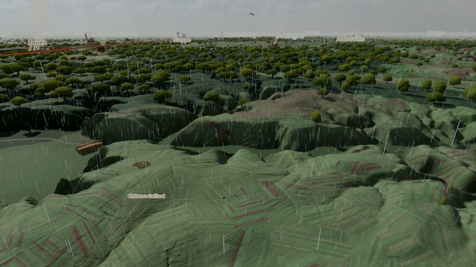
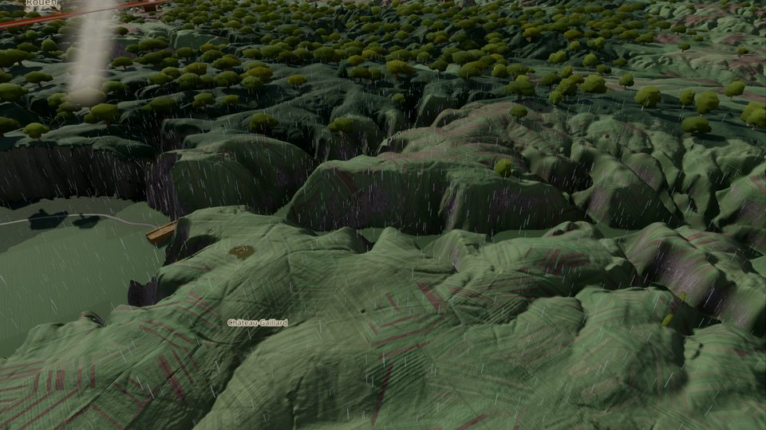
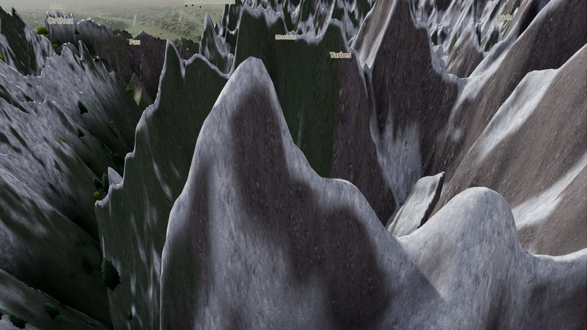
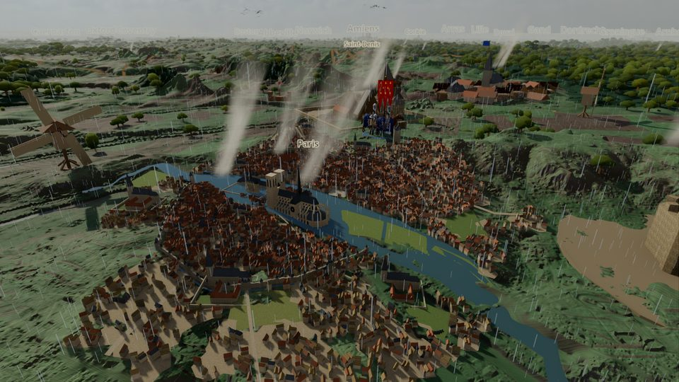

## Perf et finitions de la vue rapprochée (lot ZG7a, ADR 0036)

**Villes (ZG6).** Blocs : un MultiMesh par ville ; maisons du kit : un MultiMesh par modèle et par
cellule de 1 km (`TownBuilder.DETAIL_CELL_M`) au lieu de détail + blocs par cellule de 250 m. Le choix
maison / bloc se fait **par instance** dans `town_building.gdshader` (`lod_mode` 1 détail, 2 bloc ;
distance à `lod_camera`, publiée chaque image par `TownLayer` via `TownBuilder.set_lod_view`) : la
passe d'ombre fait le même choix que la vue principale. Une instance écartée est repliée sur l'origine
de son modèle (triangles dégénérés). Essai « un MultiMesh par modèle et par ville » abandonné : moitié
moins d'appels de dessin, mais toutes les maisons de la ville passaient dans le vertex shader (et chaque
cascade d'ombre) dès qu'une seule était proche, −9 % d'images/s.

**Fil principal.** Image et mipmaps des pages de relief décodées dans `WorkerThreadPool`
(`ReliefQuadtree._dispatch_image`) ; maillages des ponts-portes (`FineRibbonJob._prepare_gate_meshes`)
et des ponts fins (`RiverCrossings._prepare_fine`) préparés dans des fils (`BridgeMeshes.build_arrays`,
cache par clé partagé avec `build`) ; recalage des tuiles fines sur un changement de surface par un
seul parcours des pages (`ReliefQuadtree.finest_levels`) ; éviction des couches sans recalcul global
de `_chunk_top`. Minuteries par étape dans `perf_stats` (`qt_step_ms_max`, `fine_install_mesh_ms_max`,
`fine_install_gates_ms_max`, `bridge_reshape_ms_max`).

**GPU** (`tests/zg7a_gpu_ab.gd`, Vulkan obligatoire pour `viewport_get_measured_render_time_gpu` :
`godot --path game --rendering-driver vulkan --script res://tests/zg7a_gpu_ab.gd -- --configs=base,no_parcels`).
Parcellaire ZG5b : 1,4-2,7 ms de près (Amiens, Paris) ; allégé d'≈ 20 % (boucle fixe de 16 villes du
finage, hash de Hoskins, bruit fin et normale des haies seulement quand ils se voient), rendu identique.
Relief ZG8 : non mesurable (dans le bruit). Villes : 1,9-2,6 ms à Amiens.

**Seine et fleuves ancrés.** Le « chenal brun » venait du fond de vallée plaqué à 0,5 m par le relief
E1-E4 sans parcellaire (corrigé par ZG4b) ; les largeurs, elles, étaient incohérentes par tronçon (4,5 m
en amont de Rouen, 50 m d'Elbeuf à Rouen, 60 m à Mantes). `hydro_fine.WidthModel` interpole désormais la
largeur le long de la chaîne des ancrages (projection jusqu'à 25 km), règle par tronçon en amont du
premier ancrage, repli Strahler. Nouveaux ancrages La Bouille 250, Duclair 300, Caudebec 450 m
(`data/map/river_widths.json`). Résultat : Paris 133 m (îles comprises : 150-200), Mantes 146-150,
Vernon 158, Elbeuf 175, Rouen 200. `geo hydro-fine` et `geo anchors-fine` relancés (pont de Mantes
69,5 → 150,5 m). Plus de lit creusé dans les zones personnalisées (`river_styles.json`).

**Ponts-portes et ponts fins.** Le tablier garde sa largeur réelle (`BridgeMeshes.FINE_DECK_M` : porte
9 m, pierre 7, bois 4,5, bateaux 5, bac 8, gué 6 ; `fine_deck_scale`) au lieu de 0,15 + 0,05 × portée
à l'échelle fine (30-45 m sur la Loire).

**Londres.** Plancher de rehaussement monotone `max(0,5 ; min(0,85 h ; 5 m))` dans
`detail_dem.apply_boost` (`BAKE_VERSION` 4) ; seule la zone `londres` du palier 3 a été recuite (rives
2,6-3,8 m au-dessus de la Tamise au lieu de 0,5 m). Les autres zones suivront au prochain `geo
detail-dem` complet (marqueurs invalidés).

**Aperçu de chemin.** `PathPreview.width_at(d)` : plancher 0,01 unité (≈ 7 m) de près, 0,8 en vue
stratégique (lissé entre d = 40 et 160) ; soulèvement `lift_at(d)` 0,004 × d ; subdivision plus fine de
près (≤ 2 000 points) ; `update_view` reconstruit quand la distance varie de plus de 30 %.

**Mesures** (M4 Pro, `--bench-map --bench-descent-only [--bench-towns]`, base = `main` 369bc6e7,
passes base / ZG7a alternées, médiane de 3 passes, machine partagée avec d'autres sessions) :

| Mesure | Villes base | Villes ZG7a | Descente base | Descente ZG7a |
|---|---|---|---|---|
| images/s | 46,9 | 46,0 | 37,2 | 35,5 |
| p50 (ms) | 15,1 | 14,6 | 15,4 | 15,0 |
| p99 (ms) | 130 | 131 | 139 | 138 |
| pics > 50 ms | 203 | 193 | 182 | 186 |
| appels de dessin | 897 | **508** | 666 | 665 |
| `qt_update` max (ms) | 18,2 | 16,4 | 18,9 | 17,0 |
| `fine_update` max (ms) | 20,5 | **5,5** | 17,2 | **5,7** |
| `fine_install` max (ms) | 18,9 | **1,6** | 16,4 | **1,2** |
| `surface_emit` max (ms) | 17,9 | **7,5** | 14,4 | **7,9** |

Bascule des ponts : `bridge_reshape_ms_max` 0,3-0,35 ms, `fine_install_gates_ms_max` 0,5-1,1 ms (maillages préparés hors fil).

**Limites.** p99 ≈ 130 ms (cible ≈ 115 non atteinte) : les pics > 50 ms sont communs à la base et
dominés par le rendu / l'attente GPU et la création des ressources, pas par une tâche de script ; la
sélection et l'application du quadtree (GDScript) montent encore à 10-16 ms sous forte charge (au-delà
des 8 ms visés) ; relief E1-E4 : fonds de vallée proches de plateaux toujours à 0,5 m (recuisson E1-E4
hors lot) ; niveau fin de la Tamise à −7,8 m (PAVA mêlé à la bathymétrie de l'estuaire).

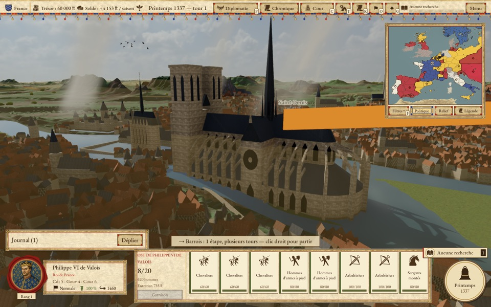
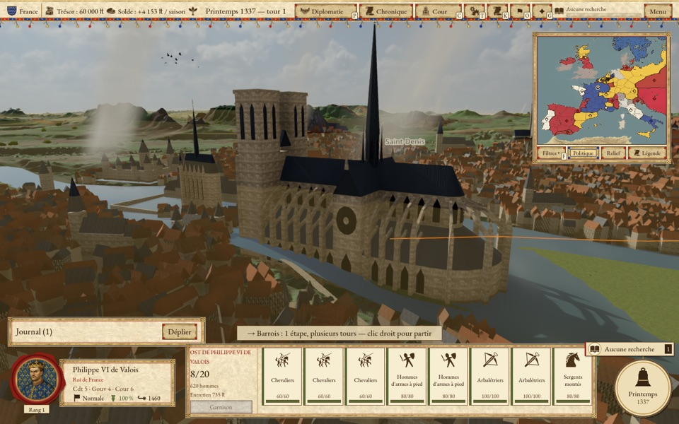

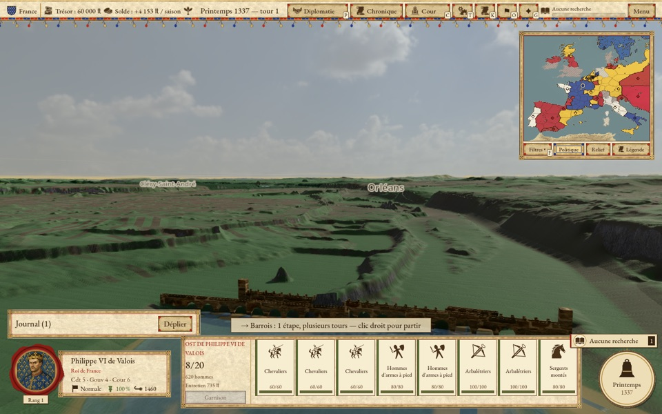
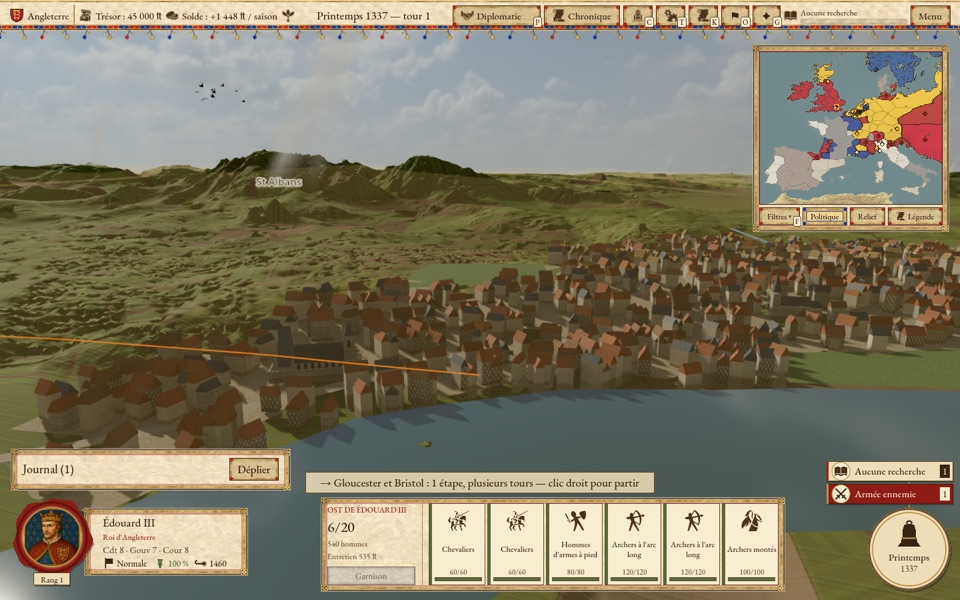
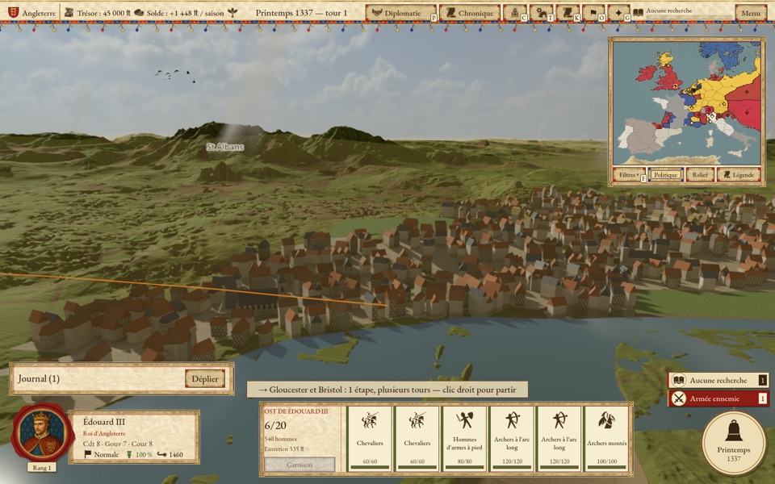
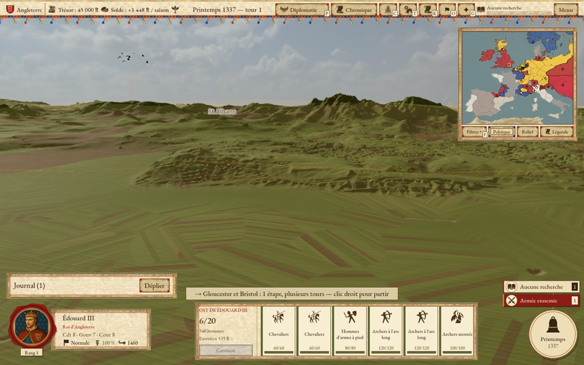
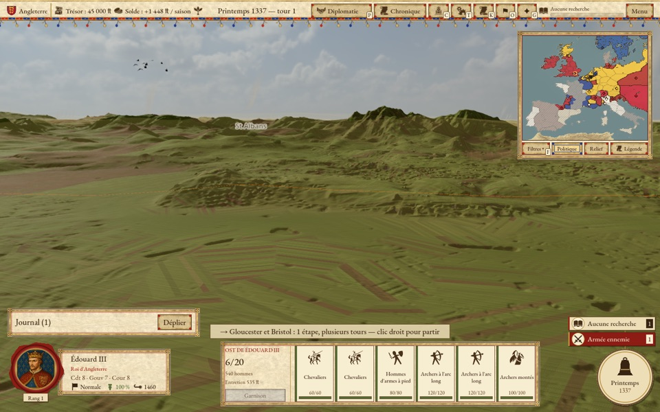
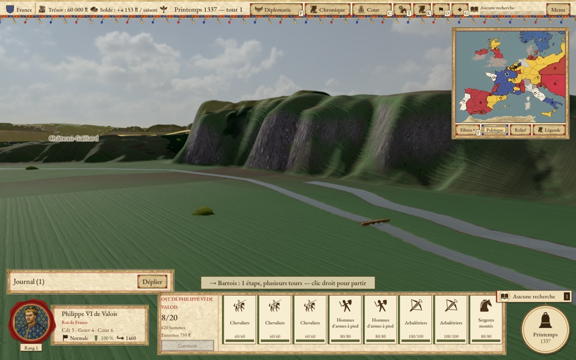

## Recette finale et clôture (lot ZG7c, ADR 0036)

**Cache partiel.** `ReliefPyramid` ne garde, par étage, que les tuiles listées **et** présentes sur
le disque (un listage du dossier de l'étage, `_drop_missing_tiles`, `missing_tiles`) ; une tuile
absente retombe sur l'ancêtre le plus fin présent (`finest_ancestor`), une tuile illisible est écartée
à l'exécution (`mark_broken`). Avant, un étage entier était ignoré si sa première tuile manquait.
Les reliquats d'écriture (`*.part.png`, `*.tmp`) ne sont jamais pris pour des tuiles : toutes les
commandes `geo` écrivent puis renomment. Test : `tests/zg7c_partial_cache_test.gd` (trous à E1-E3,
E3 sous un trou E2, tuile corrompue ; quadtree stable à d = 40, 10 et 4).

**Relief local plafonné.** `ReliefFloor` relève le fond de vallée à `sommets voisins −
local_relief_cap_m` (`relief_exaggeration.tres`, 350 m ; maximum par cellule, filtre maximum sur le
rayon total des flous, mêmes flous). Le terme `h − fond` de ZG8 reste entier sur les collines, coteaux
et falaises, mais ne dépasse plus ≈ 350 m en montagne : plus d'aiguilles au puy de Dôme ni dans les
Alpes. Même formule partout (le fond publié est lu par les shaders, `MapData` et le semis natif) ;
0 = rendu ZG8 d'origine.

**Montagnes écrasées (lot SZ1, défaut S1).** Au palier vallée, l'exagération ZG4 (×3,4 à d = 6) de
2 000 m de relief pyrénéen faisait 10 unités de murs pour une caméra à 6 : caméra au fond des canyons.
La hauteur affichée devient

```
y = s · (h − K · max(h − base, 0) + g · (1 − K) · max(h − fond, 0)),   K = c(s) · k(x, z)
```

- `base` : fond non plafonné (min + flous de `ReliefFloor`, ≤ `fond`) ;
- `k` : facteur d'écrasement par cellule, fonction de l'amplitude régionale A = sommets voisins
  (maximum puis flous, déjà calculés pour le plafond) − base : 0 sous le genou `mountain_knee_m`
  (350 m), au-delà amplitude affichée `genou + (A − genou) · mountain_ratio` (0,3), borné à
  `mountain_squash_max` (0,55). Collines, coteaux, falaises et plaines (A ≤ 290 m mesuré : Crécy,
  falaises normandes, Seine, Loire, Paris) : k = 0, rendu inchangé ;
- `c(s)` : poids selon l'échelle, `mountain_squash_far` (0) en vue stratégique → 1 dès l'exagération
  `mountain_squash_full_exaggeration` (×3,5, avant le palier vallée) ; publié avec l'échelle
  (`campaign_relief_squash`), recalé par les mêmes signaux ;
- le gain local ZG8 est écrasé d'autant (`g · (1 − K)`) : pas d'aiguilles sur une montagne aplanie ;
- autour des villes emblématiques 1:1 (VH4, `LandmarkV2Library`) : k ≥ `true_scale_squash` (0,7)
  jusqu'au rayon de la ville + `true_scale_full_units` (4), fondu sur `true_scale_fade_units` (6) :
  relief ≈ échelle vraie aux paliers vallée et site (coteaux de Rouen, côte Sainte-Catherine, plus
  des murs de 600 m à côté de maisons à l'échelle ; amplitude affichée ×0,65).

Fond, base et k partagent une texture RGBF (`campaign_relief_floor` : R, G, B) et la grille publiée
(`MapData.relief_floor_grid` : `data`, `base`, `squash`) ; doubles exacts : `campaign_relief.gdshaderinc`
(`campaign_display_height_at_fields`, gradient compris), `MapData.display_height_fields` (et l'inverse
par morceaux `height_from_display_with`), `vegetation::TileRequest::display_height` (Rust, semis natif,
`VegetationScatter.set_relief_fields`). Bornes des boîtes : `s·(1 − K_max)·h ≤ y ≤ s·(1 + g)·h`
(quadtree, villes). Palier vallée, amplitude affichée dans 8 px : Pyrénées ×0,48, Alpes ×0,42,
pays de Galles ×0,56, Massif central ×0,54, collines ×1,00 (`tests/sz1_mountain_test.gd`).

**Caméra au-dessus des crêtes voisines (SZ1).** En plus de la garde au sol et de la visée dégagée,
la caméra reste au-dessus du sol affiché (plus la garde) sur un cercle de rayon
`crest_radius_factor` × distance (0,5) autour d'elle et autour du point visé (`crest_samples` = 8,
hauteur pondérée par `crest_focus_weight`) : elle monte au-dessus des crêtes au lieu de rester dans
la vallée. Sur les collines, rien ne change (≤ 1 cm de plus à Crécy au palier site).
Captures avant / après : `docs/img/sz1/` (`tests/sz1_mountain_shots.gd`, « avant » avec
`--no-mountain-squash --no-crest` ; Rouen : `tests/vh4_shots.gd`, « avant » = `docs/img/vh4/`).

**Niveaux d'eau.** `hydro_fine.water_level` borne le fond des lignes à 0 m avant l'ajustement
monotone (la bathymétrie des zones E5-E7 tirait la Tamise à −7,8 m à Londres, la Garonne à −15,8 m à
Bordeaux) ; clé du cache de recalage liée à `detail_dem.BAKE_VERSION` (`SNAP_VERSION` 4 : les
recalages dataient d'avant ZG3b : la Loire passait 10 m sous le relief d'Orléans, encore ≈ 5 m après
recalage, car l'ajustement monotone la mêle aux biefs E4 d'amont abaissés, voir les limites). Tamise à
Londres : 1,9 m. Palier 3 : les 34 zones recuites avec le plancher monotone v4.

**Banc.** `process_ms` du banc `--bench-map` est chronométré du début de l'itération (nœud
`MapBenchFrameStart`, priorité minimale, physique comprise) jusqu'au banc (priorité maximale), au lieu
de `Performance.TIME_PROCESS` (qui ne couvrait pas l'image mesurée) : les pics > 50 ms de la descente
sont dominés par les scripts (médiane ≈ 59 ms de scripts sur ≈ 60), pas par le GPU.

**Recette.** `godot --path game --script res://tests/zg7c_recette_shots.gd -- --map-weather=clear
--out=<dossier> [--only=paris,londres] [--extras]` (brouillard de guerre coupé : sans cela, les terres
inconnues du camp joué paraissent beiges de près). Captures et défauts laissés :
`docs/wip/zg7c-recette.md`.

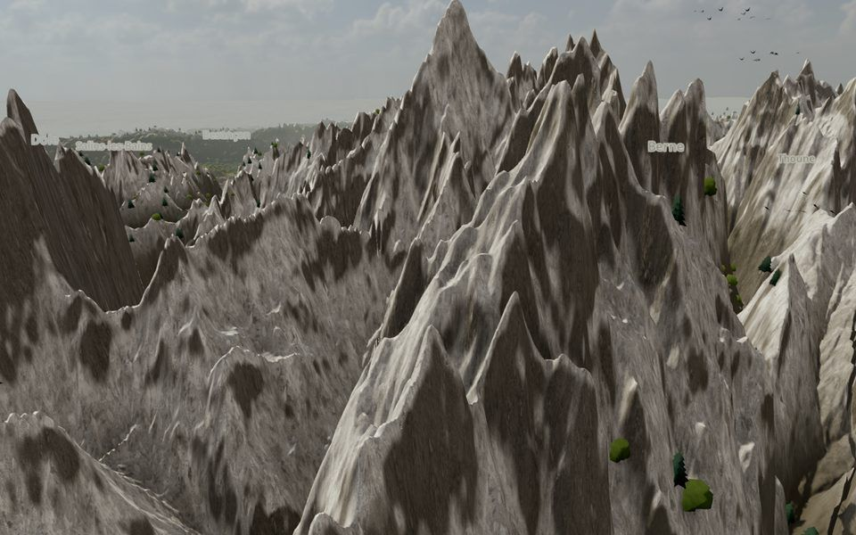
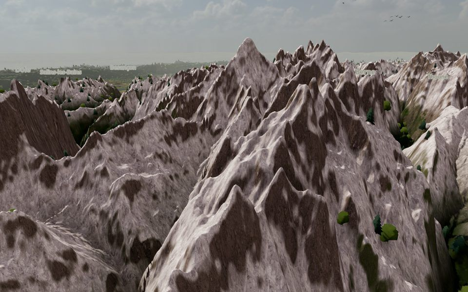
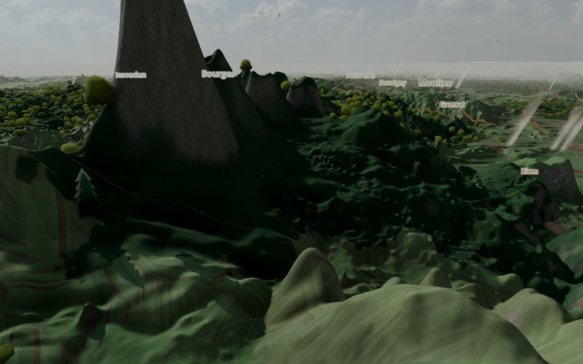
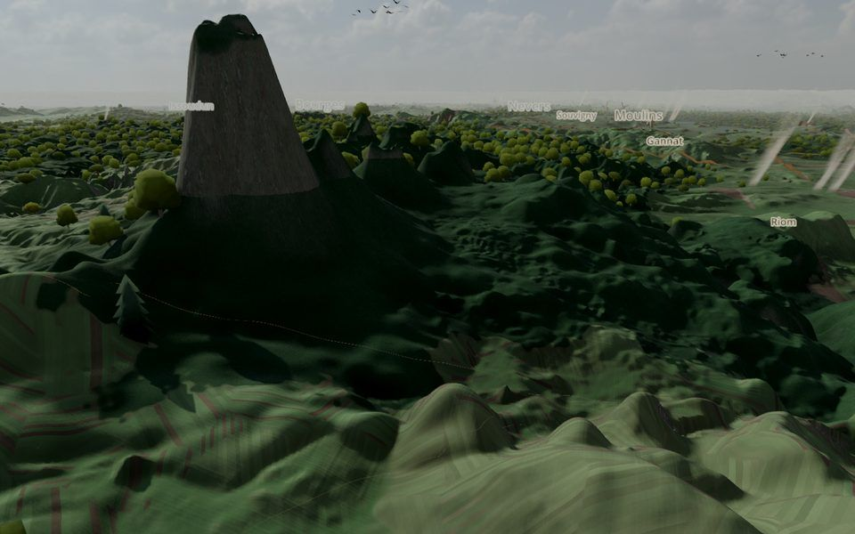
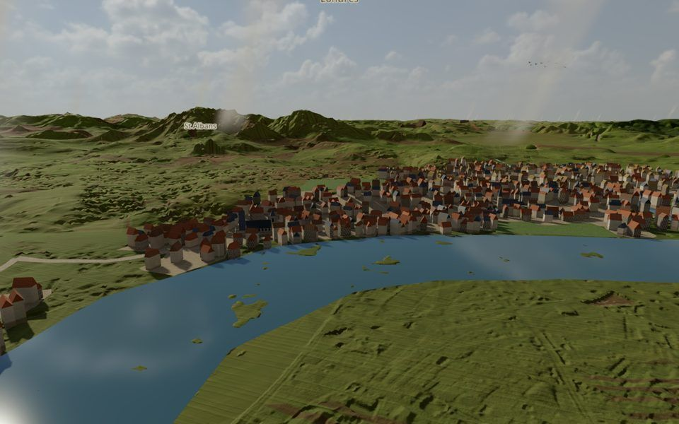
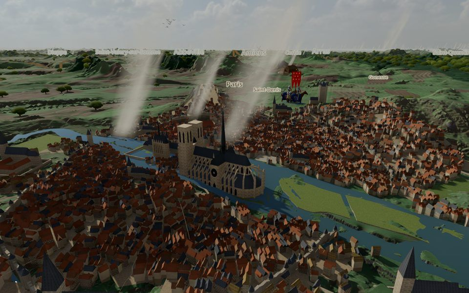
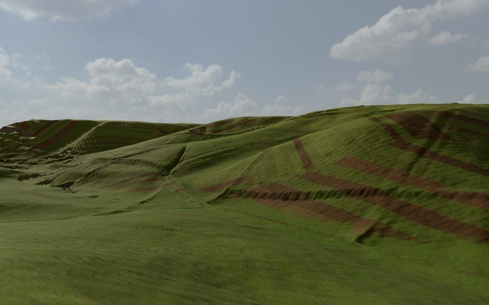
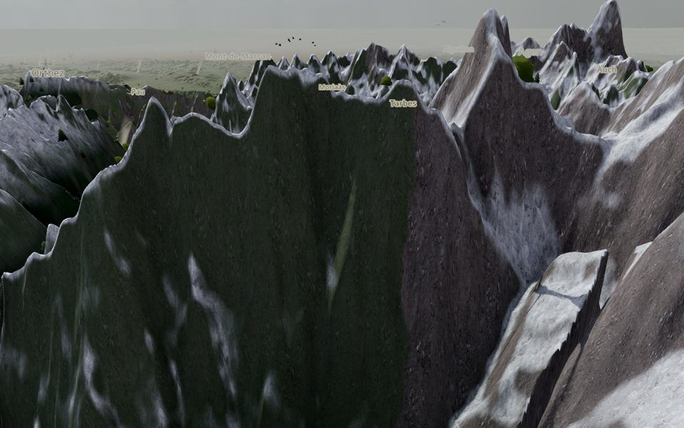
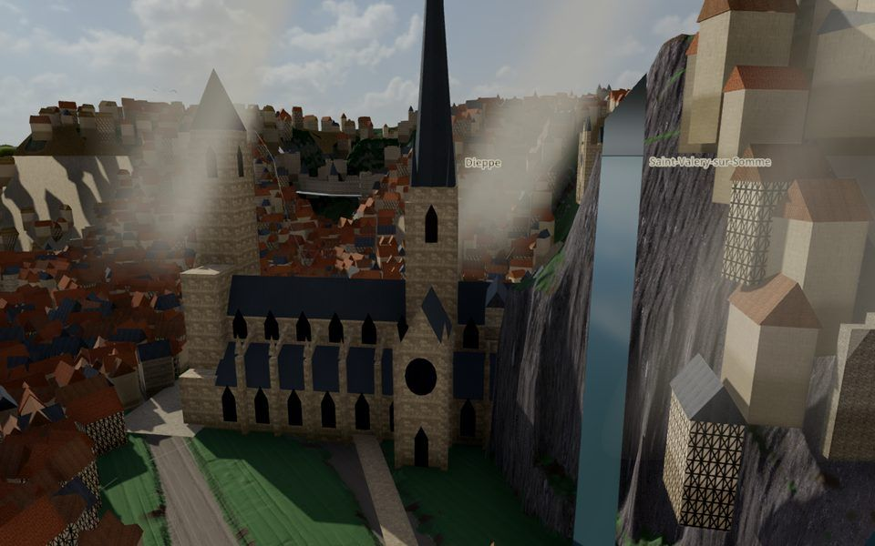

## Objets à l'échelle aux paliers intermédiaires (lot SZ4, suites ZG7c S4 et S5)

**Accessoires de carte.** Arbres, moulins, hameaux et panaches de fumée sont dessinés à l'échelle de
la carte (1 unité ≈ 719 m : arbre ~1 km, corps de moulin 2,3 km, hameau ~1,4 km, panache de
cheminée 1 × 3 km) : lisibles en vue stratégique, absurdes au palier vallée. `MapPropScale`
(`scripts/map/map_prop_scale.gd`, réglages `resources/map_prop_scale.tres`) donne leur échelle selon
la distance du rig : 1 au-delà de `shrink_start` (28 unités, rien ne change en vue stratégique ni en
haut du palier comté), taille réelle (`*_ratio` = taille réelle / taille carte) en deçà de
`shrink_end` (5 ; `tree_shrink_end` = 3 pour les arbres, dont le semis est clairsemé ; **lot SZ4b :
exagération commune et fin à 8 unités, voir plus bas**), `smoothstep`
sur le logarithme de la distance entre les deux : aucune marche visible pendant un zoom.
- arbres : paramètre global `campaign_prop_scale` (remplace `ZoomTiers.prop_scale`) ;
- panaches (`life_smoke.gdshader`) : paramètre `prop_scale` des deux matériaux ; l'origine des
  instances est au sol et la levée (sommet de la maquette, toit du hameau) est dans la colonne z de la
  base (`MODEL_MATRIX[2].y`), mise à l'échelle avec la largeur et la hauteur ; opacité des cheminées
  × `chimney_real_alpha` à taille réelle ;
- moulins (`LifeEffects`) et hameaux (`SettlementLayer`) : instances réécrites quand l'échelle varie
  de plus de `rewrite_step` (4 %), depuis des données gardées à la construction (sol du moulin ; sol
  au centre et point bas de l'emprise de carte du hameau, interpolés selon l'échelle) : ≈ 0,3-0,7 ms
  pour ~500 moulins ou ~400 hameaux chargés, sans relire le relief ;
- moulins, fumées et hameaux ne sont plus masqués au palier site (ils y sont à leur taille réelle).

**Villes ZG6 vues de loin.** À 4 km, les maisons (blocs du HLOD) sont sous-pixel : on ne voyait que
le sol de terre battue, un disque brun. Le sol bâti (`TownBuilder` : part bâtie dans `UV2.y`,
matériau `roofscape`) prend de loin la couleur moyenne (dernier mip) d'une couche de toit de l'atlas,
tirée par cellule de 9 m avec ruelles sombres, en fondu selon la distance caméra (`town_render.tres` :
`roofscape_near` 1,2 → `roofscape_far` 3,5 unités, `roofscape_strength`, `roofscape_gain`) : la ville
se lit comme une masse de toits, et redevient sol sous les maisons détaillées.

Captures `docs/img/sz4/` (`avant_*` / `apres_*`, paliers vallée d = 6, comté d = 14, stratégique
d = 60 ; `*_amiens_zoom_*` : Amiens à d = 6 et 3, pleine résolution recadrée) :
`godot --path game --script res://tests/sz4_shots.gd -- --out=<dossier> --map-weather=clear
[--tiers=vallee:6,comte:14] [--full] [--settle-towns]`. Test : `tests/sz4_prop_scale_test.gd`.

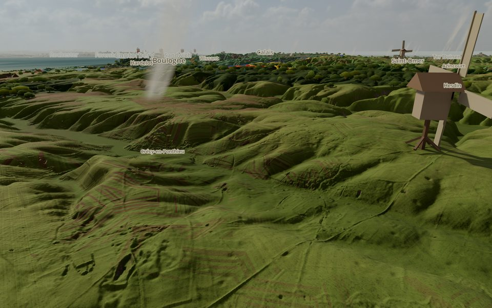
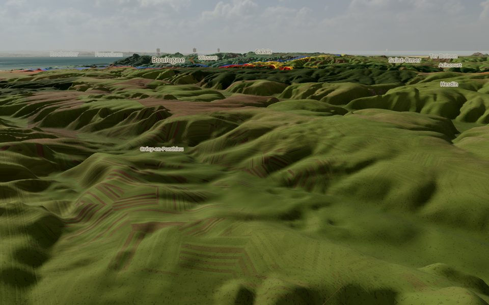
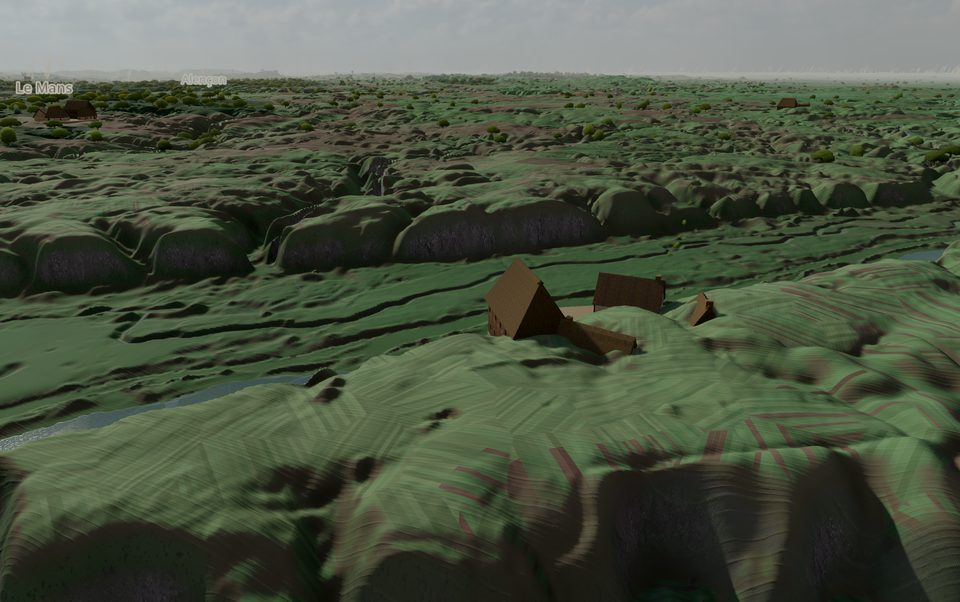
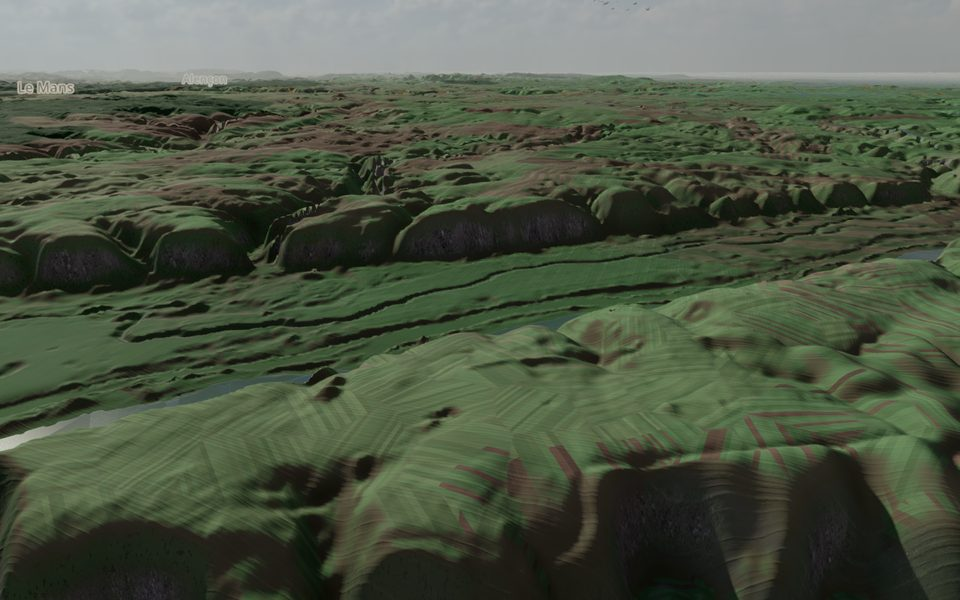
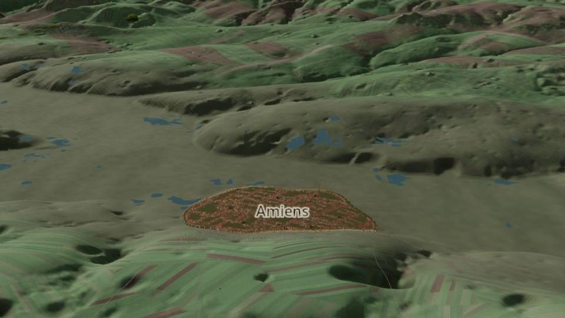
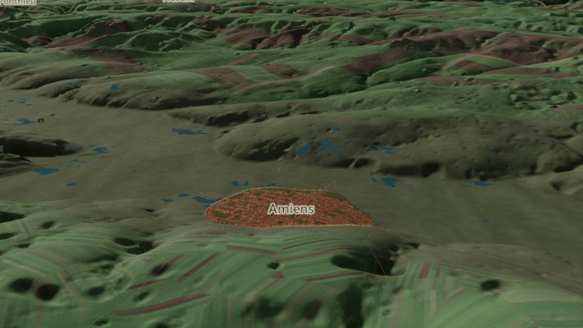

## Maquettes continues et forêts denses (lot SZ4b, suites SZ4)

> Mise à l'échelle des colonies retirée par le chantier VT (ADR 0138) : les villes sont à l'échelle
> 1:1 à toutes les hauteurs ; depuis VT2, moulins, panaches de cheminée et figurants le sont aussi :
> l'exagération commune ne s'applique plus qu'aux arbres et aux incendies.

**Exagération commune.** `MapPropScale` ne donne plus une courbe par famille mais une seule
exagération E(d) (taille affichée / taille réelle) : `max_exaggeration` (125 = 1 / rapport des
moulins) à `shrink_start` (28), 1 à `shrink_end` (**8**, seuil du palier vallée où les villes 1:1
de ZG6 s'activent), `smoothstep` sur le logarithme de la distance. Échelle d'une famille =
min(1, rapport × E) : arbres, moulins, hameaux, panaches et maquettes sont grossis du même facteur
à une distance donnée (à d = 14, E ≈ 8 : arbre ~250 m, maison de village ~80 m) ; une famille ne
quitte sa taille de carte que quand E passe sous 1 / rapport. Au-delà de 28 : rien ne change.

**Maquettes des colonies.** Chaque maquette (`SettlementLayer`) rétrécit vers sa taille réelle
propre : rayon bâti vers 1340 (`towns_1340.json`, `built_ha`) × `settlement_footprint_gain` (1,25)
/ rayon de la maquette, borné à [0,05 ; 0,6] (Crécy : 0,05, Amiens : ~0,25). Échelle appliquée au
support (`holder.scale`) par pas de `rewrite_step` de E (560 maquettes, < 0,5 ms), pose interpolée
entre le point bas de l'emprise de carte et celui de l'emprise réelle (gardés au recalage de la
surface). Masquage **par colonie** : une maquette n'est cachée que si sa ville 1:1 est construite
et affichée (`TownLayer.is_shown`) ; hors du rayon de chargement ZG6 (ou pendant la construction),
la maquette reste, à sa taille réelle, et n'est plus masquée au palier site. Étiquettes, picking
et anneau de sélection suivent l'échelle (`model_scale`, `real_radius`).

**Moulins et panaches** (`LifeEffects`) : chaque point d'une colonie garde son décalage à l'échelle
de la carte autour de la maquette ancrée (ancrage fin ZG5b) et le sol de ses deux poses extrêmes ;
position courante = centre + décalage × échelle de la maquette, sol interpolé. À taille réelle, les
moulins tombent juste hors de la ville 1:1 (1,7-2,4 × le rayon bâti), les fumées dedans. Les fumées
des hameaux partent de leur ancrage fin.

**Forêts denses** (`ForestDetail`, enfant de `Vegetation`, réglages `resources/forest_detail.tres`).
Le semis de la carte (pas 1,35 unité pour des arbres de ~1 km) devient clairsemé quand les arbres
rétrécissent. Autour du point visé, la couche sème des cellules de 16 × 16 unités au pas fin
`spacing × full_scale` (0,047 unité, ~34 m) avec les grilles grossières de la tuile de base (mêmes
masques de forêt, d'essences et de bosquets), sans haies, dans le pool natif (`VegetationScatter`,
crate `vegetation` : `DetailArea` = rectangle, part des graines gardées `keep`, parties 4 × 4,
couloirs). Part affichée `full_scale² (1/s² − 1)` (s = échelle des arbres) : couvert constant ;
décroissance au-delà de 0,55 × le rayon (3,5 × la distance du rig, 6-50 unités) ; budget
`instance_budget` (220 000 instances affichées, le rayon se resserre au-delà), cache borné
(`max_cells`, `max_stored_instances`). Les graines étant triées, `visible_instance_count` garde les
premières et le paramètre d'instance `instance_cut` / `instance_band` de `foliage.gdshaderinc` fait
grandir celles qui apparaissent ; le flux aléatoire ne dépend pas de `keep` (resemer plus dense
ajoute des arbres sans déplacer les autres). Couloirs sans arbres : fleuves fins affichés et routes
drapées de ZG5b (tuiles CAFV, demi-largeur + 25 m / + 10 m), que la trame 4096 du lit ne connaît
pas. Recalage sur les pages du quadtree groupé par tuile. `--no-forest-detail` coupe la couche.

**Défaut corrigé au passage** : le pied des instances d'arbres est enfoncé de 0,08 × leur hauteur
**de carte** (~80 m) ; `campaign_prop_scale` réduisait l'arbre autour de ce pied enterré, si bien
qu'au palier vallée presque tous les arbres (couche de base comprise) étaient sous le sol.
`foliage.gdshaderinc` réduit désormais l'enfoncement avec l'arbre (`FOLIAGE_GROUND_SINK`).

Captures `docs/img/sz4b/` (`avant_*` : `main` 60061b0b dans un worktree jetable, `apres_*` : la
branche fusionnée avec ce `main`), Crécy, Val de Loire, Amiens, forêts d'Orléans et de Compiègne,
d = 6, 10, 14, 20, 60 :
`godot --path game --script res://tests/sz4b_shots.gd -- --out=<dossier> --map-weather=clear
[--settle-towns] [--prefix=…] [--only=…] [--tiers=d6:6,…] [--full]`.
À d = 6, la ville 1:1 d'Amiens n'est qu'un disque de toits vue de si haut, comme sur `main`.
Test : `tests/sz4b_colonies_forests_test.gd` (+ `cargo test -p vegetation`).

**Coût mesuré** (`tests/sz4b_bench.gd`, fenêtre 1280 × 720 environ, vsync coupée, machine chargée
par d'autres agents : 3 passes alternées avant/après, médianes ; bruit de ± 40 % d'une passe à
l'autre, plafond à 60 i/s) :

| Vue | i/s avant | i/s après | arbres denses affichés | primitives avant → après |
|---|---|---|---|---|
| Forêt d'Orléans, d = 6 | 39 | 35 | 219 000 | 6,4 M → 13,6 M |
| Forêt d'Orléans, d = 10 | 30 | 40 | 188 000 | 6,7 M → 12,5 M |
| Forêt de Compiègne, d = 6 | 58 | 29 | 212 000 | 5,5 M → 13,5 M |
| Crécy, d = 10 | 43 | 38 | 181 000 | 4,4 M → 9,8 M |
| Amiens, d = 14 | 47 | 46 | 6 500 | 4,2 M → 4,2 M |

La couche de base reste à 490 000 instances. La forêt dense double à peu près les primitives au
palier vallée (budget de 220 000 arbres atteint en forêt) ; l'écart d'i/s reste dans le bruit sauf
peut-être à Compiègne. Levier si besoin : baisser `instance_budget` ou le maillage des arbres
proches (LOD) dans `forest_detail.tres`.

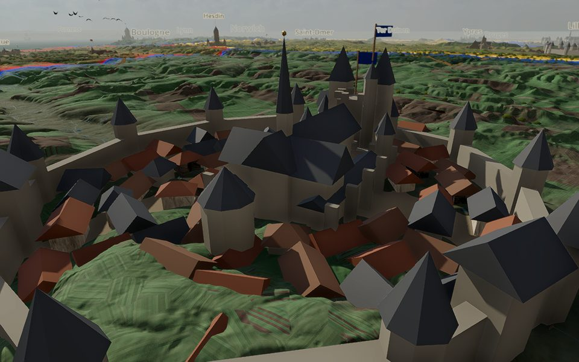
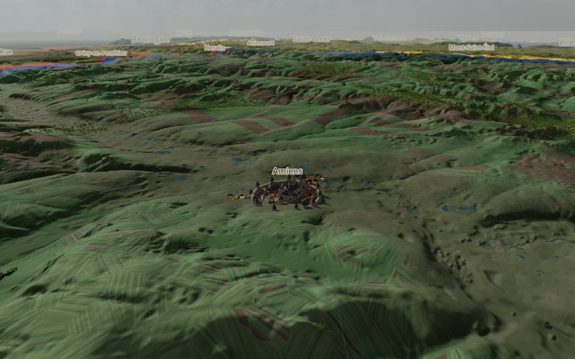
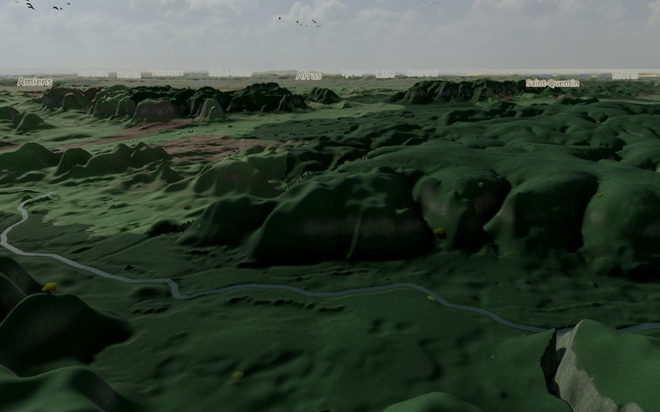
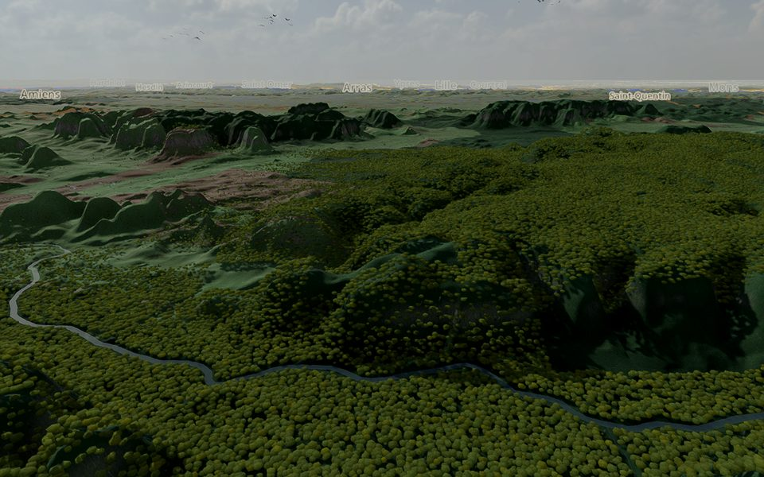
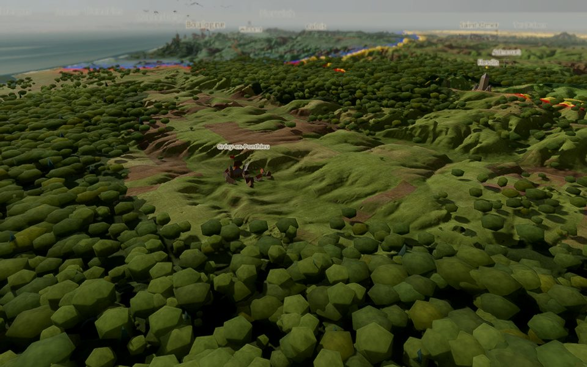

## Pics d'images côté scripts (lot SZ6, ADR 0051)

**Sonde.** `--bench-map --bench-probe` active `PerfProbe` (`scripts/dev/perf_probe.gd`) : minuteries
par section de `CampaignMap._process` (`map.*`), de `update_lod` (`lod/*`) et des étapes du quadtree
(`qt/*`) ; le rapport `probe` donne, par section, le temps cumulé dans les images > 50 ms, le nombre
de ces images qu'elle domine, sa pire durée, et les 12 pires images avec leurs sections. Ajouter une
section : `var t := Time.get_ticks_usec()` … `t = PerfProbe.lap("nom", t)` (coût : un test booléen) ;
« parent/nom » pour une sous-section.

**Causes trouvées et correctifs** (même rendu, au plus quelques images de décalage) :
- Rubans de route drapés (`RoadRenderer`) : un ruban coûtait jusqu'à 115 ms au fil principal. Avec
  le quadtree, construits dans `WorkerThreadPool` (`RibbonJob`) sur un instantané des pages de
  l'emprise des tronçons (`surface_snapshot`, même surface que `surface_heights_at`), 4 à la fois,
  installés dans le budget de l'image ; `flush` et le repli E0 restent synchrones.
- Végétation : changer `MultiMesh.mesh` après `buffer` fait relire le tampon au GPU par le serveur
  de rendu (boîte englobante), image bloquée jusqu'à 80 ms au passage détaillé / simple. Le
  MultiMesh est recréé depuis la copie processeur du tampon (`Vegetation._with_mesh`). **Règle :** ne
  jamais changer le maillage ni lire `buffer` / `get_instance_*` d'un MultiMesh rempli par `buffer`.
- Villes emblématiques : recuisson des hauteurs d'un bloc dans un fil (instantané des pages) au lieu
  de tranches de 1,5 ms par maquette et par image.
- `TerrainBuilder` : changements de niveau des morceaux signalés du plus proche au plus lointain dans
  `level_emit_budget_ms` (4 ms, au moins un par image ; tous hors image, `FrameBudget.in_frame`) :
  un zoom en changeait jusqu'à 20 d'un coup (50 ms d'écouteurs).
- Étiquettes des colonies : recalculées seulement pour les morceaux recalés, et en entier au
  changement d'échelle verticale ou de palier près (avant : les 570 à chaque image d'un zoom).
- `LifeEffects._reground` : points indexés par morceau (avant : parcours de tous les points).

**Mesures** (`--bench-map`, M4 Pro, machine partagée à une charge de 75-150 ; 4 passes alternées
main c4064c29 / SZ6, médianes) : parcours complet p99 91 → 38 ms, pire image 182 → 52 ms, images
> 50 ms 231 → 3, p50 20 → 19 ms ; descente p99 93 → 38 ms, scripts p99 87 → 29 ms. Détail et limites : `docs/wip/sz6-pics-scripts.md`.

## Villes emblématiques à l'échelle 1:1 (lots VH0/VH4, ADR 0078)

Défaut S3 de ZG7c : au palier site, les villes emblématiques étaient des maquettes à la loupe
posées sur un relief 1:1 (Rouen : falaise au milieu de la ville, plan d'eau vertical), et la caméra
était bloquée par un plancher provisoire (ZG4b). Une ville emblématique qui a un fichier
`data/landmarks_v2/<id>.json` (format v2 géoréférencé EPSG:3035) est désormais rendue à l'échelle
réelle au zoom rapproché ; format, outil et moteur : **`docs/landmarks-v2.md`**.

- `SettlementLayer` crée `LandmarkCityLayer` à côté du `TownLayer` de ZG6 ; la ville se planifie
  dès le poids vallée 0,15 (fil de travail, ≈ 2-4 s pour Rouen sous charge), puis se construit
  par étapes (`TownBuilder`, budget ZG6) ; la maquette L1/L2 se dissout par tramage
  (`landmark.gdshader`, `fade`) entre les poids vallée 0,35 et 0,65.
- Caméra : `CampaignCamera.floor_zones` (fourni par `SettlementLayer.landmark_floor_zones`) ne
  contient plus que les villes sans v2 ; au-dessus de Rouen, la caméra descend au plancher du
  relief (0,3 unité).
- `TownBuilder` étendu sans changer les villes ordinaires : cellules de détail par plan
  (`detail_cell_m`, 250 m pour les îlots des villes 1:1), enceintes polygonales `wall_rings`,
  monuments préparés (`v2_monuments`), rues pavées et ruisseaux dessinés, bord du sol par sommet.
- Rouen vers 1340 : 706 rues (OSM, percées du XIXᵉ s. exclues), enceinte de ≈ 5 km avec 9 portes
  et 65 tours, pont Mathilde habité, 26 monuments à gabarit réel (cathédrale 137 m, tour
  Saint-Romain, tour-lanterne et flèche ; chœur gothique et nef romane de Saint-Ouen ; château de
  Philippe Auguste ; halles de la Vieille-Tour ; beffroi communal jusqu'en 1382, Gros-Horloge à
  partir de 1389), ≈ 4 800 parcelles et 5 800 bâtiments.
- Captures `docs/img/vh4/` (`rouen_strategique`, `rouen_transition`, `rouen_vallee`,
  `rouen_site`, `rouen_site_ouest`, `rouen_toits`, `rouen_pont`, `rouen_chateau`) :
  `godot --path game --script res://tests/vh4_shots.gd -- --out=<dossier> --map-weather=clear`.
- Mesure (`vh4_shots.gd`, 4 s par point, machine chargée : charge moyenne ≈ 100-110 sur 14 cœurs,
  autres agents actifs ; après fusion de SZ2/SZ4) : **55 i/s au-dessus de Rouen à d = 1,6 et 56 i/s
  à d = 0,6** (pire image 33-34 ms), contre 60 et 46 i/s au-dessus d'Amiens (ville ordinaire ZG6)
  dans la même session : pas de régression par rapport à une ville ordinaire ; un premier passage,
  plus chargé, donnait 27-28 i/s (Rouen) contre 23-25 (Amiens). 60 i/s à confirmer au repos.
- Tests : `res://tests/vh4_landmarks_test.gd` (headless), `tools/tests/test_landmarks_v2.py`.

## Villes 1:1 à toutes les hauteurs (chantier VT, ADR 0138)

Plus aucune maquette agrandie sur la carte de campagne : les 2 141 villes (2 134 colonies de
`data/map/towns_1340.json` et les 8 villes v2 de `data/landmarks_v2/`) sont rendues à l'échelle
réelle sur tout l'intervalle 3D (0-1250). `LandmarkModel` et `data/landmarks/` ne servent plus
qu'au décor de bataille. Remplace, pour la carte, la loupe (ADR 0015), les maquettes L1/L2 en vue
lointaine (ADR 0078) et la mise à l'échelle des colonies de SZ4/SZ4b (sections plus haut).

**Trois niveaux.**
| Niveau | Quand | Contenu | Code |
|---|---|---|---|
| Plan complet | rig < `max_rig_distance` (16, hystérésis 10 %) | ZG6 / VH4 inchangés : maisons du kit jusqu'à `detail_range` (1,6), blocs jusqu'à `block_range` (14) × qualité | `TownLayer`, `LandmarkCityLayer` |
| F1 | tuile à moins de `f1_range` (300 ; bas 150, moyen 240, ultra 360) | nappe de toits polaire (32 relèvements de `radii`), faubourgs, enceinte, monuments simplifiés ; ≈ 300 tri/ville ; tuiles de 128 u ; ombres sous rig 60 (haute, ultra) | `TownFarLayer`, `TownFarBuilder` |
| F2 | de `f1_range` à `ZoomTiers.model_range` | polygone à 16 côtés, jupe, une flèche au plus ; ≈ 50 tri/ville ; tuiles de 512 u, sans ombre | idem |

Fondus croisés F1/F2 sur 10 % de `f1_range` (`visibility_range`, `FADE_SELF`) ; calque masqué en
vue stratégique (poids ≥ 0,99, parchemin au-delà de 1200). Villes v2 : lointain tiré des
`districts`, `walls` et grands `monuments`.

**Génération.** Au chargement, dans `WorkerThreadPool` (4 fils au plus, une tâche par tuile), depuis
`towns_1340.json` et `landmarks_v2`, sans `TownPlan`. Le fil principal ne crée que les `ArrayMesh`
(`build_budget_ms` = 2 ms par image, au moins une tuile). Hauteurs : grille `ground_m` (centre +
32 × 2 points, mètres) cuite par `cent-ans geo towns` ; le shader `town_far.gdshader` pose le sol
(`campaign_display_height`, ZG8) ; jupe de 30 m. Teinte des toits partagée avec les blocs
(`roofscape.gdshaderinc`).

**Passage au plan complet.** Union des `built_ids()` des calques 1:1 → masque `TownFarMask` (R8
64 × 64) ; le shader enfonce les sommets d'une ville marquée à moins de `block_range` × qualité ×
`sink_factor` (0,95) de la caméra, bande de transition de 10 % (miroir du fondu des blocs).

**Repérage, clic.** Nom et écu (DV2) ; étiquettes, clic (rayon minimal 8 px) et anneau de sélection
sur l'emprise réelle. Hameaux, moulins, panaches de cheminée et figurants FK à taille réelle
(VT2, ci-dessous) ; arbres 1:1 (VT3) ; seuls les incendies restent exagérés. Végétation exclue du finage. Rivières : plus de coupure sous les villes, la ville 1:1 enjambe la vraie rivière.

**Options.** `--no-town-far` (lointain coupé), `--no-landmarks-1to1` (villes v2 rendues comme les
autres). Réglages : `@export` de `town_far_layer.gd` (`f1_tile`, `f2_tile`, `f1_range`,
`fade_fraction`, `shadow_rig_distance`, `sink_factor`, `generation_threads`, `build_budget_ms`,
`quality`), `game/resources/town_render.tres` (`max_rig_distance`, portées des blocs).

**Tests.** `tf_far_mesh_test.gd` (maillages F1/F2/v2), `tf_far_shader_test.gd` (enfoncement),
`tf_far_layer_test.gd` (tuiles, masque, budget), `zg6_towns_test.gd`, `vh4_landmarks_test.gd`.
Captures (fenêtre réelle) : `godot --path game --resolution 640x400 --script res://tests/vt_shots.gd
-- --out=<dossier> --hide-armies --map-weather=clear` (Paris d = 1100, 300, 60, 15 ; Amiens
d = 150), copies locales dans `docs/img/vt/`.

**Mesures** (30/09, M4 Pro, fenêtre 1280 × 720, qualité Haute, `--bench-map --bench-probe
--bench-pan-only --bench-distance=D --bench-seconds=15`, 3 passes alternées base `main` 94cfa8103 /
VT, machine partagée à une charge de 6-25 ; médianes des passes) :

| d | appels de dessin p50 base → VT | primitives p50 | coût CPU du rendu p50 | i/s (passe 3, sans plafond) |
|---|---|---|---|---|
| 1100 | 475 → **201** | 1,40 → 1,30 M | 0,53 → 0,25 ms | 145 → 144 |
| 150 | 3 284 → **751** | 5,24 → 3,55 M | 1,45 → 0,78 ms | 82 → 83 |
| 30 | 1 088 → **517** | 9,19 → 8,60 M | 0,87 → 0,62 ms | 55 → 54 |

Les passes 1-2 sont plafonnées à 60 i/s par l'affichage (p50 16,6 ms des deux côtés). Chargement de
la carte (`startup_total_ms`) : 6,4-7,4 s → 5,3-6,0 s (décor 3,2 → 2,3 s : plus de maquettes) ; le
lointain se génère ensuite en tâche de fond en 1,4-1,9 s réelles (5,7-7,4 s de CPU), pendant la
chauffe. Fil principal : `townfar` ≤ 2,2 ms par image (budget 2 ms + une tuile), un pic isolé de
17 ms (une tuile, machine chargée) sur 9 passes. 1,23 M sommets, ≈ 41 Mo de mémoire vidéo.


### Moulins, fumées et figurants 1:1 (VT2, addendum à l'ADR 0138)

Plus d'exagération pour les moulins, les panaches de cheminée et les figurants FK : échelle
constante à toute distance, et une **portée** au-delà de laquelle ils ne sont plus dessinés (ils
seraient sous-pixel ; on ne paie pas leur rendu). Arbres et incendies (événement de jeu) gardent
l'exagération commune de SZ4b.

| Famille | Avant | Après (taille réelle) | Portée (rig) | Réglage |
|---|---|---|---|---|
| Moulins | ×125 au plus (~2 km de loin), 0,008 → corps ~9,5 m de près | `windmill_ratio` 0,0093 : faîte 11 m, ailes 18 m d'envergure (≈ 26 / d px en 1080p) | 30 | `resources/map_prop_scale.tres` |
| Panaches de cheminée | ×50 au plus, 0,02 → ~19 × 57 m de près ; levée des villes écrasée par l'échelle | `chimney_ratio` 0,0098 : ~9 × 28 m, levée réelle (faîte de la ville, ~7 m sur un hameau) | 25 (fondu `visibility_fade` 20 %) | idem |
| Figurants FK | plancher de lisibilité (hauteur ≥ 0,045 × d, plus gros que les îlots de Paris à d = 15) | 1 m du modèle = 1 / `meters_per_px` (homme 1,8 m ≈ 0,8 px à d = 3 en 1080p, charrette ≈ 2 px) | `figure_max_distance` 3 | `data/rules/map_scenes.json` |

- `MapPropScale.windmill_scale()` / `chimney_scale()` sans argument ; `windmills_visible(d)`,
  `chimney_alpha(d)` (`chimney_real_alpha` éteint sur les derniers 20 % de la portée),
  `range_weight(d, portée)`.
- `LifeEffects` : taille réelle écrite dans les instances des panaches (matériau `prop_scale` 1 ;
  les incendies gardent `fire_scale`), moulins à échelle constante ; plus de réécriture d'échelle
  (moulins, panaches) pendant un zoom ; nœuds des moulins masqués au-delà de leur portée.
- Couronne des moulins et semis des cheminées sur le rayon bâti ; pour une ville v2 absente de
  `towns_1340.json` (Paris, Londres…), `extent_m` de `data/landmarks_v2/` (sans quoi les moulins
  de Paris, à taille réelle, tombaient dans ses rues).
- `FolkPool` : `world_scale()` constant ; `figure_height` et `figure_min_view_fraction` retirés
  (données, schéma, miroir `MapSceneRules` du cœur) au profit de `figure_max_distance` ; niveau de
  détail 1 sous d = 1, 2 au-delà ; rayon d'activité `min(activity_radius, max(1,3 d, 6))` = 6 u.
- Tests : `sz4_prop_scale_test.gd` (échelles, tailles réelles, portées, instances),
  `fk_folk_test.gd` (vue rapprochée à d = 2, échelle 1:1, rien au-delà de la portée). Captures :
  `godot --path game --resolution 640x400 --script res://tests/vt2_shots.gd -- --out=<dossier>
  --hide-armies --map-weather=clear` (Paris d = 15, le moulin des environs de Paris où la caméra
  descend le plus bas, à d = 3 et 1 ; demande la pyramide de relief `data/map/pyramid/`, sans quoi
  le plancher de caméra reste à 7). Constats (640 × 400) : à d = 15, moulins et fumées sont
  invisibles, comme les maisons de Paris (une tache brune) ; à d = 1, moulin ≈ 9 px, figurants
  ≈ 1 px ; les arbres, restés grossis, dominent tout.

### Arbres 1:1 (VT3, addendum à l'ADR 0138)

Plus d'exagération pour les arbres de la carte (tuiles `Vegetation`, forêt dense `ForestDetail`,
haies, vergers, arbres isolés) : échelle constante à toute distance, et une **portée** au-delà de
laquelle aucun arbre individuel n'est dessiné. Au-delà, la forêt est portée par le terrain
(canopée). Touffes d'herbe, broussailles et rochers FC3 / GA3-L2 passent aussi au 1:1 : seuls les
incendies restent grossis.

| | Avant | Après |
|---|---|---|
| Échelle | `tree_ratio` 0,035 × E(d), E jusqu'à ×125 (houppier ~1 km à d ≥ 28, un quartier de Paris à d = 15) | `tree_ratio` 0,018 constant : chêne 14-22 m, hêtre 17-25 m, conifère 17-27 m, haie 4-6 m (mesuré : médiane 19,7 m, p10-p90 15,7-24,5 m) |
| Portée des arbres | tuiles jusqu'à 700 u (préréglage 500-1 100) | rig < `tree_max_distance` 30 ; par arbre, distance caméra < `tree_view_range` 30 (arbre de 20 m ≈ 1 px en 1080p, fov 55°), éteint par graine sur 35 % |
| Forêt dense | part `fraction_for(s)` (couvert constant, d ≤ 8 surtout) ; pas natif relevé à 0,05 u (36 m) | `fraction_at(d)` : 1 jusqu'à d = 8, 0,35 à d = 30, 0 au-delà ; pas 0,022 × 1,35 = 0,03 u (21 m), cellules 8 u × 2 parties, budget 300 k instances |
| Ombres des arbres | jusqu'à d = 300 | jusqu'à d = 12 (`tree_shadow_distance`) |
| Loin | arbres de ~1 km en imposteurs | canopée du terrain (`canopy_field`) |

- `MapPropScale` : `tree_scale()` sans argument, `trees_weight(d)`, `trees_visible(d)`,
  `pixels_for(m, D)` (taille à l'écran). `scale_for` / `exaggeration` / `progress` retirés :
  `shrink_*` et `max_exaggeration` ne servent plus qu'à `fire_scale`.
- Touffes FC3 (`GroundClutter`) : taille réelle dans les instances (`grass_height_m` 0,6,
  `bush_height_m` 1,8, `rock_size_m` 1,0, ± aléa ; avant : ~45 / 110 / 90 m près du sol), plus de
  réduction dans les shaders (`clutter_scale`, `prop_scale_power`, `min_prop_scale` retirés) ;
  portée `max_camera_distance` 2,6 (broussaille de 1,8 m ≈ 1 px), fondu 0,8 ; disque 1,5-3,2 u,
  cellules de 2 u, ≈ 2 500 candidats / u² ; rochers 40 par cellule, niveaux de détail à 0,8 / 1,6.
  Au-delà, la texture du terrain suffit.
- `Vegetation` : `fade_start/fade_end` du feuillage = portée des arbres (fermée en fondu à
  l'approche de d = 30) ; plus de courbe de densité au dézoom (`density_*`, `fade_*_factor`
  retirés) ; tuiles semées (sans être affichées) jusqu'à `tile_prefetch_distance` 120 u (la
  forêt dense a besoin des grilles de la tuile) ; `effective_max_distance()` plafonné par la
  portée ; `tree_shadow_limit()`. Toutes les tuiles visibles étant sous `detail_distance`, les
  niveaux lointains ne servent plus qu'aux essais (`fc2_impostors_test` réduit les portées).
- `ForestDetail` : rayon borné par `tree_view_range`, gain du budget appliqué après les bornes
  (`min_gain` 0,2). Pont natif : plancher du pas de semis 0,05 → 0,01 (`vegetation_scatter.rs`).
- Teinte des forêts du terrain éclaircie vers celle des houppiers (`canopy_lift` 1,8 / 1,65 /
  1,25) : à d = 5, les arbres ne se détachent plus en points clairs sur un sol presque noir
  (pixels sombres de la zone boisée 35-39 % → 19-26 %), les massifs lointains sont un peu plus
  clairs. Forêt dense : décroissance dès 0,4 × le rayon (`fade_from`, 0,55 avant).
- Amorçage bloquant des tuiles de végétation (`warm_start_tiles`) limité aux `warm_start_frames`
  (60) images qui suivent `build` : le premier passage sous d = 30 après un chargement vu de loin
  bloquait 240-300 ms (mesuré) ; il est désormais asynchrone (pire image au saut 300 → 10 :
  57-61 ms, contre 65-69 ms végétation coupée : le reste vient des autres couches).
- Canopée du terrain (`terrain.gdshader`, `canopy_field`) : quatre octaves de bruit à dérivées
  analytiques (période 0,05 u ≈ 36 m, puis × 4 : bouquets, peuplements, massifs), chacune éteinte
  quand sa période passe sous `canopy_min_px` (6) pixels ; relief des houppiers dans la normale
  (`canopy_bump` 0,45) et contraste de teinte (`canopy_contrast` 0,35), pondérés par la part de
  forêt. Les massifs restent lisibles de loin (grain, ombrage) sans arbre dessiné ; sous les
  arbres, la même canopée assure la transition (les arbres s'éteignent par graine sur elle).
- Finage (VT) : exclusions de végétation autour des villes inchangées.
- Tests : `vt3_trees_test.gd` (échelle, hauteurs réelles, portée ≈ 1 px, carte : rien à
  d = 300 / 60, arbres à d = 10), `sz4b_colonies_forests_test.gd` (part dense, forêt dense à
  d = 20, rien au-delà de 30), `sz4_prop_scale_test.gd`, `fc2_impostors_test.gd`,
  `settlements_render_test.gd`. Captures : `godot --path game --resolution 640x400 --script
  res://tests/vt3_shots.gd -- --out=<dossier> --hide-armies --map-weather=clear` (forêt d'Orléans
  d = 300, 40, 5 ; Paris d = 15).

**Mesures** (30/09, M4 Pro, fenêtre 1280 × 720, `--bench-map --bench-probe --bench-pan-only
--bench-distance=D --bench-seconds=15`, 3 passes alternées base `main` 42050fe98 / VT3, machine
partagée à une charge de 8-31 ; médianes des passes) :

| d | appels de dessin p50 base → VT3 | primitives p50 | coût CPU du rendu p50 | i/s moyen | pire image |
|---|---|---|---|---|---|
| 1100 | 262 → 266 | 1,30 → 1,30 M | 0,37 → 0,37 ms | 74 → 65 | 25 → 23 ms |
| 150 | 722 → **668** | 2,79 → **2,58 M** | 0,75 → 0,56 ms | 79 → 89 | 43 → 44 ms |
| 30 | 426 → **351** | 2,82 → **2,22 M** | 0,57 → 0,47 ms | 78 → 66 | 36 → 40 ms |
| 5 | 582 → 556 | 3,77 → 3,75 M | 0,84 → 0,75 ms | 60 → 66 | 36 → 34 ms |

Les i/s sont dominés par le rythme de l'affichage (p50 à 16,6 ms, plafond 60 i/s, dans une passe
sur deux des deux côtés) : un A/B de la même version VT3 à d = 30, canopée coupée / active,
donne 63-66 / 80-83 i/s, écart de même ampleur que base / VT3 dans un sens ou dans l'autre ;
aucun coût mesurable de la canopée. À d = 1100, aucun arbre ni avant ni après (portée du
préréglage 700) : écarts de bruit. Fil principal : aucune image > 50 ms en VT3 (base : 33 dans une
passe à d = 150 sous charge) ; sections les plus chères de la sonde inchangées (`update_lod`,
`settlements`, `life`), la forêt dense n'y apparaît pas. Chargement de la carte inchangé
(5,3-6,4 s). Après le passage de l'herbe au 1:1, de la teinte de canopée et du fondu : une passe
VT3 à d = 5 donne 559 appels de dessin, 3,71 M primitives, 74 i/s, pire image 28 ms.

## Bâtiments hors les murs et croissance des villes (lot TB3, ADR 0162)

Rendu seulement ; les règles restent dans `core/`. Données : `data/map/building_models.json`
(schéma `building_models.schema.json`).

- **Bâtiments hors les murs** (`OutbuildingLayer`, enfant `Outbuildings` de `SettlementLayer`) :
  ferme, moulin, vignoble, mine, saline, abbaye, marché, port. Pour chaque colonie, le plus haut
  niveau (1 à 3) de chaque famille dont les groupes `require` comptent assez de bâtiments
  construits (`get_settlements_live`, sinon `settlement_detail`) et dont la province produit une
  des `resources` ; au plus `render.max_per_settlement` maquettes par colonie. Maquettes de
  `game/assets/models/outbuildings/` (`tools/blender_scripts/tb3_outbuildings.py`).
- **Site** : calculé une fois par famille et par colonie, entre `ring_min_m` et `ring_max_m` du
  bâti, dans le secteur de la famille (tiré de l'identifiant de la colonie), hors des emprises
  voisines, des lits de fleuve, de la mer et des routes des portes, pente ≤ `max_slope`. `site` :
  `field` (le plus plat), `slope` (coteau), `water` (près d'un fleuve), `road` (au plus près),
  `coast` (grève la plus proche, sinon champ), `shore` (grève obligatoire : pas de port sans eau
  à moins de `shore_reach_m`). La maquette grandit sur place ; sa façade regarde la ville, ou
  l'eau.
- **Rendu** : un `MultiMesh` par maillage pour le voisinage de la caméra (rayon `load_factor` ×
  distance du rig, entre `load_min_units` et `load_max_units`), reconstruit par tranches de
  1,5 ms quand la caméra s'éloigne de son centre, que le palier de distance change ou que l'état
  de la simulation change (`get_state_revision`) ; hauteurs recalées quand des pages de relief
  plus fines arrivent. Ombres sous `shadow_range_units` (90). `--no-tb3` après `--` coupe la
  couche.
- **Taille tenue à l'écran** (`render.screen`, ADR 0162) : échelle réelle sous `real_below` (10) ;
  à partir de `full_from` (15) chaque maquette garde une largeur d'écran selon son niveau
  (`fractions` : 4,4 %, 6 %, 8 % de la hauteur d'écran, soit 40 / 54 / 72 px au centre en
  900 px), son grossissement suivant la distance du rig (`model_factor`) ; fondu de sortie de
  `fade_from_units` (120) à `view_range_units` (160). De loin, les maquettes s'écartent de la
  ville dans la même proportion (`_layout`, `_far_spot`) : anneau au bord de la ville dans la
  direction du site réel, sans recouvrement entre elles ni avec les colonies voisines, hors mer
  et lits de fleuve, routes principales et routes des portes évitées tant qu'il reste de la
  place. La mise en place est calculée par palier géométrique de distance (`band_top`,
  `band_ratio` 1,5) et gardée par colonie ; les cités passent avant les villes, les niveaux hauts
  avant les bas ; une maquette sans place est retirée à ce palier ; au-delà de `minor_until`
  (60), seules les cités et les villes gardent les leurs. Faubourgs ajoutés : quartier grossi
  depuis son départ sur la route (`house_fraction`) ; enceinte ajoutée : tracé inchangé,
  épaisseur tenue à l'écran (`wall_fraction`, au plus `wall_max_share` du rayon), tours
  éclaircies.
- **Signes en volume** : maquettes faites de quelques pièces grosses et hautes, une silhouette
  par famille ; de loin, volumes relevés (`screen.vertical`), teintes éclaircies (`brighten`),
  usure réduite (`aging`), façade vers la caméra de jeu (ou vers l'eau pour un port, posé sur la
  grève la plus proche à `shore_reach_far` unités au plus).
- **Signe de colonie** (`screen.signs` par genre : `sign_village`, `sign_town` / `sign_walled`,
  `sign_city`, `sign_castle`, abbaye) : maquette tenue à l'écran qui recouvre la ville 1:1 dès
  que celle-ci est plus petite qu'elle ; l'anneau des maquettes et les faubourgs ajoutés partent
  de son bord ; l'enceinte ajoutée passe par la variante murée. Gardé sous le brouillard.
- **Pose par pièce** : `manifest.json` liste les pièces rigides de chaque maquette (`pieces`) ;
  `OutbuildingLayer.with_pieces` écrit le centre de sa pièce dans `CUSTOM0` de chaque sommet et
  `town_building.gdshader` (`drape`, `drape_heightmap` = heightmap du terrain) pose chaque pièce
  sur le sol sous son centre : rien d'enterré dans un versant.
- **Brouillard de guerre** : rien n'est posé dans une province hors de vue
  (`ArmyMarkers.hidden_provinces` ; `OutbuildingLayer.fog_source`, `is_hidden(id)`).
- **Croissance de la ville 1:1** (`TownGrowth`, mêmes `MultiMesh`) : quartiers de faubourg (maisons
  de `town_kit/`) le long des routes des portes selon la population de la province rapportée à
  celle de 1337 ; enceinte (pans, tours, portes aux dimensions de `towns_1340.json`) quand un
  bâtiment de fortification construit en cours de partie dépasse l'enceinte du plan et les
  bâtiments de départ. `SettlementLayer.growth_of(id)` résume la croissance d'une colonie.
- **Suie par ville** (`TownSoot`, `SettlementLayer.town_soot` / `set_town_soot`) : dévastation de
  la province, siège, prise de la place (mémoire de session). Portée par le paramètre d'instance
  `town_soot` des nœuds de la ville (`TownBuilder.set_soot`), le masque `soot_mask` du maillage
  lointain et `INSTANCE_CUSTOM.b` des instances partagées. Effet borné dans les shaders : toits
  brun-noir à 60 % au plus (`soot_roof_max`), murs et sol à 15 % (`soot_wall_max`).
- **Chantier** : `ConstructionMarkers` pose la maquette `worksite_1` (taille constante à l'écran,
  couche « Signes ») ; la cité en chantier reçoit aussi un chantier parmi ses maquettes.

Mesures (`game/tests/tb3_shot.gd --bench`, M4 Pro, 1600 × 900, Agen, états imposés), couche
masquée → affichée : d = 20 : 642 → 692 appels de dessin (23 instances, 15 nœuds, ombres
comprises) ; d = 45 : 449 → 528 (196 instances, 26 nœuds) ; d = 90 : 478 → 506 (282 instances,
31 nœuds) ; d = 400 : 398 → 398 (hors de portée). Temps par image inchangé (16,7 ms, synchro
verticale). Mise en place d'un voisinage (hors image, par tranches de 1,5 ms) : 0,4 à 0,9 s
pour 9 à 64 colonies ; lecture groupée de l'état 6 à 10 ms par changement d'état. Largeurs à
l'écran (`tb3_growth_test`, autour du point visé, en 900 px de haut) : 34,5 à 62,1 px à 20 ;
29,7 à 62,2 px à 45 ; 29,6 à 64,2 px à 90 ; aucune paire en recouvrement.
Captures de contrôle : `godot --path game --resolution 1600x900 --script res://tests/tb3_shot.gd
-- --out=<dossier>` : Agen, Fleurance et La Rochelle (port, saline) aux distances 20, 45 et 90,
chaque cadrage en `-avant.png` (sans le lot) et `-apres.png`, plus une planche par ville
(`tb3-planche-<id>.png`). Planche catalogue des maquettes sur sol neutre, à leur taille d'écran :
`godot --path game --resolution 1600x900 --script res://tests/tb3_catalogue_shot.gd --
--out=<dossier> [--zoom=2]`.

## Interface des colonies (lot C5)

Scripts : `settlement_controller.gd` (contrôleur), `settlement_panel.gd` (panneau construit en code),
`panel_widgets.gd` (lignes partagées avec le panneau de province), `reachable_markers.gd` (anneaux).
Aucune règle en GDScript : options, disponibilités et refus viennent de `CampaignSim`.

- **Panneau de colonie** : clic gauche sur une icône ou une maquette (`SettlementLayer.settlement_selected`).
  Type, province (lien vers son panneau), propriétaire, contrôleur, fortification, siège, revenu ;
  onglet Garnison (formation d'armée, recrutement, file de la colonie) et onglet Bâtiments (chantier,
  constructions permises par le type de colonie). Les ordres nomment la colonie (`settlement`).
- **Onglet « Colonies »** du panneau de province : une ligne par colonie (cité d'abord) avec contrôleur,
  garnison et siège ; un clic ouvre le panneau de colonie, sélectionne la colonie et centre la caméra.
- **Armée sélectionnée** : anneaux verts sur les colonies atteignables ce tour
  (`get_reachable_settlements`), orange sur la cible survolée ; le survol d'une colonie a priorité sur
  celui de la province ; clic droit sur une colonie = ordre `move_army` vers elle (`find_path`), clic
  droit ailleurs = cité de la province (v1).
- **Aperçu de chemin** : le long des arêtes du graphe ; une arête qui suit une route prend son tracé
  réel (`data/map/settlement_edge_paths.json`, calculé par le pipeline géo, voir `docs/geo.md`,
  lu par `SettlementData.edge_path`, lot C7b), les autres restent des segments droits ; posé sur le
  relief.
- **Panneaux** (lot C7b) : les panneaux de province et de colonie sont ancrés à gauche de la
  minicarte (`MapUI.dock_right_panel`), qui reste visible ; seuls les panneaux de faction et de
  personnage la masquent. Centrer la caméra sur une colonie (onglet Colonies) la place au milieu de
  la zone libre à gauche du panneau.
- Getters du pont : `settlement_detail(id)` (avec `buildings_info`, `recruit_slots`,
  `recruit_slots_free`, `garrison_strength`, `port`, `province_name`), `settlement_buildable(id)`,
  `get_recruitable(id)`, `province_settlements(province)`.
- Test : `godot --headless --path game --script res://tests/c5_settlements_ui_test.gd`. Captures :
  `--stage=settlement` et `--stage=settlement_orders`.

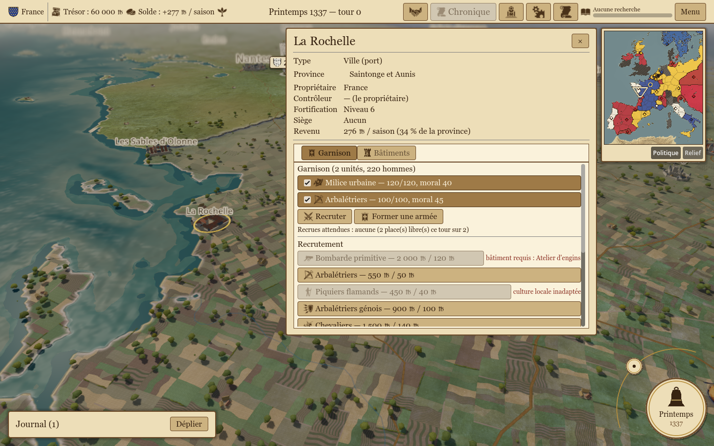
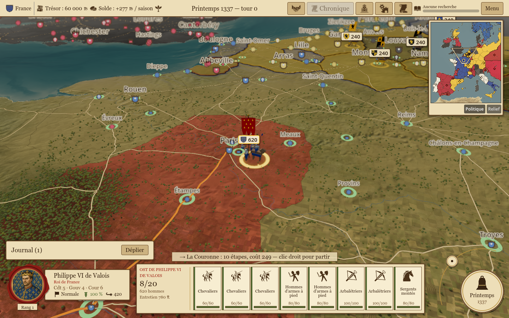

Avant C7b : `c5-panneau-colonie.png` (panneau sur la minicarte), `c7b-avant-chemin.png`.

## Mouvement libre des armées (lot M4)

Spec : `docs/design/2026-09-24-mouvement-libre.md` § 6. Scripts : `army_movement_controller.gd`
(contrôleur), `army_movement_bubble.gd` + `shaders/reachable_bubble.gdshader` (bulle),
`army_movement_path.gd` (chemin). `campaign_map.gd` ne fait que brancher le contrôleur. Avec la
vraie simulation, la bulle remplace les anneaux C5 et le masque de provinces ; le panneau de
colonie et le bouton « Garnison » restent. Avec le mock, la carte garde le comportement C5.

- **Bulle** : `get_reachable_area(armée)` renvoie un masque RG8 recadré (une case de la grille par
  texel, R = atteignable, G = coût / budget) ; les trouées d'une ou deux cases (fleuves franchis plus
  loin par un pont) sont comblées pour l'affichage. Maillage posé sur le relief, contour doré
  anticrénelé, ombre d'encre, voile qui se renforce vers le bord de portée ; mipmaps pour un contour
  stable au dézoom.
- **Chemin** : `find_path_points(armée, x, y)` (polyligne en pixels carte, `stop_index`,
  `turn_ends`, coût) ; vert pour ce tour, rouge pour les tours suivants, jalon à chaque fin de tour.
  Il suit le curseur (recalcul au plus toutes les 40 ms, et seulement si la case visée change) ;
  l'étiquette de survol donne le nombre de tours et le coût. Une armée déjà en marche montre le reste
  de son `planned_path`.
- **Clic droit** : sur le sol → `move_army_to` ; sur une armée ennemie (en guerre) → `attack_army` ;
  sur une colonie → `move_army_to_settlement` (stationnement, siège ou prise), ou `embark_army` si
  l'armée est dans un port relié à la colonie par mer. La réponse (`walked`, `stop`, `events`) anime
  le marqueur le long du trajet, affiche un avis (arrêt en zone de contrôle, siège…) et propose la
  bataille en attente le cas échéant.
- **Attaque (lot AT1)** : curseur « épées croisées » (`AttackCursor`, icône `lorc-crossed-swords`) au
  survol d'une cible attaquable (`is_attack_target` : faction en guerre, ou en paix/trêve). Sur une
  place en guerre, `order_attack_settlement` : assaut direct si l'armée l'assiège déjà, sinon marche
  puis ordre `assault` si le siège commence ce tour (dialogue d'avant-bataille de siège), ou
  `attack_army` sur le défenseur qui arrête la marche aux portes. Faction en paix ou en trêve :
  `WarDeclarationDialog` (conséquences de `evaluate_proposal`), puis `declare_war` et l'attaque.
- **Zone de contrôle** : cercle rouge (décalque) de `zoc_radius_km` au survol d'une armée ennemie.
- **Marqueurs** : une armée en campagne se tient à sa `position` libre ; seules les armées dans une
  colonie s'y empilent.
- Getters du pont : `get_army` gagne `position`, `settlement`, `movement_left`, `movement_max`,
  `planned_path`, `destination_point` (anciens champs gardés) ; `get_movement_rules`,
  `submit_order_report` ; `debug_place_army` (tests et captures seulement).
- Test : `godot --headless --path game --script res://tests/m4_free_movement_ui_test.gd`. Captures :
  `--stage=movement` et `--stage=movement_near`.

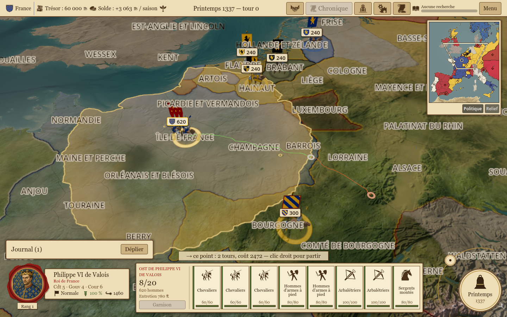
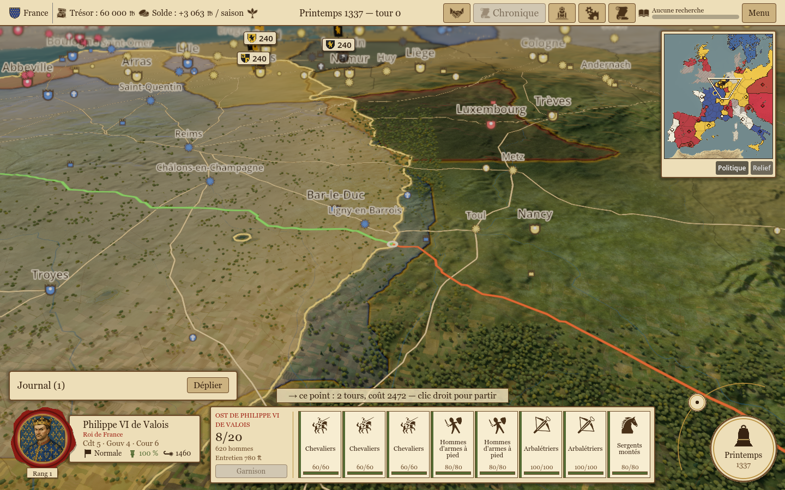

## Vision par rayon (lot M5a)

- Règle (cœur, `sim-campaign/src/vision.rs`) : un point est vu à moins de `vision_army_km` (30) d'une
  armée amie ou de `vision_settlement_km` (20) d'une colonie tenue (`data/movement/rules.json`) ;
  alliés, vassaux et suzerains partagent leur vue (`data/rules/vision.json`). Toutes les terres des
  provinces tenues par la faction ou ses alliés sont vues (`own_provinces_visible`). Une province est
  visible si `province_seen_percent` (25 %) de ses terres sont vues, si elle contient une colonie
  vue ou une armée amie, ou si un agent la surveille. La vue est recalculée, jamais sauvegardée
  (≈ 1 ms par faction en release).
- Pont : `get_vision(faction)` → `{image (R8 512², 255 = vu, bord doux, vu dès 128), size,
  texel_px, provinces, armies, seen_share}` ; `get_visible_army_ids`, `is_point_visible` ;
  `get_visible_provinces` inchangé.
- Rendu : `MinimapController.refresh_fog` pose la texture sur le terrain
  (`TerrainBuilder.set_fog_cells`, `terrain.gdshader` : prise filtrée, bord effrangé par un bruit
  lent, liseré sépia) et sur la minicarte (`CampaignMinimap.set_fog_cells`). Les armées étrangères
  dont le point n'est pas vu n'ont ni marqueur (`ArmyMarkers.visible_armies`) ni point sur la
  minicarte. Sans `get_vision` (simulation de repli), l'ancien masque par province reste utilisé.
- Test : `godot --headless --path game --script res://tests/m5a_vision_ui_test.gd`.

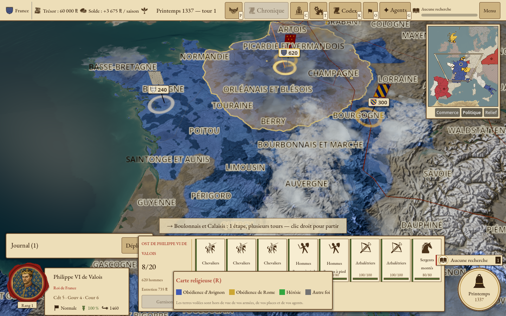
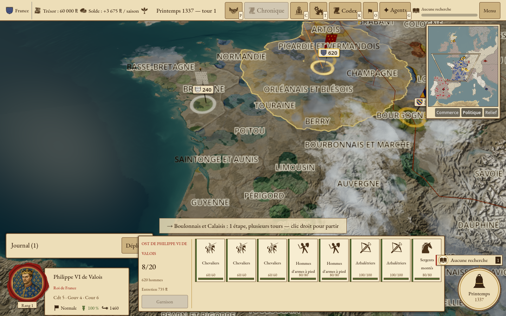
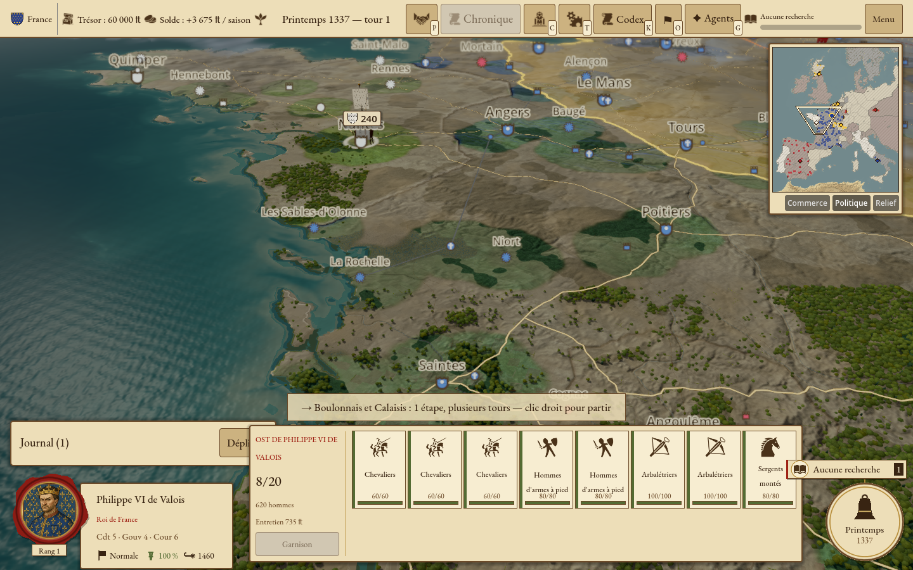

## Performances mesurées (M4 Pro)

| Jeu de données | Chargement | Terrain (LOD lointain) | Tuile proche |
|---|---|---|---|
| Fixtures 512², 6 provinces | 5 ms | 17 ms (74 k sommets, pas 2) | < 1 ms |
| Réel 4096², 132 provinces, décodage Rust | 0,23 s (heightmap 107 ms, masques 98 ms) | 96 ms (279 k sommets, pas 8) | 0,9 ms (pas 4) |
| Idem, repli `Png16` GDScript, cache froid | 5,3 s | idem | idem |

20 000 lectures pick + hauteur : 23 ms. Mémoire résidente ≈ 120 Mo.

## Limites connues

- Frontières en escalier de près (résolution de `province_ids`) ; lissage possible plus tard.
- Pas de jupes entre tuiles de LOD différents : petites fissures possibles vues de très près.
- Rivières, côte, chemin et marqueurs sont rendus sans test de profondeur (visibles à travers le relief).
- Étiquettes de capitales sans dé-chevauchement ; elles peuvent recouvrir un marqueur d'armée.
- Le mock ne connaît ni liens maritimes ni coûts de terrain (1 point par lien) ; ses batailles sont
  aléatoires. Tout cela est remplacé par `core/` dès que `CampaignSim` expose l'API M2.
- « Former une armée » prend les unités cochées de la garnison ; pas encore de fusion/scission d'armées
  ni d'affectation de général depuis l'interface (`MergeArmies`, `SplitArmy`, `AssignGeneral` du § 1.2).
- Un `Label3D` de compte est affiché même quand plusieurs armées se superposent exactement ; l'anneau
  de décalage n'est appliqué qu'aux armées d'une même province.
- macOS arm64 uniquement testé (Metal, Forward+).
- Mode mécontentement (M) : réutilise la texture 1D de couleur de province (`set_province_colors`)
  plutôt qu'une seconde texture dédiée (approche « la moins chère » suggérée par la spec § 3) ; recalculée
  à chaque bascule et à chaque `refresh_all`, pas par frame.
- `ConstructionMarkers.refresh` appelle `get_province_city` pour chaque province de la carte à chaque
  rafraîchissement (après chaque ordre ou fin de tour) : correct mais O(provinces) ; à revoir si le
  nombre de provinces grandit beaucoup au-delà des ~130 de la carte 1337.
- Le panneau de faction n'affiche pas le détail catégorie → liste de ressources (juste les catégories
  puis la liste complète des ressources) : `get_faction_economy` ne donne pas la catégorie par ressource,
  seulement `goods_categories` global.
- F3 : le rapport de saison ne montre que les événements du `end_turn` (pas ceux des batailles
  résolues ensuite via le dialogue) ; les alertes d'armée ennemie ne regardent que les voisins
  terrestres (`neighbors`), pas les débarquements possibles. La confirmation « partie non
  sauvegardée » compte les tours, pas les ordres donnés dans le tour.

## HUD de campagne « à la Total War » (F10b)

Composants F10a (`docs/design/hud-campagne.md`) branchés par `HudController`
(`scripts/map/hud_controller.gd`) ; placement par `MapUI.layout_hud()` (redimensionnement de la
fenêtre, bandeau, journal, panneaux de droite).

- **Armée sélectionnée** : `ArmyStrip` (bas centre) + `GeneralSeal` (bas gauche) remplacent l'ancien
  panneau d'armée. Armée étrangère : lecture seule (pas de posture, pas de « Séparer »). « Séparer »
  n'apparaît que si la simulation déclare `supports_order("split_army")` (aucune ne le fait encore).
  Clic sur le sceau → fiche du chef ; armée sans chef → cour filtrée sur les chefs. Capacité affichée :
  `army.max_units` si la simulation l'expose, sinon 20.
- **Cloche** (bas droite) : date, fin de saison, alertes ; une décision de chronique est bloquante.
- **Lettres scellées** (haut droite) : `NewsLetters.news_from_event` sur les événements gardés par
  `journal_keeps` ; le journal et le rapport de saison restent.
- **Accesseurs stables** (tutoriel) : `MapUI.selected_army_widget()` (bandeau), `MapUI.end_turn_control()`
  (cloche), `MapUI.province_panel` ; nœuds `UI/ArmyStrip`, `UI/GeneralSeal`, `UI/EndTurnCluster`,
  `UI/NewsLetters`.
- Captures : `--stage=army` (défaut), `--stage=province`, `--stage=chronicle` →
  `docs/img/hud-campaign*.png` (1440×900 et 1920×1080).

## Tour de l'IA à la Total War (lot CT1, ADR 0073)

En fin de tour, après la résolution du cœur et avant la diplomatie, la victoire et le rapport de
saison, `AiTurnReplay` (`game/scripts/map/ai_turn_replay.gd`, créé par `campaign_map.gd`) rejoue les
marches des armées IA que le joueur voit :

- **Données** : `CampaignSim.get_ai_turn_moves()` (trajet réel, issue, partie vue, intérêt pour le
  joueur ; format dans l'ADR 0073), enregistré seulement si `set_ai_turn_recording(true, …)` a été
  appelé avant `end_turn` ; mise en scène dans `data/ui/ai_turn_replay.json`.
- **Réglages** (Réglages › Carte) : « Mouvements de l'IA » = Suivre (défaut ; la caméra se porte sur
  les 6 mouvements au plus qui concernent le joueur — bataille, siège de ses places, marche sur ses
  terres, arrivée près de ses armées ou colonies — puis revient), Montrer (marches sans caméra),
  Masquer (fin de tour immédiate, rien d'enregistré) ; « Vitesse » ×1 / ×2 / ×4. Espace passe le
  reste. Les armées alliées et vassales marchent sans être suivies.
- **Rendu** : chaque armée rejouée repart de son point de départ (figurines CV2 en marche le long
  du trajet, `ArmyMarkers.place_marker`), les autres mouvements vus se jouent en même temps ; une
  légende « Tour de l'IA : <faction> — Espace : passer » remplace le bandeau des autres factions.
- **Tests** : `game/tests/ct1_ai_turn_test.gd` (headless, les trois modes, Espace),
  `core/crates/ai/tests/ct1_ai_replay.rs` (déterminisme, jeu inchangé, bataille notable) ;
  captures `game/tests/ct1_capture.gd` → `docs/audit/captures/ct1/`.
- **Coût** : Masquer = coût d'avant ; enregistrement actif ≈ 2 ms par tour dans le cœur (release),
  < 0,1 ms de tri côté Godot ; la relecture elle-même dure le temps de l'animation (de 0 s sans
  mouvement vu à une vingtaine de secondes à ×1 quand six mouvements sont suivis).

## Nappe d'eau des fleuves et convention des rasters (lot SZ2b, ADR 0086)

Défaut : au palier site, pas d'eau autour des villes (Seine à Rouen en lit sableux, Loire absente à
Orléans et Tours), et, là où l'eau existait, lit creusé à 360 m du vrai lit du relief. Deux causes :

- **Eau coupée sous les emprises** : `FineRibbonJob` coupait les rubans et `FineBedCarver` ne
  creusait pas sous les emprises des maquettes de colonies (rayon de maquette × 0,8 : 5,2 km à
  Orléans) ni dans les zones personnalisées (Rouen, Paris, Londres…), règle d'avant les villes 1:1
  (ZG6, VH4). Désormais l'eau traverse les emprises et les zones des villes qui ont un fichier v2 ;
  ses sommets y sont marqués (`UV2.y` = ordre + 100 × marque : 1 emprise, 2 zone de ville 1:1) et
  `river_fine.gdshader` les efface tant que les maquettes sont affichées : `cover_open` = villes 1:1
  de ZG6 actives (`TownLayer.active`, toutes les maquettes masquées), `zone_open` = 1 − opacité de la
  maquette L1/L2 (`LandmarkCityLayer.fade`). Le lit est creusé partout sauf dans les zones des
  maquettes sans ville 1:1 (Paris, Londres… tant que VH5-VH8 ne sont pas faits : leur maquette
  porte sa propre eau). Ponts-portes masqués quand les maquettes le sont.
- **Demi-pixel** : Godot lisait les rasters avec le pixel i centré en x = i (`uv = (p + 0,5) /
  taille`, `GRID_OFFSET = −0,5`), les outils et toutes les données vectorielles avec le pixel i sur
  [i, i + 1] (`docs/geo.md`). Le relief était affiché 0,5 unité (360 m) au nord-ouest des fleuves,
  colonies et villes 1:1. Rendu aligné sur les outils (ADR 0086) : `GRID_OFFSET = 0`,
  `MapData.height_m_at` en (x − 0,5, y − 0,5), `uv = p / map_size` dans les shaders du terrain, même
  chose dans la végétation native (Rust). Aucune recuisson : les niveaux d'eau `hydro_fine` étaient
  déjà calés sur le relief dans la convention des outils.

Mesures (`game/tests/sz2b_water_shots.gd --probe-heights`, relief − eau, mètres affichés) : à l'axe
−2,9 à −4 m partout (lit creusé) ; berges à 1,15 demi-largeur ≈ −0,2 m à Rouen et en Val de Loire
(l'eau touche la berge) ; Orléans et Tours −2 à −4 m sur une rive (chenal du relief plus large que
la largeur de `river_widths.json`, bras multiples) : pas de mur, eau peu profonde au bord.
Captures `docs/img/sz2b/avant_*` / `apres_*` (Rouen, Orléans, Tours, Londres, Bordeaux ; vallée et
site). Laissés : maillages E0 des morceaux (vue parchemin, repli sans pyramide), tuiles fines d'avant
la pyramide et grille du fond ZG8 dans l'ancienne convention (≤ 0,5 pixel de 719 m, invisible).

